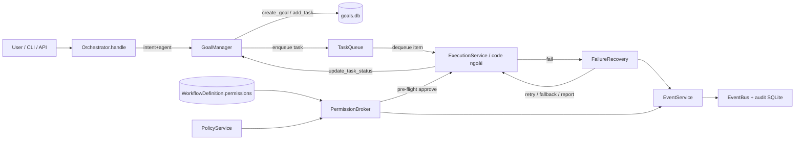

# TASK-012 — M2-P3b: Goal Manager + Task Queue + Permission Broker + Failure Recovery

**Metadata**
- Task ID: `TASK-012`
- Milestone / Phase: M2 (Developer Edition) / P3 (Orchestrator v1 + Assistants)
- Ngày: 2026-08-12
- Trạng thái: `approved` (critique ×2 đã resolve — 16/16 vòng 1 + 15/15 vòng 2)
- Owner: AIOS Orchestrator
- Module đích: `backend/src/aios_core/orchestrator/goals/` (package mới)

---

## 1. Mục tiêu

Xây 4 module quản trị & điều phối còn thiếu của Orchestrator v1 theo PLAN.md ("Quản trị & policy" + "Điều phối & thực thi" + "Goal Manager + Task Queue"):

1. **GoalManager** — goal dài hạn nhiều phiên ("Xây AIOS") → tasks → mỗi task ánh xạ 1 workflow, theo dõi progress, **persist SQLite** để tiếp tục được qua phiên mới (restart kernel không mất).
2. **TaskQueue** — queue **logic** của Orchestrator (khác SchedulerService là queue kỹ thuật cron/one-shot): enqueue theo priority, dequeue, pause/resume, reorder, list, clear — **bền vững qua phiên**.
3. **PermissionBroker** — thuộc Policy Engine: gom permission của workflow/plan → gom nhóm trùng lặp → đối chiếu policy → xin user approve (callback injectable, mặc định auto-approve cho simulate/test) → kết quả ghi audit qua EventService → trả quyết định approve/deny/ask theo từng scope.
4. **FailureRecovery** — chuỗi phục hồi: Agent lỗi → Retry (N lần, exponential backoff) → Fallback Agent → Fallback Workflow → Report; emit `ERROR_OCCURRED`/`RECOVERY_RETRY`/`RECOVERY_FALLBACK` qua EventBus.

Tất cả **offline-first, thuần deterministic, không phụ thuộc LLM** — đúng triết lý Decision Pipeline (planner LLM là optional; các module này KHÔNG gọi model).

## 2. Phạm vi

### In (thuộc `backend/src/aios_core/orchestrator/goals/`)

1. `goal.py` — `GoalManager` + `GoalStatus` + `TaskStatus` + `Goal` + `GoalTask` (pydantic v2)
2. `task_queue.py` — `TaskQueue` + `QueueItemStatus` + `QueueItem`
3. `permission_broker.py` — `PermissionBroker` + `PermissionBatch` + `PermissionBatchDecision`
4. `failure_recovery.py` — `FailureRecovery` + `RecoveryStatus` + `RecoveryResult`
5. `errors.py` — `GoalError`, `QueueError` (kế thừa `OrchestratorError`)
6. `__init__.py` — exports; cập nhật export ở `orchestrator/__init__.py` + `aios_core/__init__.py` (test_import)
7. Mở rộng `kernel/events.py` `EventType`: thêm 6 giá trị **pin value** (C1-06): `GOAL_CREATED = "goal.created"`, `GOAL_STATUS_CHANGED = "goal.status_changed"`, `GOAL_TASK_UPDATED = "goal.task_updated"`, `QUEUE_UPDATED = "queue.updated"`, `RECOVERY_RETRY = "recovery.retry"`, `RECOVERY_FALLBACK = "recovery.fallback"` (`ERROR_OCCURRED` đã có — giữ nguyên)
8. Mở rộng `kernel/services/policy.py` `PolicyDecision` + `PolicyService.evaluate`: thêm field `ask_scopes: list[str]` (C1-01) — **LƯU Ý C2-06: `PolicyDecision` là `@dataclass`, phải dùng `field(default_factory=list)` của `dataclasses`, KHÔNG dùng pydantic `Field`**; `evaluate` set đủ field ở MỌI nhánh return (deny/token/internet → `[]`, approval → danh sách scope ngoài allow, allow → `[]`). Additive, backward-compatible — baseline 428 test không vỡ.
9. Mở rộng `config.py` `Settings`: thêm `GoalsSettings(db_path="aios/data/goals.db")` + field `goals` (pattern `AuditSettings`/`MemorySettings`) + cập nhật `backend/config.yaml`
10. Factory `build_goal_modules()` trong `goals/__init__.py` (C1-13 — chứng minh `GoalsSettings` sống, không để config chết)
11. 4 file test mới + cập nhật `test_import.py` (chi tiết mục 8)

### Out (không làm — tránh scope creep)

- **M4 Goal Manager nâng cao**: progress tracking chi tiết (biểu đồ, ETA), báo cáo tổng hợp, gắn vào Dashboard → M4 P8
- **ExecutionSupervisor** (consumer loop thật lấy item từ TaskQueue chạy ExecutionService) → M4; v1 chỉ cung cấp `dequeue()` để code/task sau sử dụng
- **Async approve UI** (dashboard prompt) → M3; v1 dùng callback **sync** injectable
- Không gọi `ResourceService`/`SchedulerService` khi dequeue (chỉ đánh dấu `running`; gating resource do ExecutionService đảm nhiệm như hiện tại)
- Không tự động đọc `workflow.retries` của WorkflowDefinition vào FailureRecovery (nhận config riêng qua constructor; ExecutionService đã có retry/timeout cấp node)
- Capability Router, Skill Manager Proxy, Context/Memory Coordinator, System Knowledge nâng cao → task P3 khác
- Không LLM ở bất kỳ module nào (kể cả tạo task từ goal — v1 bắt buộc truyền task thủ công)

## 3. Input / Output

**Input (phụ thuộc có sẵn):**
- TASK-004: `EventService` (audit + bus, pattern connection-per-call), `PolicyService` (`evaluate` → `PolicyDecision` — **mở rộng thêm field `ask_scopes`**), `PermissionScope`/`PermissionDecision`
- TASK-012 (chính nó): mở rộng `kernel/services/policy.py` (`PolicyDecision.ask_scopes` — dataclasses.field) + `kernel/events.py` (`EventType` +6) + `config.py` (`GoalsSettings`) — xem mục 2.7–2.10
- TASK-008: `WorkflowDefinition.permissions: list[str]` (nguồn input cho PermissionBroker, đã validate scope)
- TASK-010: `orchestrator/errors.py` (`OrchestratorError`), package `orchestrator/`
- `config.py` `Settings` (để thêm `GoalsSettings`)

**Output:**
- `orchestrator/goals/` (6 file) + test (4 file + `test_import.py` cập nhật)
- `EventType` +6 giá trị; `Settings.goals`; `config.yaml` cập nhật
- DB SQLite `aios/data/goals.db` (3 bảng: `goals`, `goal_tasks`, `queue_items`)
- Commit + cập nhật `PROGRESS.md`/`LOG.md`

## 4. Kiến trúc

### 4.1 Vị trí module

```
backend/src/aios_core/
├── kernel/                     # Runtime Plane — 9 services (M1, ĐÓNG BĂNG)
│   ├── events.py               # EventType (+6 giá trị mới — thay đổi duy nhất ở kernel)
│   └── services/               # EventService, PolicyService, ...
└── orchestrator/               # Control Plane (M2)
    ├── orchestrator.py         # Decision Pipeline v1 (TASK-010 — KHÔNG sửa logic)
    ├── goals/                  # ★ TASK-012 — package mới
    │   ├── __init__.py
    │   ├── errors.py
    │   ├── goal.py             # GoalManager
    │   ├── task_queue.py       # TaskQueue
    │   ├── permission_broker.py# PermissionBroker
    │   └── failure_recovery.py # FailureRecovery
    └── ...
```

### 4.2 QUYẾT ĐỊNH WIRING: KHÔNG wire vào RuntimeKernel — Orchestrator layer tự assemble

**Quyết định rõ (đã cân nhắc 2 phương án):**

- **Phương án A — wire vào `RuntimeKernel.create()`**: bị BÁC BỎ. RuntimeKernel = 9 kernel services đã đóng băng từ M1 (review độc lập PASS, 428 test); thêm module Control Plane vào đó phá ranh giới Runtime Plane ↔ Control Plane mà PLAN "Quyền hạn" quy định (Orchestrator là agent DUY NHẤT truy cập services), đồng thời buộc `Settings`/`create()` mở rộng contract đã pin.
- **Phương án B — Orchestrator layer tự assemble (CHỌN)**: 4 module mới dùng **constructor injection** (giống `Orchestrator` v1), nhận dependency là kernel services (`EventService`, `PolicyService`) qua tham số. Không đăng ký vào `Container` v1; tuy nhiên **DI-compatible**: constructor chỉ dùng type hints (kèm `from __future__ import annotations` + `typing.get_type_hints` nếu cần) nên sau này M3/M4 có thể đăng ký vào Container không phải sửa code. Mã assemble (tạo instance với dep) nằm ở nơi dùng: test / code orchestrator layer / M4 ExecutionSupervisor.

Lý do chốt: (1) giữ nguyên contract M1 RuntimeKernel; (2) đúng phân tầng Control Plane; (3) test độc lập dễ dàng (mock dep); (4) user/task sau (M3 dashboard, M4 supervisor) quyết định wiring chính thức.

### 4.3 Luồng dữ liệu (v1)



Chuỗi v1 (kiểm chứng bằng test, không có supervisor):
1. Tạo goal + tasks → `GoalManager` persist vào `goals`/`goal_tasks`.
2. Task sẵn sàng chạy → `TaskQueue.enqueue(...)` (link `task_id`/`goal_id`).
3. Trước khi chạy: `PermissionBroker.collect_and_request(workflow.permissions)` → deny thì không chạy, allow thì chạy.
4. Chạy fail → `FailureRecovery.run(...)` (retry → fallback agent → fallback workflow → report).
5. Kết thúc → `GoalManager.update_task_status(...)` → tự động recompute progress + goal status.

### 4.4 Quan hệ với Orchestrator v1 + kernel services

- `GoalManager` / `TaskQueue`: dùng `EventService` (audit + emit). KHÔNG phụ thuộc `SchedulerService` (queue logic ≠ queue kỹ thuật — PLAN ghi rõ).
- `PermissionBroker`: dùng `PolicyService.evaluate` (pre-check scope) + `EventService` (audit). **KHÔNG phụ thuộc `PermissionService`** — enforcement cuối vẫn do PermissionService ở execution layer (TASK-004); Broker chỉ là lớp gom nhóm + quyết định batch thuộc Policy Engine. Quyết định này giảm coupling và tránh trùng lặp trách nhiệm (ghi rõ để critique kiểm chứng).
- `FailureRecovery`: độc lập với ExecutionService (không gọi `execute()`); nhận `executor` callable (contract `fn(agent, workflow_name)`) → dễ test, dễ dùng cho cả workflow thật lẫn stub.
- `Orchestrator.handle()` (TASK-010) **không đổi**: 4 module này là thành phần đứng cạnh Decision Pipeline; M4 ExecutionSupervisor sẽ nối chúng vào pipeline thật.

## 5. Đặc tả chi tiết từng thành phần

Quy ước chung: mọi model là `pydantic.BaseModel` với `model_config = ConfigDict(extra="forbid")`, `Field(default_factory=...)`; `id` sinh `uuid4().hex`; timestamp `datetime.now(timezone.utc).isoformat()`; tất cả method thread-safe theo pattern **connection-per-call + `PRAGMA busy_timeout=5000`** + `with closing(self._connect()) as conn, conn:` (transaction auto-commit/rollback) + `db_path.parent.mkdir(parents=True, exist_ok=True)` — copy đúng pattern `events.py`.

### 5.1 `goal.py` — GoalManager

**Enums:**
```python
class GoalStatus(str, Enum):
    ACTIVE = "active"; PAUSED = "paused"; COMPLETED = "completed"
    FAILED = "failed"; CANCELLED = "cancelled"

class TaskStatus(str, Enum):
    PENDING = "pending"; QUEUED = "queued"; RUNNING = "running"
    COMPLETED = "completed"; FAILED = "failed"; PAUSED = "paused"; CANCELLED = "cancelled"
```

**Models:** `Goal` (id, title, description="", status=ACTIVE, progress=0.0, created_at, updated_at, tasks: list[GoalTask] = Field(default_factory=list)); `GoalTask` (id, goal_id, title, workflow_name, status=PENDING, priority=0, position=0 (C2-02), result="", created_at, updated_at).

**`GoalManager.__init__(self, event_service: EventService, db_path: Path | str)`** — `_init_db()` tạo 2 bảng (schema mục 5.5).

**API:**
```python
def create_goal(self, title: str, description: str = "", tasks: list[dict] | None = None) -> Goal
    # tasks: [{title, workflow_name, priority?}] — tạo goal + tasks trong 1 transaction
def add_task(self, goal_id: str, title: str, workflow_name: str, priority: int = 0) -> GoalTask
def update_task_status(self, goal_id: str, task_id: str, status: TaskStatus, result: str = "") -> GoalTask
    # + recompute goal (mục 5.1.1)
def get_goal(self, goal_id: str) -> Goal | None          # kèm danh sách tasks (ORDER BY position — C2-02)
def list_goals(self, status: GoalStatus | None = None, limit: int = 100) -> list[Goal]  # mới nhất trước
def progress(self, goal_id: str) -> float                # 0.0..1.0
def pause_goal(self, goal_id: str) -> Goal
def resume_goal(self, goal_id: str) -> Goal
def cancel_goal(self, goal_id: str) -> Goal
```

**5.1.1 Luồng xử lý:**
- `progress` = `completed_tasks / total_tasks` (total=0 → 0.0); lưu cache vào cột `goals.progress` sau mỗi `update_task_status`.
- **Auto-status (chỉ khi goal đang ACTIVE)**: sau `update_task_status` — mọi task ∈ {COMPLETED} → goal → `completed`; có bất kỳ task ∈ {FAILED, CANCELLED} → goal → `failed`. Goal PAUSED/terminal không bị tự chuyển. *Rationale (C1-08): "bất kỳ task failed/cancelled → goal failed" là lựa chọn cố ý v1 — đơn giản, an toàn (một phần hỏng = goal cần xem xét lại); M4 Goal Manager nâng cao sẽ thêm ngưỡng/chính sách chi tiết.*
- **Cascade cancel (C1-02)**: `cancel_goal` trong CÙNG transaction cũng chuyển queue items của goal (`goal_id` khớp) đang `queued → cancelled` — công việc của goal bị cancel không còn được dequeue. `pause_goal` KHÔNG cascade (chỉ chặn auto-status; item queued vẫn chạy nếu supervisor dequeue — giới hạn v1 ghi rõ).
- **`add_task` trên goal terminal** (completed/failed/cancelled) → `GoalError` ("goal is terminal: X"); **`update_task_status(goal_id, task_id)` mà task thuộc goal khác** → `GoalError` ("task X not in goal Y") (C1-09).
- **State machine goal** (transition hợp lệ; vi phạm → `GoalError` kèm message rõ):
  `active → paused | completed | failed | cancelled`; `paused → active | cancelled`; `completed/failed/cancelled` = **terminal** (không chuyển).
- **State machine task**: `pending → queued | paused | cancelled`; `queued → running | paused | cancelled`; `running → completed | failed | cancelled`; `paused → queued | cancelled`; `completed/failed/cancelled` = terminal. `update_task_status` với transition bất hợp lệ → `GoalError`.
- `add_task`/`update_task_status` trên goal không tồn tại → `GoalError` ("goal not found: X").
- `progress(goal_id)` với goal không tồn tại → `GoalError` ("goal not found: X") — nhất quán (C2-13).
- **`resume_goal` gọi lại auto-status recompute** sau khi chuyển ACTIVE (C2-11) — goal PAUSED lúc mọi task hoàn tất (auto-status bị chặn) sẽ tự `completed` ngay khi resume; nếu không, goal ACTIVE kẹt vĩnh viễn.
- **Choreography v1 task→queue (C2-10)**: `enqueue` không đụng task status (decoupled); caller chịu trách nhiệm gọi `update_task_status(goal_id, task_id, QUEUED)` sau enqueue (trước khi supervisor dequeue). Chuỗi hợp lệ v1: `enqueue` → `update_task_status(QUEUED)` → `dequeue` → `update_task_status(RUNNING)` → chạy → `update_task_status(COMPLETED|FAILED)` (có test tích hợp).
- **Events** (qua `event_service.emit`; **chỉ emit khi thao tác thành công — exception không emit** — C1-15): `GOAL_CREATED` (payload: goal_id, title) khi create_goal thành công; `GOAL_STATUS_CHANGED` (payload: goal_id, status, progress) khi status đổi hợp lệ; `GOAL_TASK_UPDATED` (payload: goal_id, task_id, status) mỗi `update_task_status` hợp lệ.
- Đọc thẳng DB mỗi lần gọi, **không cache in-memory** (bài học F-006 catalog stale — tránh state cũ giữa instance).

### 5.2 `task_queue.py` — TaskQueue

**Enums/Models:** `QueueItemStatus` (queued/running/paused/cancelled/completed/failed); `QueueItem` (id, workflow_name, priority=0, status=QUEUED, payload: dict = Field(default_factory=dict), task_id: str | None = None, goal_id: str | None = None, created_at, updated_at).

**`TaskQueue.__init__(self, event_service: EventService, db_path: Path | str)`** — dùng CHUNG file `goals.db` với GoalManager (1 file, 3 bảng — đơn giản setup, transaction nhất quán). **Ràng buộc (C2-14): GoalManager và TaskQueue PHẢI dùng chung `db_path`** (nếu khác → cascade cancel không thấy queue items — tính năng C1-02 chết âm thầm; factory luôn dùng chung 1 path). `_init_db()` dùng `CREATE TABLE IF NOT EXISTS` (idempotent khi cả 2 instance cùng khởi tạo).

**API:**
```python
def enqueue(self, workflow_name: str, priority: int = 0, payload: dict | None = None,
            task_id: str | None = None, goal_id: str | None = None) -> QueueItem
    # position = COALESCE(MAX(position),0)+1 — ATOMIC 1 câu SQL (C1-04):
    #   INSERT INTO queue_items (..., position, ...)
    #   SELECT ..., COALESCE(MAX(position),0)+1, ... FROM queue_items;
    # + UNIQUE(position) ở schema — chống trùng position khi 2 thread enqueue đồng thời
def dequeue(self) -> QueueItem | None      # atomic (mục 5.2.1)
def pause(self, item_id: str) -> QueueItem # queued → paused (khác → QueueError)
def resume(self, item_id: str) -> QueueItem# paused → queued (khác → QueueError)
def reorder(self, item_ids: list[str]) -> None  # gán position 0..n-1 theo thứ tự mảng — BẮT BUỘC đủ mọi item queued (C2-01)
def list_items(self, status: QueueItemStatus | None = None, limit: int = 100) -> list[QueueItem]
def clear(self, status: QueueItemStatus = QueueItemStatus.QUEUED) -> int  # trả số dòng đã xóa
```

**5.2.1 Dequeue atomic (chống double-dequeue) — 1 statement (C2-05):**
```sql
-- SQLite ≥ 3.35 (Python 3.13 luôn có RETURNING): vừa nguyên tử vừa đúng liveness
UPDATE queue_items SET status='running', updated_at=?
WHERE id = (SELECT id FROM queue_items
            WHERE status='queued'
            ORDER BY priority DESC, position ASC LIMIT 1)
RETURNING *;
-- cursor.fetchone() == None → queue rỗng/không giành được → trả None
```
- **Thứ tự dequeue**: `priority DESC` (số lớn hơn chạy trước — đồng nhất với RuleEngine) → `position ASC` (FIFO trong cùng priority).
- `pause`: chặn dequeue (item paused không nằm trong subquery); `resume`: quay lại queued.
- `reorder`: **thuật toán 2 pha trong 1 transaction (C2-01)** — vì `UNIQUE(position)` là immediate (mỗi UPDATE kiểm tra ngay), gán trực tiếp 0..n-1 sẽ đụng position đang giữ → IntegrityError lộ ra ngoài. Pha 1: toàn bộ item trong `item_ids` → `position = -(i+1)` (dải âm không đụng ai); pha 2: gán `position = i` cho 0..n-1 theo thứ tự mảng. **Ràng buộc: `item_ids` PHẢI là đủ mọi item đang `queued`** (thiếu/thừa/id không tồn tại → `QueueError` "reorder requires all queued items") — deterministic, không lộ IntegrityError. Chỉ ảnh hưởng thứ tự trong cùng priority — priority vẫn là tiêu chí chính (docstring cảnh báo rõ; test AC5 dùng item cùng priority) (C1-12).
- `clear`: xóa theo status (mặc định chỉ xóa queued — không đụng running/completed).
- **Events** (qua `event_service.emit`; **chỉ emit khi thao tác thành công — exception không emit** — C1-15): `QUEUE_UPDATED` với payload `{action: enqueue|dequeue|pause|resume, item_id, workflow_name}`; action bulk (C2-08): **reorder → 1 event/item** (`action="reorder"`, item_id, workflow_name); **clear → 1 event tổng** (`action="clear"`, item_id=None, workflow_name="", kèm `count`).
- **Persist**: trạng thái item nằm trong DB — tạo `TaskQueue` mới trên cùng file (phiên mới) → item queued còn nguyên, dequeue được tiếp.
- **Recover stale running (C1-03)**: `recover_stale_running(threshold_s: float = 3600) -> int` — chuyển item `running` có `updated_at` cũ hơn threshold → `queued` (requeue), trả số item đã phục hồi. **Gọi tự động trong `__init__` sau `_init_db()`**. Giả định v1: **single-writer single-process** (không chạy 2 process cùng DB) — nếu vi phạm, stale recovery có thể requeue item đang chạy thật ở process khác.
- **enqueue không validate sự tồn tại `goal_id`/`task_id`** (C1-16) — queue decoupled khỏi goals (queue_items không FK); link chỉ là metadata cho supervisor/report.

### 5.3 `permission_broker.py` — PermissionBroker

**Models:**
```python
class PermissionBatch(BaseModel):
    model_config = ConfigDict(extra="forbid")
    id: str; scopes: list[PermissionScope]  # đã dedupe + sort theo scope.value
    source: str = ""                        # VD: "workflow:crud_generator"

class PermissionBatchDecision(BaseModel):
    model_config = ConfigDict(extra="forbid")
    batch_id: str
    decisions: dict[str, PermissionDecision]  # key = scope.value → allow/deny/ask
    approved: bool                             # True khi mọi scope ALLOW
    reason: str = ""
```

**`PermissionBroker.__init__(self, event_service: EventService, policy_service: PolicyService, approver: Callable[[PermissionBatch], PermissionDecision] | None = None)`** — `approver=None` → **auto-approve (ALLOW)** cho simulate/test (mặc định); production inject callback thật (prompt UI).

**API:**
```python
def collect(self, permissions: list[str], source: str = "") -> PermissionBatch
    # validate scope (lạ → ValueError), dedupe, sort theo scope.value → batch
    # rỗng → ValueError("empty scopes") (C1-11 — gom nhóm rỗng thường là bug caller)
def request(self, batch: PermissionBatch) -> PermissionBatchDecision
    # batch rỗng (scopes=[]) → ValueError("empty batch") — nhất quán C1-11 (C2-13)
def collect_and_request(self, permissions: list[str], source: str = "") -> PermissionBatchDecision  # tiện ích 1 bước
```

**5.3.1 Luồng xử lý `request`:**
1. `decision = policy_service.evaluate(PolicyRequest(scopes=batch.scopes, internet=False))`. *Giới hạn cố ý (C1-14): `internet=False, tokens=None` cố định — gating internet/token thật vẫn ở ExecutionService; broker chỉ pre-check scope.*
2. `decision.approved=False` (deny/token/internet) → mọi scope → `DENY`, `approved=False`, reason từ policy (default-deny an toàn).
3. `decision.requires_approval=True` → scope trong `decision.ask_scopes` (**field mới của `PolicyDecision`, do PolicyService tính — broker KHÔNG tự tính lại** — C1-01) → `ASK`; scope còn lại (trong `allow_scopes`) → `ALLOW` không hỏi. **Case đặc biệt (C1-01): `requires_approval=True` mà `ask_scopes` rỗng (policy `require_approval=True`, mọi scope đều allowed) → TOÀN BỘ batch → `ASK`** (không tự ALLOW) — policy đang yêu cầu approval thì phải hỏi.
4. Với scope ASK: nếu `approver` có → gọi `approver(batch)` — trả `ALLOW` → tất cả scope ASK thành ALLOW; trả `DENY` → tất cả thành DENY; **approver raise exception → DENY toàn bộ + emit `ERROR_OCCURRED` (payload: service="permission_broker", batch_id, error) — default-deny an toàn (C2-09); approver trả `ASK` → coi như DENY** (C1-07). Nếu `approver is None`: **policy `requires_approval=True` → `approved=False`, reason "no approver configured" (default-deny — C2-12); ngược lại (policy allow trực tiếp) → ALLOW** (mode simulate/test chỉ hợp lệ khi policy không đòi hỏi approval).
5. `approved = all(d == ALLOW for d in decisions.values())`.
6. **Events/audit qua EventService** (C1-05 re-decide C2-04 — **điều chỉnh có chủ đích**: giữ broker emit `PERMISSION_REQUESTED` vì event của PolicyService publish trực tiếp qua bus, KHÔNG vào audit — broker emit để có audit trace "đã hỏi"): payload **KHỚP CHÍNH XÁC schema policy** `{service: "permission_broker", request_id, scopes, ask_scopes}` (KHÔNG thêm batch_id/source vào payload — batch_id để vào `Event.source` và payload của GRANTED/DENIED); request_id do broker tự sinh uuid4. Sau quyết định emit **1** `PERMISSION_GRANTED` (nếu approved) hoặc `PERMISSION_DENIED` (payload: service="permission_broker", batch_id, scopes, reason).
7. Trả `PermissionBatchDecision` (decisions theo từng scope).

Ghi chú: Broker **không** tự đánh giá policy scope-level thay PolicyService (chỉ gom + map kết quả từ `PolicyDecision.ask_scopes`), không đụng `PermissionService._pending` — enforcement cuối vẫn ở PermissionService/ExecutionService.

### 5.4 `failure_recovery.py` — FailureRecovery

**Enums/Models:** `RecoveryStatus` (recovered/failed); `RecoveryResult` (status, attempts: int, error="", fallback_used: Literal["","agent","workflow"], final_result: Any = None, history: list[str] = Field(default_factory=list)).

**`FailureRecovery.__init__(self, event_service: EventService, max_retries: int = 2, backoff_base_s: float = 0.1, backoff_max_s: float = 2.0, fallback_agents: dict[str, str] | None = None, fallback_workflows: dict[str, str] | None = None, sleeper: Callable[[float], None] = time.sleep)`** — validate: `max_retries >= 0`, `backoff_base_s >= 0`, `backoff_max_s >= 0` (sai → `ValueError`). Config "qua policy/constructor": v1 qua constructor; M4 có thể đọc từ `Policy` (mở rộng sau).

**API:**
```python
def run(self, agent: str, workflow_name: str, executor: Callable[[str, str], Any]) -> RecoveryResult
```

**5.4.1 Luồng xử lý (chuỗi 4 bước theo PLAN):**
1. **Gốc**: `executor(agent, workflow_name)`. Thành công → `RECOVERED`, attempts=1.
2. **Retry**: fail → emit `ERROR_OCCURRED` (payload: agent, workflow_name, error) → retry tối đa `max_retries` lần, backoff `min(backoff_base_s * 2**attempt_idx, backoff_max_s)` với `attempt_idx` = 0,1,2... (sau mỗi lần fail) → `sleeper(backoff)` trước mỗi retry (injectable → test không ngủ thật) → mỗi lần retry emit `RECOVERY_RETRY` (payload: agent, workflow_name, attempt, backoff_s). Thành công → `RECOVERED`. *C2-07: **MỌI lần executor fail** (gốc, retry, fallback agent, fallback workflow) đều emit `ERROR_OCCURRED` — audit nhất quán.*
3. **Fallback Agent**: hết retries → `fb_agent = fallback_agents.get(agent)`; nếu có → emit `RECOVERY_FALLBACK` (payload: kind="agent", from=agent, to=fb_agent, workflow_name) → `executor(fb_agent, workflow_name)`. Thành công → `RECOVERED`, `fallback_used="agent"`.
4. **Fallback Workflow**: fail → `fb_wf = fallback_workflows.get(workflow_name)`; nếu có → emit `RECOVERY_FALLBACK` (payload: kind="workflow", from=workflow_name, to=fb_wf, agent) → `executor(fb_agent or agent, fb_wf)` (agent = fallback agent nếu có, ngược lại agent gốc). Thành công → `RECOVERED`, `fallback_used="workflow"`.
   *Lưu ý (C1-10): **retry CHỈ áp dụng cho attempt gốc; fallback agent/workflow mỗi bước chạy ĐÚNG 1 lần, không retry**.*
5. **Report**: tất cả fail → `FAILED` + `error` (lỗi cuối), `history` ghi đầy đủ các bước đã thử (`["agent:coder", "retry:1", "retry:2", "fallback_agent:doctor", "fallback_workflow:crud_v2"]`), `attempts` = tổng số lần gọi executor.
6. Exception ngoài dự kiến (executor raise non-Exception như BaseException) → để lan truyền? KHÔNG — bọc `except Exception` (bài học TASK-010: RuntimeError ≠ ModelError; deterministic); BaseException/KeyboardInterrupt không bắt.

**Events tổng hợp**: `ERROR_OCCURRED` (đã có sẵn trong EventType — dùng nguyên), `RECOVERY_RETRY` (mới, value "recovery.retry"), `RECOVERY_FALLBACK` (mới, value "recovery.fallback") — tất cả qua `event_service.emit` (audit + bus).

### 5.5 Schema SQLite (`goals.db` — 3 bảng, dùng chung cho GoalManager + TaskQueue)

```sql
CREATE TABLE IF NOT EXISTS goals (
    id          TEXT PRIMARY KEY,
    title       TEXT NOT NULL,
    description TEXT NOT NULL DEFAULT '',
    status      TEXT NOT NULL CHECK (status IN ('active','paused','completed','failed','cancelled')),
    progress    REAL NOT NULL DEFAULT 0.0,
    created_at  TEXT NOT NULL,
    updated_at  TEXT NOT NULL
);

CREATE TABLE IF NOT EXISTS goal_tasks (
    id            TEXT PRIMARY KEY,
    goal_id       TEXT NOT NULL REFERENCES goals(id) ON DELETE CASCADE,
    title         TEXT NOT NULL,
    workflow_name TEXT NOT NULL,
    status        TEXT NOT NULL CHECK (status IN ('pending','queued','running','completed','failed','paused','cancelled')),
    priority      INTEGER NOT NULL DEFAULT 0,
    position      INTEGER NOT NULL DEFAULT 0,
    result        TEXT NOT NULL DEFAULT '',
    created_at    TEXT NOT NULL,
    updated_at    TEXT NOT NULL
);
CREATE INDEX IF NOT EXISTS idx_goal_tasks_goal ON goal_tasks(goal_id);

CREATE TABLE IF NOT EXISTS queue_items (
    id            TEXT PRIMARY KEY,
    workflow_name TEXT NOT NULL,
    priority      INTEGER NOT NULL DEFAULT 0,
    status        TEXT NOT NULL CHECK (status IN ('queued','running','paused','cancelled','completed','failed')),
    payload_json  TEXT NOT NULL DEFAULT '{}',
    task_id       TEXT,
    goal_id       TEXT,
    position      INTEGER NOT NULL UNIQUE,
    created_at    TEXT NOT NULL,
    updated_at    TEXT NOT NULL
);
CREATE INDEX IF NOT EXISTS idx_queue_status_prio ON queue_items(status, priority DESC, position ASC);
```

- CHECK constraint = tầng bảo vệ thứ 2 (ngoài state machine ở code) — DB từ chối trạng thái lạ.
- `payload_json` serialized bằng `json.dumps(payload, default=str)`; parse fail → `{}` + warning (pattern `events.py`).
- Không dùng WAL/foreign_keys pragma đặc biệt — giữ đúng pattern `events.py` (busy_timeout=5000).

### 5.6 Cấu hình

```python
class GoalsSettings(BaseModel):
    db_path: str = "aios/data/goals.db"

class Settings(BaseSettings):
    ...
    goals: GoalsSettings = GoalsSettings()   # env: AIOS_GOALS__DB_PATH
```

Cập nhật `backend/config.yaml` thêm block `goals: {db_path: aios/data/goals.db}`.

**Factory (C1-13/C2-03 — config sống, không để `GoalsSettings` chết):** `goals/__init__.py` cung cấp:
```python
def build_goal_modules(settings: Settings, event_service: EventService,
                       policy_service: PolicyService,  # BẮT BUỘC (C2-03 — không tự tạo; EventService không expose bus)
                       approver: Callable[[PermissionBatch], PermissionDecision] | None = None,
                       ) -> tuple[GoalManager, TaskQueue, PermissionBroker, FailureRecovery]:
    # dùng settings.goals.db_path cho GoalManager + TaskQueue (PHẢI chung path — C2-14)
```

## 6. Ràng buộc & bài học áp dụng

1. **pydantic v2**: `Field(default_factory=...)` cho mutable default; `extra="forbid"` ở mọi model; validator cho số âm (`max_retries`, `backoff_*`).
2. **`from __future__ import annotations` + `typing.get_type_hints`** — mọi constructor dùng type hints (DI-compatible như `container.py`); `Optional[X]`/`X | None` cho dep tùy chọn.
3. **SQLite pattern chuẩn dự án** (copy `events.py`): `with closing(self._connect()) as conn, conn:` + `PRAGMA busy_timeout=5000` + `db_path.parent.mkdir(parents=True, exist_ok=True)`; `CREATE TABLE IF NOT EXISTS` idempotent (2 instance cùng DB).
4. **Không LLM**: 4 module thuần deterministic, 0 gọi model — offline-first (verification M2).
5. **Emit events qua EventService** (audit trước, publish sau — pattern `events.py`): mọi hành động có nghĩa đều có event + audit trace.
6. **Bài học TASK-004 (critique "fake clock trap")**: `sleeper` injectable trong FailureRecovery — test không bao giờ ngủ thật (dùng stub + `backoff_base_s=0`).
7. **Bài học F-006/TASK-011 (catalog stale)**: GoalManager đọc thẳng DB, không cache in-memory — nhiều instance/phiên luôn nhất quán.
8. **Bài học TASK-010 (exception phân biệt)**: chỉ bắt `Exception` (không bắt BaseException); message lỗi luôn có ngữ cảnh (`goal not found: X`).
9. **State machine tường minh**: transition table ghi rõ trong spec (5.1.1, 5.2) + CHECK constraint DB — tránh trạng thái mơ hồ (bài học critique TASK-004 "timebase mâu thuẫn").
10. **Atomicity**: dequeue 2 bước có `WHERE status='queued'` + rowcount check; create_goal + tasks cùng 1 transaction; reorder cùng 1 transaction.
11. **Test offline**: không gọi model, không sleep thật, không cần Docker/network; coverage ≥ 80% cho module mới.

## 7. Tiêu chí chấp nhận (Acceptance Criteria)

Mỗi AC kiểm chứng bằng test thật (pytest, offline).

- [ ] **AC1 — Goal CRUD + persist qua phiên**: `create_goal("Xây AIOS")` + `add_task` ×3 (workflow khác nhau) → `get_goal` trả đủ 3 tasks đúng workflow_name/priority/**thứ tự position (C2-02)**; **tạo `GoalManager` mới trên cùng DB file (mô phỏng phiên mới) → `get_goal` trả nguyên vẹn goal + tasks + status** (có test).
- [ ] **AC2 — Progress + auto-status**: 3 tasks, update 1 → `completed` → `progress(goal_id) == pytest.approx(1/3)`; update hết → goal tự chuyển `completed` (auto); có task → `failed` → goal tự chuyển `failed` (auto); goal `paused` → update task không tự đổi status goal (có test).
- [ ] **AC3 — State machine goal**: `pause_goal`/`resume_goal`/`cancel_goal` chuyển đúng; transition bất hợp lệ (pause goal `completed`, cancel goal `cancelled`, resume goal `active`) → raise `GoalError`; `update_task_status` transition bất hợp lệ (`pending → running`) → `GoalError`; goal/task không tồn tại → `GoalError`; **`cancel_goal` cascade: item queued của goal bị chuyển `cancelled` (không dequeue được)**; **`add_task` trên goal terminal → `GoalError`**; **`update_task_status` với task thuộc goal khác → `GoalError`** (có test).
- [ ] **AC4 — Queue ordering**: enqueue 3 items priority 5/1/3 → `dequeue` lần lượt trả priority 5 → 3 → 1; cùng priority → FIFO theo thứ tự enqueue; queue rỗng → `None`; **2 thread enqueue đồng thời → 2 position khác nhau (UNIQUE(position) không vi phạm)** (có test).
- [ ] **AC5 — Queue pause/resume/reorder/clear + persist**: pause item → dequeue bỏ qua (không trả item paused); resume → dequeue được; `reorder([c, b, a])` (đủ mọi item queued, cùng priority) → dequeue theo thứ tự mới; `reorder` thiếu item → `QueueError` (không lộ IntegrityError); `clear()` → queue không còn item queued; **tạo `TaskQueue` mới trên cùng DB → item queued còn nguyên, dequeue tiếp được**; **item `running` cũ hơn threshold được `recover_stale_running` requeue khi khởi tạo** (có test).
- [ ] **AC6 — Dequeue atomic**: `dequeue()` chuyển item `queued → running` (query DB xác nhận); `dequeue()` lần 2 → `None` (item đang running không bị dequeue lại); pause item đang `running` → `QueueError` (có test).
- [ ] **AC7 — Broker gom + dedupe + policy**: `collect(["network", "shell", "network", "filesystem"])` → batch scopes = 3, sort theo scope.value; scope lạ → `ValueError`; `collect([])` → `ValueError`; policy `deny_scopes=["network"]` → `collect_and_request` trả `DENY` cho network + `approved=False` + reason (có test).
- [ ] **AC8 — Broker approver + audit**: `approver` trả `DENY` → mọi scope ASK thành DENY + `approved=False`; **`approver` raise → DENY toàn bộ**; **`approver=None` + policy `require_approval=True` → `approved=False` + reason "no approver configured"**; **policy `require_approval=True` + approver trả ALLOW → ALLOW**; **`EventService.query_audit` chứa `PERMISSION_REQUESTED` (payload service="permission_broker", KHÔNG batch_id trong payload) + `PERMISSION_GRANTED`/`PERMISSION_DENIED` (có batch_id)**; scope trong `allow_scopes` (policy không require_approval) → ALLOW không hỏi approver (có test).
- [ ] **AC9 — Recovery retry**: executor fail 2 lần rồi thành công, `max_retries=3` → `status=recovered`, `attempts=3` (1 gốc + 2 retry); fail liên tục → `max_retries=2` → `failed` + `attempts=3`; **sleeper stub nhận backoff đúng dãy** (`min(0.1*2**i, 2.0)` khi base=0.1) — không sleep thật (có test).
- [ ] **AC10 — Recovery fallback + report**: executor luôn fail → có `fallback_agents={"coder": "doctor"}` → chạy doctor thành công → `recovered` + `fallback_used="agent"`; tiếp tục fail → `fallback_workflows` thành công → `fallback_used="workflow"`; tất cả fail → `failed` + `error` lỗi cuối + `history` đủ các entry của 4 phase (gốc, retry, fallback agent, fallback workflow) + **đủ 4 `ERROR_OCCURRED`**; **fallback mỗi bước chạy đúng 1 lần, không retry** (có test).
- [ ] **AC11 — Events đầy đủ**: subscribe EventBus → create_goal phát `GOAL_CREATED`; update_task_status phát `GOAL_TASK_UPDATED`; **auto-status đổi goal → phát `GOAL_STATUS_CHANGED`**; enqueue/dequeue phát `QUEUE_UPDATED`; recovery phát `ERROR_OCCURRED` + `RECOVERY_RETRY` + `RECOVERY_FALLBACK`; **toàn bộ có record trong `query_audit`**; **thao tác fail (transition bất hợp lệ; pause item running) → KHÔNG emit event** (có test).
- [ ] **AC12 — Tích hợp + chất lượng**: `test_import.py`: `from aios_core.orchestrator.goals import GoalManager, TaskQueue, PermissionBroker, FailureRecovery, build_goal_modules` pass; **`build_goal_modules(Settings(), event_service, policy_service)` tạo 4 module dùng `Settings().goals.db_path` thật**; pytest toàn bộ pass (giữ ≥ 428 baseline + test mới); **coverage module mới ≥ 80%**; git sạch sau commit (yêu cầu quy trình).

## 8. Kế hoạch test

4 file test mới trong `backend/tests/` + cập nhật `test_import.py`:

### `tests/test_goal_manager.py` (AC1, AC2, AC3, AC11-goal)
- `test_create_goal_with_tasks_and_get` — CRUD + field đúng + thứ tự position (AC1, C2-02)
- `test_persist_across_instances` — GoalManager mới cùng `tmp_path` DB → dữ liệu còn (AC1)
- `test_progress_recompute` — 1/3, 2/3, 3/3 + `pytest.approx` (AC2)
- `test_auto_completed` / `test_auto_failed` / `test_paused_goal_not_auto_changed` (AC2)
- `test_resume_goal_recomputes_auto_status` — paused + complete hết → resume → completed (AC2, C2-11)
- `test_pause_resume_cancel_flow` (AC3)
- `test_invalid_transition_raises` — tham số hóa các cặp transition sai + goal/task not found + `progress` not found → GoalError (AC3, C2-13)
- `test_add_task_on_terminal_goal_raises` / `test_update_task_mismatch_goal_raises` (AC3, C1-09)
- `test_cancel_goal_cascades_queue_items` — item queued của goal → cancelled (AC3, C1-02)
- `test_goal_events_emitted` — subscribe bus + query_audit + GOAL_STATUS_CHANGED khi auto-status + **transition fail không emit** (AC11, C1-15, C2-15)
- `test_choreography_enqueue_to_complete` — enqueue→update QUEUED→dequeue→update RUNNING→update COMPLETED (C2-10)
- `test_list_goals_filter_status_limit` (C2-13)

### `tests/test_task_queue.py` (AC4, AC5, AC6, AC11-queue)
- `test_dequeue_priority_order` / `test_dequeue_fifo_same_priority` / `test_dequeue_empty_none` (AC4)
- `test_pause_blocks_dequeue` / `test_resume_requeues` (AC5)
- `test_reorder_changes_order` / `test_reorder_unknown_id_raises` (AC5)
- `test_clear_only_queued` (AC5)
- `test_persist_across_instances` (AC5)
- `test_dequeue_atomic_sets_running` / `test_no_double_dequeue` / `test_pause_running_raises` (AC6)
- `test_concurrent_enqueue_unique_positions` — 2 thread enqueue → position khác nhau (AC4, C1-04)
- `test_recover_stale_running_on_init` — item running cũ → requeue khi khởi tạo (AC5, C1-03)
- `test_enqueue_unknown_goal_id_accepted` — queue decoupled (C1-16)
- `test_reorder_incomplete_list_raises` — thiếu item → QueueError, không lộ IntegrityError (AC5, C2-01)
- `test_queue_events_emitted` — kể cả QUEUE_UPDATED bulk reorder/clear (AC11, C2-08) + **pause running fail → không emit** (C2-15)
- `test_queue_events_emitted` (AC11)

### `tests/test_permission_broker.py` (AC7, AC8)
- `test_collect_dedupes_and_sorts` / `test_collect_unknown_scope_raises` / `test_collect_empty_raises` (AC7, C1-11)
- `test_policy_deny_rejects_batch` (AC7)
- `test_default_no_approver_denies_when_policy_requires` / `test_approver_deny_all_ask` / `test_approver_raise_denies_all` (AC8, C2-12, C1-07)
- `test_require_approval_with_approver_allow` (AC8, C1-01)
- `test_allow_scopes_not_asked` (AC8)
- `test_audit_events_written` — `query_audit` có PERMISSION_REQUESTED (payload service=permission_broker, không batch_id) + GRANTED/DENIED (có batch_id) (AC8, C2-04)
- `test_request_empty_batch_raises` (C2-13)

### `tests/test_failure_recovery.py` (AC9, AC10, AC11-recovery)
- `test_retry_until_success` / `test_fail_after_max_retries` (AC9)
- `test_backoff_sequence_injected_sleeper` — sleeper stub ghi dãy backoff, không sleep thật (AC9)
- `test_fallback_agent_then_workflow` / `test_all_fail_reports_history` / `test_fallback_runs_once_no_retry` (AC10, C1-10)
- `test_recovery_events_emitted` — ERROR_OCCURRED/RECOVERY_RETRY/RECOVERY_FALLBACK trên bus + audit (AC11)
- `test_validate_config_negative_values` — ValueError (mục 5.4)
- `test_build_goal_modules_factory` — `build_goal_modules(Settings(), event_service, policy_service)` 4 module + db_path thật (AC12, C1-13, C2-03/C2-14)
- `test_policy_decision_ask_scopes_field` — baseline: `PolicyDecision(approved=True).ask_scopes == []` và `evaluate` trả đúng `ask_scopes` ở nhánh approval/deny/allow (C2-06 — đặt trong `test_policy.py` cũ)

### Chạy & đánh giá
- `pytest` toàn bộ pass (baseline 428 + test mới), `coverage` module `orchestrator/goals/` ≥ 80%
- Mọi test offline: không LLM (không ModelContract), không sleep thật (sleeper stub), không Docker/network

## Phụ thuộc

- TASK-004: `EventService`, `PolicyService`, `PermissionScope`/`PermissionDecision`, `EventType` (audit pattern)
- TASK-008: `WorkflowDefinition.permissions` (định dạng input broker — chỉ đọc, không sửa)
- TASK-010: `OrchestratorError` (base cho `GoalError`/`QueueError`), package `orchestrator/`
- Không dependency mới (chỉ pydantic v2 + stdlib đã có)

## Rủi ro

- **R1 — Nhiều instance cùng DB file** (GoalManager + TaskQueue + 2 process/thread): busy_timeout + transaction + idempotent DDL; test persist cross-instance. Giảm thiểu: connection-per-call, không cache.
- **R2 — Sleep thật trong test recovery** làm test chậm/không xác định: `sleeper` injectable + `backoff_base_s=0`; test pin dãy backoff.
- **R3 — Race dequeue/reorder**: UPDATE có `WHERE status='queued'` + rowcount check; reorder trong 1 transaction; test concurrency nhẹ (2 thread dequeue → 1 thắng 1 None).
- **R4 — Scope creep** (supervisor, async approve, M4 reporting): out-of-scope liệt kê mục 2; AC giới hạn đúng phạm vi.
- **R5 — Mâu thuẫn trách nhiệm Broker vs PermissionService/PolicyService**: spec 5.3.1 ghi rõ Broker chỉ gom + map, không tự enforce; critique sẽ kiểm chứng.
- **R6 — Thay đổi `EventType` (thêm 6 giá trị) ảnh hưởng audit cũ**: thêm enum value là backward-compatible (không đổi/remove giá trị cũ); test_events cũ giữ nguyên.
