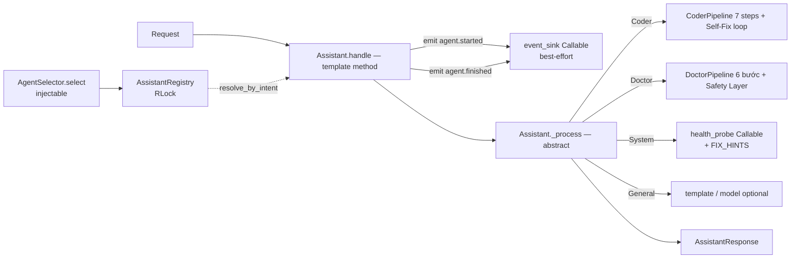

# TASK-013 — M2-P3c: Assistants (General + Coder Pipeline + Doctor Pipeline + Safety Layer + System Doctor)

**Metadata**
- Task ID: `TASK-013`
- Milestone / Phase: M2 (Developer Edition) / P3 (Orchestrator v1 + Assistants)
- Ngày: 2026-08-13
- Trạng thái: `draft` (chờ critique ×2 + review)
- Owner: AIOS Orchestrator
- Module đích: `backend/src/aios_core/agents/` (package mới — Worker Plane)

---

## 1. Mục tiêu

Xây **Worker Plane agents** theo PLAN.md P3: General (chat), Coder pipeline (Requirement→Planner→Generator→Static Analysis→Formatter→Unit Test→Integration Test→Self Fix→Repeat), Doctor pipeline (Symptom Extractor→Medical Knowledge→Risk Assessment→Recommendation→Safety Layer→Final Response), System Doctor (system status) — tất cả **offline-first, deterministic, 0 gọi model mặc định**.

Điểm cốt lõi của task: agents/ là **Worker Plane đầu tiên** — phải tuân 2 bất biến kiến trúc vừa chốt ở TASK-016:

- **INV-001**: Worker Agent KHÔNG truy cập trực tiếp Runtime Service (`aios_core.kernel.services`).
- **INV-002**: Agent KHÔNG gọi Tool trực tiếp (`aios_core.tools`) — chỉ qua Capability (v1 chưa có → dùng callable injectable).

Khi `agents/` ra đời, `test_inv001_worker_no_runtime` + `test_inv002_worker_no_direct_tool` trong `backend/tests/test_architecture.py` **tự hết skip và PHẢI PASS** — đây là mốc kiểm chứng cứng của task (hiện baseline 502 pass + 2 skip).

**Lưu ý C1-01 (resolve)**: `test_inv002_worker_no_direct_tool` hiện có skip condition `not (AGENTS_DIR.is_dir() and TOOLS_DIR.is_dir())` — đòi CẢ `tools/` (TASK-014, out-of-scope) → KHÔNG thể 0 skip. **Task này SỬA skip condition thành chỉ `not AGENTS_DIR.is_dir()`** (forbidden target không cần tồn tại — `dir_imports` chạy được khi chỉ có agents/) — nằm trong In mục 2 #8. Sau task: 0 skip.

## 2. Phạm vi

### In (thuộc `backend/src/aios_core/agents/`)

1. `base.py` — `AssistantRequest`, `AssistantResponse`, `Assistant` (ABC + template method `handle`), contract event sink
2. `general.py` — `GeneralAssistant` (chat deterministic + model optional)
3. `coder.py` — `CoderAssistant` + `CoderResult` + pipeline 7 step callable + vòng lặp Self-Fix (`max_fix_rounds=2`)
4. `doctor.py` — `DoctorAssistant` + `DoctorAssessment` (intermediate) + `DOCTOR_KNOWLEDGE` (KB nhúng demo) + **Safety Layer 4 bất biến**
5. `system_doctor.py` — `SystemDoctor` (health score + suggestions, deterministic)
6. `registry.py` — `AssistantRegistry` (register/get/list/resolve_by_intent, RLock)
7. `__init__.py` — exports; cập nhật `aios_core/__init__.py` (line 5 import list) + `tests/test_import.py`
8. Mở rộng `tests/test_architecture.py`: **rule allow-list mới cho `agents/`** (`test_inv_agents_import_allowlist`) — agents/ chỉ được import `aios_core.models.base` + `aios_core.models.errors` (giống rule B planner), cấm trần `aios_core.models` + provider modules; **sửa skip condition `test_inv002_worker_no_direct_tool` thành chỉ `not AGENTS_DIR.is_dir()`** (C1-01 — không đòi tools/); INV-001/002 tự bật khi package tồn tại
9. 5 file test mới (`test_agents_base.py`, `test_coder_assistant.py`, `test_doctor_assistant.py`, `test_system_doctor.py`, `test_assistant_registry.py`) + cập nhật `test_import.py` (chi tiết mục 8)

### Out (không làm — tránh scope creep)

- **KHÔNG sửa `orchestrator/agent_selector.py`** — registry đứng cạnh, nối qua callable injectable (mục 4.3); wiring chính thức vào `Orchestrator.handle()` → task P3 khác / M4 ExecutionSupervisor
- **KHÔNG sửa kernel** (không thêm EventType — `agent.started`/`agent.finished` ĐÃ tồn tại; không sửa `healthcheck.py`)
- **KHÔNG tạo tools/ hay gọi capabilities/**: TASK-014 sẽ làm; v1 dùng callable injectable
- **KHÔNG có model gọi mặc định**: model optional chỉ ở `GeneralAssistant`; Coder/Doctor/SystemDoctor thuần deterministic 0 token
- **KHÔNG làm prompt registry / memory / session persist** cho agents (đã có ở M1 — nối vào là task khác)
- **KHÔNG làm streaming / async / WebSocket**
- **KHÔNG có knowledge base y tế thật**: `DOCTOR_KNOWLEDGE` là demo nhúng, ghi rõ không phải chẩn đoán

## 3. Input / Output

**Input (phụ thuộc có sẵn):**
- TASK-006: `aios_core/models/base.py` — `ModelContract`, `ChatMessage`, `ChatResponse` (contract — import hợp lệ)
- TASK-016: `tests/_arch_scan.py` (AST scanner: đếm MỌI Import node — kể cả TYPE_CHECKING/try/except), `tests/test_architecture.py` (INV-001/002 sẽ bật, rule B làm mẫu allow-list)
- TASK-004: `EventType.AGENT_STARTED = "agent.started"` / `AGENT_FINISHED = "agent.finished"` (đã tồn tại — event_sink dùng đúng giá trị string, KHÔNG import kernel)
- TASK-010: `AgentSelector.DEFAULT_MAP = {coding: coder, medical: doctor, system: system_doctor, chat: general}` (chỉ dùng để đồng bộ intent string + wiring từ ngoài)
- TASK-012: `failure_recovery.py` (pattern retry loop tham khảo cho Self-Fix)
- `healthcheck.py` — `HealthRegistry.get_all()` (SystemDoctor KHÔNG import — dùng `health_probe` callable; caller adapter)

**Output:**
- `agents/` package (7 file) + 5 file test + cập nhật `test_architecture.py`/`test_import.py`/`aios_core/__init__.py`
- INV-001/002 hết skip và PASS (502 baseline + test mới, 0 skip)
- Coverage module mới ≥ 80%
- Commit + cập nhật `PROGRESS.md`/`LOG.md`

## 4. Kiến trúc

### 4.1 Vị trí module

```
backend/src/aios_core/
├── kernel/                     # Runtime Plane (M1 — ĐÓNG BĂNG, agents/ không import)
│   └── services/               # EventService, ... (INV-001: CẤM từ agents/)
├── orchestrator/               # Control Plane (M2 — INV-005, agents/ không import)
│   ├── agent_selector.py       # intent → agent id (KHÔNG sửa)
│   └── goals/                  # TASK-012
├── models/base.py              # ModelContract, ChatMessage, ChatResponse (contract — DUY NHẤT được import)
├── models/errors.py            # ModelError (được import — catch fallback)
└── agents/                     # ★ TASK-013 — Worker Plane (package mới)
    ├── __init__.py
    ├── base.py                 # AssistantRequest / AssistantResponse / Assistant
    ├── general.py              # GeneralAssistant
    ├── coder.py                # CoderAssistant + CoderResult + default steps
    ├── doctor.py               # DoctorAssistant + DoctorAssessment + DOCTOR_KNOWLEDGE + Safety Layer
    ├── system_doctor.py        # SystemDoctor + FIX_HINTS
    └── registry.py             # AssistantRegistry
```

### 4.2 QUYẾT ĐỊNH: Import allow-list cứng cho `agents/` (rule mới — bổ sung vào `test_architecture.py`)

**Cho phép:** `aios_core.models.base`, `aios_core.models.errors`, pydantic, stdlib (`typing`, `abc`, `re`, `logging`, `ast`, `dataclasses`, `enum`, `threading`, `collections`, `functools` — C2-08 đầy đủ), `__future__`.

**Cấm (mọi Import node — kể cả TYPE_CHECKING, try/except, function-local):**
- `aios_core.kernel.*` → INV-001 (test có sẵn)
- `aios_core.tools` → INV-002 (test có sẵn)
- `aios_core.capabilities`, `aios_core.orchestrator`, `aios_core.workflow`, `aios_core.healthcheck`, `aios_core.memory`, ... (mọi aios_core khác ngoài allow-list)
- `aios_core.models` TRẦN (vì `__init__` re-export providers) + provider modules (`models.openai_provider`, `models.ollama_provider`, `models.mock`, `models.registry`) — copy đúng bài học rule B TASK-016 (C2-01: cấm trần == chính xác, prefix cho nhánh)

Enforcement: test mới `test_inv_agents_import_allowlist` trong `test_architecture.py` — **loop `AGENTS_DIR.rglob("*.py")` + `collect_imports(SRC_ROOT, rel)` gộp set → **loại trừ `aios_core.agents*` (intra-package — R1.2) TRƯỚC khi check subset**; check CẢ 2 ràng buộc (C2-06): `aios_mods ⊆ {"aios_core.models.base", "aios_core.models.errors"}` VÀ `external_top_level ⊆ {"pydantic"} ∪ stdlib_allowed` (stdlib_allowed = {typing, collections, abc, re, logging, ast, dataclasses, enum, threading, functools})** (C1-07 — `dir_imports` không hỗ trợ allow-list toàn package, không cần sửa `_arch_scan.py`). **System Doctor cần health status nhưng KHÔNG được import `healthcheck.py`** → nhận `health_probe: Callable[[], dict]`; caller (orchestrator/CLI/task sau) viết adapter `lambda: {c.name: {"ok": c.status.value == "healthy", "detail": c.message} for c in HealthRegistry().get_all()}`.

### 4.3 QUYẾT ĐỊNH WIRING: registry đứng cạnh AgentSelector — nối bằng callable, không sửa selector

- `AgentSelector` giữ nguyên (intent → agent id string). `AssistantRegistry` key bằng `assistant.name` (khớp id selector: `coder`/`doctor`/`system_doctor`/`general`).
- `AssistantRegistry.__init__(selector: Callable[[str], str | None] | None = None)` — `resolve_by_intent(intent)` gọi `selector(intent)` → `get(name)`. **`selector=None` → `resolve_by_intent` trả `None`** (không tự duy trì bản map riêng — tránh 2 nguồn sự thật drift với `DEFAULT_MAP`; mapping intent→agent là việc của Control Plane, đúng INV-005).
- Wiring mẫu (nằm ở layer ngoài — test tích hợp / task nối Orchestrator, KHÔNG nằm trong agents/):
```python
from aios_core.orchestrator.agent_selector import AgentSelector
from aios_core.agents import AssistantRegistry, GeneralAssistant, CoderAssistant, DoctorAssistant, SystemDoctor
registry = AssistantRegistry(selector=AgentSelector().select)
registry.register(GeneralAssistant())
registry.register(CoderAssistant())
registry.register(DoctorAssistant())
registry.register(SystemDoctor(health_probe=health_probe_adapter))
# request flow (M4 supervisor / task nối): intent từ Rule Engine → registry.resolve_by_intent(intent) → assistant.handle(request)
```
- `Orchestrator.handle()` **không đổi trong task này**; `agents/` độc lập, test tích hợp dùng `AgentSelector` thật để chứng minh khớp intent string.

### 4.4 Luồng dữ liệu



### 4.5 Quan hệ invariant

| Invariant | Trạng thái | Cách tuân thủ |
|---|---|---|
| INV-001 (Worker không chạm Runtime Service) | BẬT khi agents/ tồn tại | agents/ chỉ import allow-list; EventService/HealthRegistry/Pipeline đều qua callable |
| INV-002 (Agent không gọi Tool trực tiếp) | BẬT khi agents/ + tools/ tồn tại | agents/ không import `aios_core.tools`; step pipeline là callable injectable (TASK-014 sẽ nối qua Capability) |
| INV-005 (Control Plane Isolation) | Giữ nguyên | agents/ không import orchestrator; mapping intent→agent vẫn ở AgentSelector |

## 5. Đặc tả chi tiết từng thành phần

Quy ước chung: mọi model `pydantic.BaseModel` + `model_config = ConfigDict(extra="forbid")` + `Field(default_factory=...)`; `from __future__ import annotations`; validate constructor (sai → `ValueError` kèm message rõ — bài học TASK-010/TASK-012).

### 5.1 `base.py` — contract chung

```python
class AssistantRequest(BaseModel):
    model_config = ConfigDict(extra="forbid")
    text: str                      # nội dung user (rỗng/whitespace → handle trả status="error")
    context: dict[str, Any] = Field(default_factory=dict)   # knowledge/rule/session data do caller đưa
    session_id: str | None = None

class AssistantResponse(BaseModel):
    model_config = ConfigDict(extra="forbid")
    text: str                      # phản hồi (hoặc message lỗi khi status="error")
    intent: str = ""               # intent đã xử lý (trace)
    metadata: dict[str, Any] = Field(default_factory=dict)  # cấu trúc theo từng assistant (mục 5.2–5.5)
    status: Literal["ok", "error"] = "ok"

class Assistant(ABC):
    @property
    @abstractmethod
    def name(self) -> str: ...          # khớp agent id của AgentSelector: coder/doctor/system_doctor/general
    @property
    @abstractmethod
    def description(self) -> str: ...   # 1 dòng mô tả nhiệm vụ
    @property
    @abstractmethod
    def intent(self) -> str: ...        # trùng intent rule engine: coding/medical/system/chat
    def __init__(self, event_sink: Callable[[str, dict], None] | None = None)
    def handle(self, request: AssistantRequest) -> AssistantResponse   # template method — không override
    @abstractmethod
    def _process(self, request: AssistantRequest) -> AssistantResponse: ...  # subclass implement
```

**`handle()` — template method (thống nhất mọi assistant):**
1. Validate: `request.text` rỗng/whitespace → trả `AssistantResponse(status="error", text="empty request text", intent=self.intent)` (KHÔNG raise — contract hướng kết quả; lỗi kiểu dữ liệu do pydantic chặn lúc construct).
2. Emit `"agent.started"` — payload `{"agent": name, "intent": intent, "session_id": request.session_id}`.
3. Gọi `self._process(request)`; bọc `except Exception` (bài học: không bắt BaseException) → trả `status="error"`, `text` = message lỗi có ngữ cảnh (`f"{self.name} failed: {exc}"`), metadata `{"error": str(exc)}`.
4. Emit `"agent.finished"` — payload `{"agent": name, "intent": intent, "status": "ok"|"error", "session_id": request.session_id}`. Emit finished kể cả khi _process raise (status="error").
5. Trả response.

**Event sink contract (bắt buộc — mọi assistant dùng chung qua base):**
- Signature: `Callable[[str, dict], None]` — (event_type: str, payload: dict); event_type dùng **string literal `"agent.started"`/`"agent.finished"` — khớp chính xác `EventType.AGENT_STARTED.value`/`AGENT_FINISHED.value` hiện có** (kernel/events.py:21-22) nên caller có thể bridge `lambda et, pl: event_service.emit(EventType(et), pl, source="agents")` — bridge nằm ở layer ngoài.
- **Best-effort**: event_sink raise → `logging.getLogger("aios.agents").warning(...)` (stdlib) + tiếp tục xử lý — event không được làm hỏng response (pattern `EventService._audit` swallow).
- `event_sink=None` → bỏ qua emit (vẫn chạy bình thường).

### 5.2 `general.py` — GeneralAssistant

- `name="general"`, `intent="chat"`, `description="General chat assistant (deterministic template, model optional)"`.
- `__init__(self, model: ModelContract | None = None, event_sink: ... = None)`.
- `_process`:
  1. **Không model** (mặc định): template deterministic — `text = f"Bạn nói: {request.text}"`; nếu `request.context.get("knowledge")` là `list[str]` → append bullet `- {item}` (giới hạn 5 item đầu). **0 gọi model, 0 token.**
  2. **Có model**: `model.chat([ChatMessage(role="user", content=request.text)], temperature=0.7)` → dùng `response.content`; **bọc `except ModelError` trước, `except Exception` sau (C1-08 — phân biệt, không tuple thừa) → fallback template deterministic** (offline-first: model lỗi không làm hỏng chat); metadata `{"model": model.name, "model_called": True}` khi thành công, `{"model_called": False, "model_error": str(exc)}` khi fallback.
- Deterministic khi không model (test: 2 lần gọi cùng input → cùng output).

### 5.3 `coder.py` — CoderAssistant (7 steps + 1 Self-Fix loop = 8 mục theo PLAN — C1-14)

**Models:**
```python
class CoderResult(BaseModel):
    model_config = ConfigDict(extra="forbid")
    code: str
    test_reports: dict[str, Any] = Field(default_factory=dict)   # {"unit": {...}, "integration": {...}}
    issues: list[str] = Field(default_factory=list)              # C2-07: static analysis issues (advisory)
    iterations: int = 0            # số vòng pipeline đã chạy
    passed: bool = False
    history: list[str] = Field(default_factory=list)             # ["requirement", "planner", ..., "fix_round:1", ...]
```

- `name="coder"`, `intent="coding"`, `description="Code generator: requirement → plan → generate → static analysis → format → unit/integration test → self-fix"`.
- `__init__(self, steps: dict[str, Callable] | None = None, max_fix_rounds: int = 2, event_sink: ... = None)` — validate `max_fix_rounds >= 0` (sai → `ValueError`).

**Step contract (C1-03 — key riêng theo tên step, không ghi đè):** mỗi step `Callable[[dict, AssistantRequest], dict]` — `(state, request) -> dict`; **kết quả step được gộp vào `state[step_name]`** (VD `state["unit_test"] = {"passed": ..., "detail": ...}`, `state["integration_test"] = {...}`) — KHÔNG merge phẳng vào state (tránh 2 step ghi đè cùng key `passed`). **Step unit_test/integration_test PHẢI trả dict có key `"passed"` (R3.5 — injected step trong test phải tuân, nếu không pipeline KeyError)**. `state["passed"]` (aggregate) do pipeline tính sau mỗi vòng: **`passed = state["unit_test"]["passed"] and state["integration_test"]["passed"]`** (C1-09 — static_analysis issues là advisory, phản ánh qua metadata, KHÔNG chặn). Key step (7): `"requirement"`, `"planner"`, `"generator"`, `"static_analysis"`, `"formatter"`, `"unit_test"`, `"integration_test"`. **Default stub deterministic cho MỌI key** (thiếu key → dùng default; key lạ ngoài 7 key chuẩn → `ValueError` — deterministic, extra="forbid"-spirit).

**Default stubs (thuần deterministic, offline, 0 model):**
- `requirement`: `state["requirement"] = request.text.strip()`.
- `planner`: `state["plan"] = [f"implement: {requirement}", "validate"]`.
- `generator`: sinh code template hợp lệ `def main(): return <repr(requirement)>` (kèm docstring); **ESCAPE bằng `repr()` (C1-04)** — input chứa `"`/`\` vẫn tạo code `ast.parse` được; **nếu `state["feedback"]` có lỗi** → sinh code phản hồi feedback (v1: gộp feedback vào docstring — **cũng qua `repr()` (C2-09)**, đảm bảo có `main`) — stub đơn giản, test nhánh fix dùng step inject.
- `static_analysis`: `ast.parse(code)` — syntax lỗi → `state["issues"] = [...]`; thiếu `def main` → issue; không lỗi → `[]`.
- `formatter`: chuẩn hóa (strip trailing whitespace, kết thúc `\n`, tab→4 spaces).
- `unit_test`: `ns: dict = {}; exec(code, ns)` (C2-04); `main = ns.get("main")` — thiếu main → `passed=False, detail="no main function"`; gọi `main()` raise → `passed=False, detail=str(exc)`; không raise → `passed=True` (v1 không kiểm tra return value); syntax fail → `passed=False` kèm lỗi parse. Deterministic.
- `integration_test`: stub trả `{"passed": True, "detail": "integration stub"}`.
- **Self-Fix (bước 8 — vòng điều khiển, không phải step callable)**: sau mỗi vòng, nếu `unit/integration` fail:
  1. `state["feedback"] = {"unit": report, "integration": report}` (feedback từ test_reports).
  2. Nếu còn lượt fix (`iteration < 1 + max_fix_rounds`) → vòng mới **chạy lại từ `generator`** (requirement/planner đã có — không chạy lại; deterministic, tiết kiệm); `history.append(f"fix_round:{n}")`.
  3. Hết lượt → dừng, `passed=False`.

**`_process` vòng lặp:**
1. `state = {"request": request.model_dump()}`.
2. `for iteration in 1 .. (1 + max_fix_rounds)`: chạy chuỗi steps theo thứ tự (vòng 1: đủ 7; vòng ≥ 2: từ generator); sau integration_test — tính `state["passed"] = unit.passed and integration.passed` — nếu True → break; else → self-fix như trên.
3. Trả `AssistantResponse(text=..., intent="coding", status="ok", metadata={"result": CoderResult(...).model_dump()})` — text: `f"generated code (iterations={iterations}, passed={passed})"` + `\n\n` + code (rút gọn nếu dài > 2000 ký tự, ghi rõ). `CoderResult.history` ghi từng bước đã chạy (`["requirement", "planner", "generator", "static_analysis", "formatter", "unit_test", "integration_test"]` + `fix_round:n`).
- **Mọi step raise → handle bắt → status="error"** (không retry vô hạn; Self-Fix chỉ xử lý test fail, không xử lý exception — rõ ràng, dễ test).
- Tham khảo pattern retry của `FailureRecovery` (TASK-012) nhưng KHÔNG import — logic lặp nằm trong `_process`.

### 5.4 `doctor.py` — DoctorAssistant (pipeline 6 bước + Safety Layer bất biến)

**Knowledge base demo (nhúng — ghi rõ không phải chẩn đoán thật):**
```python
DOCTOR_KNOWLEDGE: dict[str, dict] = {
    # keyword triệu chứng → {"condition": str, "severity": "low"|"medium"|"high"}
    "đau đầu":   {"condition": "headache (demo)",     "severity": "low"},
    "sốt":       {"condition": "fever (demo)",        "severity": "medium"},
    "sốt cao":   {"condition": "high fever (demo)",   "severity": "high"},
    "ho":        {"condition": "cough (demo)",        "severity": "low"},
    "đau bụng":  {"condition": "abdominal pain (demo)","severity": "medium"},
    "khó thở":   {"condition": "breathing difficulty (demo)", "severity": "high"},
    "đau ngực":  {"condition": "chest pain (demo)",   "severity": "high"},
    "buồn nôn":  {"condition": "nausea (demo)",       "severity": "low"},
}
DANGER_KEYWORDS = ("sốt cao", "khó thở", "đau ngực", "bất tỉnh", "co giật")   # risk → high
MEDICATION_REQUEST_PATTERNS = ("thuốc", "liều", "mg", "kê đơn", "uống gì")    # → refusal sentence
DISCLAIMER = ("Thông tin này chỉ mang tính tham khảo demo, KHÔNG phải chẩn đoán y tế. "
              "Vui lòng hỏi bác sĩ hoặc cơ sở y tế chuyên môn.")
```

**Models:**
```python
class DoctorAssessment(BaseModel):      # intermediate — cho phép test từng bước
    model_config = ConfigDict(extra="forbid")
    symptoms: list[str] = Field(default_factory=list)
    conditions: list[str] = Field(default_factory=list)   # từ KB (kèm "(demo)")
    risk: Literal["low", "medium", "high"] = "low"
    recommendation: str = ""            # ∈ {self_care, see_doctor, emergency}; rỗng khi (d) trigger (C1-11)
    need_more_info: bool = False         # C2-05: (d), (b)∩(d), KB-miss
    disclaimer: str = DISCLAIMER
```

- `name="doctor"`, `intent="medical"`, `description="Medical demo assistant: symptom → knowledge → risk → recommendation (offline, safety-layered)"`.
- `__init__(self, knowledge: dict | None = None, event_sink: ... = None)` — `knowledge=None` → `DOCTOR_KNOWLEDGE`; **validate KB khi init**: mỗi entry phải là dict có `condition: str` + `severity ∈ {low, medium, high}`; keyword rỗng → `ValueError` (deterministic fail-fast).

**`_process` — 6 bước (nội bộ, deterministic; không cần inject step — KB inject được là đủ cho test):**
1. **Symptom Extractor** (keyword/regex, offline): match case-insensitive, **longest-match-first** (sort keyword theo độ dài giảm dần — "sốt cao" thắng "sốt"); **keyword nguồn = union(DEFAULT_KB keys, active KB keys, DANGER_KEYWORDS) (R1.1)** — KB inject chỉ thay thế LOOKUP (bước 2), KHÔNG thu hẹp extractor (mọi keyword default KB luôn match được); KB-miss = keyword match (từ default KB, VD "đau đầu") nhưng không có trong KB đang dùng (inject); `symptoms = [...]` theo thứ tự xuất hiện trong text (danger keyword cũng vào symptoms — C2-01).
2. **Medical Knowledge**: với mỗi symptom → tra KB → `conditions` (dedupe, giữ thứ tự).
3. **Risk Assessment**: `high` nếu có danger keyword TRONG text HOẶC bất kỳ condition severity=high; ngược lại `medium` nếu có severity=medium; ngược lại `low`; **không có symptom nào → KHÔNG đánh giá** (bước 5 sẽ từ chối).
4. **Recommendation** (chỉ khi có symptom): `high → "emergency"` (đến cơ sở y tế/cấp cứu gần nhất, gọi cấp cứu); `medium → "see_doctor"` (đi khám bác sĩ); `low → "self_care"` (nghỉ ngơi, uống nước, theo dõi — **KHÔNG kể tên thuốc/liều**). **C1-06 — có symptom nhưng KHÔNG có condition nào trong KB → `recommendation="see_doctor"` + `need_more_info=True`** (thận trọng — không khuyên "tự chăm sóc" khi không nhận diện được bệnh).
5. **Safety Layer (BẤT BIẾN — 4 điều, kiểm chứng bằng test riêng, mục 7 AC8):**
   - **(a) Mọi response `ok` chứa `DISCLAIMER`** (kể cả response từ chối/hỏi thêm — C1-02; error path thuộc contract chung `handle()` AC2 — không đòi disclaimer).
   - **(b) KHÔNG bao giờ kê đơn/liều thuốc — kiểm tra TRƯỚC (d) và áp dụng cho MỌI response** (C1-05): template response KHÔNG bao giờ echo nội dung thuốc; nếu text chứa pattern `MEDICATION_REQUEST_PATTERNS` → thêm câu từ chối: `"Tôi không kê đơn hoặc gợi ý liều thuốc. Hãy hỏi bác sĩ/dược sĩ."`; metadata `{"medication_refused": True}`; **khi (b)∩(d) (hỏi thuốc nhưng không có symptom) → text = refusal thuốc + câu hỏi thêm + disclaimer, metadata `{"need_more_info": True, "medication_refused": True}`**.
   - **(c) risk=high → recommendation LUÔN là "emergency"** (bất kể recommendation bước 4 tính thế nào — Safety Layer override).
   - **(d) Không trích được symptom nào VÀ không có danger keyword (C2-01) → TỪ CHỐI trả lời y tế**: response text = hỏi thêm thông tin (`"Tôi chưa nhận diện được triệu chứng cụ thể. Bạn có thể mô tả thêm..."`) + disclaimer; KHÔNG có condition/risk/recommendation (assessment rỗng); metadata `{"need_more_info": True}`; status vẫn `ok`. **Danger-only (danger keyword nhưng không KB symptom) → KHÔNG vào (d)**: risk=high, recommendation="emergency" (cấp cứu), danger keyword trong symptoms.**
6. **Final Response**: template deterministic — `"Triệu chứng: {symptoms}. Có thể liên quan: {conditions}. Mức rủi ro: {risk}. Khuyến nghị: {recommendation_text}."` (+ refusal nếu (b)) + `\n\n` + disclaimer.

**metadata** (khi có symptom): `{"symptoms", "conditions", "risk", "recommendation", "disclaimer": True, "medication_refused": bool, "need_more_info": bool}` (C2-05 — 1 key thống nhất 3 nhánh: (d), (b)∩(d), KB-miss).

### 5.5 `system_doctor.py` — SystemDoctor

- `name="system_doctor"`, `intent="system"`, `description="System status reporter: health probe → score → suggestions (deterministic)"`.
- `__init__(self, health_probe: Callable[[], dict] | None = None, event_sink: ... = None)` — **probe contract**: trả `{component: {"ok": bool, "detail": str}}`; `None` → default probe trả `{"aios_core": {"ok": True, "detail": "default probe"}}` (dùng standalone/test).
- **FIX_HINTS (map nhúng, deterministic):** `{"models": "check model config and connectivity", "docker": "start docker daemon", "sandbox": "check sandbox pool status", "database": "check disk space and db connection", ...}` — component fail → hint từ map, không có → `"check component logs and configuration"`.
- `_process`:
  1. Normalize probe output: entry không phải dict/thiếu `ok` → coi `{"ok": False, "detail": "invalid probe entry"}` (defensive, deterministic); **R3.3: probe contract chỉ có {"ok", "detail"} — entry thiếu ok (vd chỉ có status='degraded') → coi fail (worst-wins — C1-12)**.
  2. `health_score = ok_count / total` (total=0 → 0.0); list ok/fail theo thứ tự xuất hiện.
  3. Suggestions: với mỗi component fail → hint (FIX_HINTS hoặc generic).
  4. Response text deterministic: `"Health: {ok}/{total} healthy ({pct:.0f}%)"` + `"OK: a, b"` + `"FAILED: c (hint: ...)"`; `metadata = {"health_score": float, "ok_components": [...], "failed_components": [...], "suggestions": [...]}`.
- probe raise → handle bắt → `status="error"`, text mô tả, metadata `{"error": ...}` (best-effort reporting).

### 5.6 `registry.py` — AssistantRegistry

```python
class AssistantRegistry:
    def __init__(self, selector: Callable[[str], str | None] | None = None):
        # selector: intent → agent name (v1: AgentSelector().select — inject từ ngoài, KHÔNG import)
    def register(self, assistant: Assistant) -> None        # trùng name (cùng hoặc khác instance) → ValueError
    def get(self, name: str) -> Assistant | None
    def list(self) -> list[Assistant]                       # theo thứ tự register
    def resolve_by_intent(self, intent: str) -> Assistant | None
        # selector None → None; selector(intent) → None → None; → get(name)
```
- **Thread-safe**: 1 `threading.RLock` bao toàn bộ register/get/list/resolve (ghi rõ — không cần lock chi tiết hơn v1).
- `register(None)` / không phải Assistant → `TypeError`/`ValueError` rõ ràng.

### 5.7 `__init__.py` + exports

- `agents/__init__.py` exports: `Assistant, AssistantRequest, AssistantResponse, GeneralAssistant, CoderAssistant, CoderResult, DoctorAssistant, DoctorAssessment, DoctorKnowledge (type alias), DOCTOR_KNOWLEDGE, SystemDoctor, AssistantRegistry`.
- Cập nhật `aios_core/__init__.py` line 5: thêm `agents` vào danh sách submodule import (agents chỉ phụ thuộc pydantic + models.base — không có circular import với orchestrator/kernel).
- Cập nhật `tests/test_import.py`: `from aios_core.agents import ...` smoke test.

## 6. Ràng buộc & bài học áp dụng

1. **INV-001/002 là hard gate**: `agents/` KHÔNG import `aios_core.kernel.*`, `aios_core.tools`, `aios_core.capabilities`, `aios_core.orchestrator` — kể cả trong TYPE_CHECKING (`_arch_scan.collect_imports` đếm MỌI Import node — bài học C1-04 TASK-016). Mọi tương tác runtime = callable injectable (`event_sink`, `health_probe`, steps, selector).
2. **Allow-list rule mới cho agents/** (mục 4.2): chỉ `aios_core.models.base` + `aios_core.models.errors` + pydantic + stdlib — học đúng bài học rule B planner (cấm trần `aios_core.models` == chính xác, prefix cho nhánh provider).
3. **pydantic v2**: `extra="forbid"` mọi model; `Field(default_factory=...)` cho mutable; `Literal` cho status/risk; validator/constructor-check cho số âm (`max_fix_rounds`).
4. **`from __future__ import annotations`** + type hints đầy đủ (DI-compatible — sau này đăng ký Container/M4 không phải sửa).
5. **Offline-first**: mặc định 0 gọi model (chỉ GeneralAssistant có model optional); Coder/Doctor/SystemDoctor thuần deterministic — kiểm chứng M2 "tắt LLM → 70–90% request vẫn routing đúng".
6. **Safety Layer bất biến phải có test riêng** (invariant test) — không nằm lẫn trong test happy path.
7. **Best-effort event sink** (bài học `EventService._audit` swallow): event lỗi không làm hỏng response.
8. **Exception phân biệt** (bài học TASK-010): handle bắt `Exception` (không bắt BaseException); message có ngữ cảnh (`f"{name} failed: {exc}"`); lỗi lập trình (validate) raise tại constructor.
9. **Không drift intent string**: agents/ không tự định nghĩa map intent→name; `resolve_by_intent` phụ thuộc selector injectable; test tích hợp dùng `AgentSelector` thật để bắt drift.
10. **EventType không đổi**: `agent.started`/`agent.finished` đã tồn tại — kernel đóng băng, không thêm gì.
11. **Determinism có thể kiểm chứng**: mọi assistant — gọi 2 lần cùng input → cùng output (khi không model); test pin chuỗi output.

## 7. Tiêu chí chấp nhận (Acceptance Criteria)

Mỗi AC kiểm chứng bằng test thật (pytest, offline, 0 model mặc định).

- [ ] **AC1 — Package + exports + INV compliance**: `from aios_core.agents import Assistant, AssistantRequest, AssistantResponse, GeneralAssistant, CoderAssistant, CoderResult, DoctorAssistant, SystemDoctor, AssistantRegistry` pass; **`test_inv001_worker_no_runtime` + `test_inv002_worker_no_direct_tool` HẾT SKIP và PASS** (agents/ không import kernel.services, không import tools); **test allow-list mới pass** (agents/ chỉ import models.base + models.errors + pydantic + stdlib; không `aios_core.models` trần, không provider, không orchestrator/capabilities) (có test).
- [ ] **AC2 — Base handle + event contract**: dummy assistant (test stub) → handle emit qua event_sink đúng 2 event `"agent.started"` + `"agent.finished"` với payload chuẩn (agent/intent/session_id; finished có status); `_process` raise → response `status="error"` + finished event status error; **event_sink raise → response vẫn ok (best-effort)**; `event_sink=None` → không crash; `text` rỗng → `status="error"` (có test).
- [ ] **AC3 — GeneralAssistant deterministic**: không model → 2 lần gọi cùng input → output giống hệt, template đúng, `metadata["model_called"]` không tồn tại; có `context["knowledge"]` → response có bullets; **có model (MockModel) → dùng `model.chat` (mock trả content)**; **model raise ModelError → fallback template + status ok + `metadata["model_error"]`** (có test).
- [ ] **AC4 — Coder happy path (0 model)**: default steps, input "tính tổng 2 số" → `CoderResult.passed=True`, `iterations=1`, `code` parse được bằng `ast.parse`, `test_reports` có unit + integration, `history` đủ 7 bước theo thứ tự; response `status="ok"`, `metadata["result"]["passed"]=True` (có test).
- [ ] **AC5 — Coder Self-Fix loop**: inject `unit_test` fail lượt 1, pass lượt 2 → `iterations=2`, `passed=True`, `history` có `fix_round:1`, **generator stub ghi nhận `state["feedback"]` được truyền**; `max_fix_rounds=0` + unit_test luôn fail → `iterations=1`, `passed=False`; `max_fix_rounds=-1` → `ValueError`; key step lạ → `ValueError` (có test).
- [ ] **AC6 — Coder error path**: inject step raise → `handle()` bắt → response `status="error"` + `metadata["error"]` + finished event status error; **exception KHÔNG propagate ra ngoài (pipeline không crash giữa chừng)** (có test).
- [ ] **AC7 — Doctor happy path**: "tôi bị đau đầu" → risk=low, recommendation=self_care, `conditions=["headache (demo)"]`, text chứa DISCLAIMER; "đau bụng" → medium + see_doctor; **longest-match: "sốt cao" → high (không bị "sốt" medium chiếm)**; `metadata` đủ fields (có test).
- [ ] **AC8 — Safety Layer invariants (test riêng, tham số hóa)**: (a) MỌI response **ok** (happy, high-risk, không triệu chứng, từ chối thuốc) chứa DISCLAIMER (C1-02); (b) input **"tôi đau đầu, nên uống thuốc gì"** (C2-02 — match "thuốc" + "uống gì") → response KHÔNG chứa tên thuốc cụ thể (assert "paracetamol"/"mg" — R3.2, không assert từ "thuốc") + câu từ chối + `metadata["medication_refused"]=True`; (b)∩(d) — "uống thuốc gì" (thuốc, không symptom) → refusal + hỏi thêm + `{"need_more_info": True, "medication_refused": True}`; (c) mọi input risk=high ("đau ngực", "khó thở", **"bất tỉnh" — danger-only C2-01**) → recommendation luôn `emergency` (bất tỉnh: danger keyword vào symptoms, KHÔNG vào (d)); (d) "hôm nay trời đẹp" (không triệu chứng, không thuốc, không danger) → response từ chối + hỏi thêm + `metadata["need_more_info"]=True`, **assert TRÊN response text + metadata (KHÔNG có key risk/conditions/recommendation — R2; không assert field assessment.risk vì model default "low")**, vẫn có DISCLAIMER (có test).
- [ ] **AC9 — Doctor KB inject + validate**: KB tùy biến inject → kết quả theo KB; **KB-miss (R1.1): inject KB chỉ `{"ho": ...}` + text "tôi bị đau đầu" → "đau đầu" match (từ default KB) → lookup miss → conditions=[], risk="low", `recommendation="see_doctor"` + `need_more_info=True`**; KB entry thiếu `severity`/severity sai → `ValueError` khi init; **deterministic: 2 lần cùng input → cùng output** (có test).
- [ ] **AC10 — SystemDoctor deterministic**: probe `{"api": {ok}, "models": {ok}, "docker": {fail}}` → `health_score == 2/3`, ok/fail list đúng, docker fail → suggestion từ FIX_HINTS; probe entry sai format → coi fail + detail "invalid probe entry"; probe raise → `status="error"`; probe None → default ok; 2 lần cùng probe → cùng output (có test).
- [ ] **AC11 — Registry**: register 4 assistant → get theo name, list đúng thứ tự; register trùng name → `ValueError`; get unknown → `None`; **`resolve_by_intent` với selector stub → đúng instance; selector None → `None`; intent không map được → `None`**; **2 thread register/get/list đồng thời → không crash, dữ liệu nhất quán (RLock)** (có test).
- [ ] **AC12 — Tích hợp AgentSelector + chất lượng**: **test tích hợp: register 4 assistant + `AssistantRegistry(selector=AgentSelector().select)` thật → `resolve_by_intent("coding")` là CoderAssistant, "medical"→DoctorAssistant, "system"→SystemDoctor, "chat"→GeneralAssistant** (chứng minh khớp intent string, không drift); `test_import.py` updated pass; pytest toàn bộ pass (baseline 502 + test mới, **0 skip**); **coverage `aios_core/agents/` ≥ 80%**; git sạch sau commit (yêu cầu quy trình).

## 8. Kế hoạch test

5 file test mới trong `backend/tests/` + cập nhật `test_architecture.py` + `test_import.py`:

### `tests/test_agents_base.py` (AC1-part, AC2, AC3)
- `test_inv001_worker_no_runtime` / `test_inv002_worker_no_direct_tool` — KHÔNG còn skip (tự bật, file cũ)
- `test_inv_agents_import_allowlist` — rule mới (file cũ, bổ sung)
- `test_agents_exports` — import smoke (test_import.py cũ, bổ sung)
- `test_dummy_assistant_emits_started_finished` / `test_event_sink_error_best_effort` / `test_event_sink_none` / `test_empty_text_error` / `test_process_raise_error_status` (AC2)
- `test_general_deterministic_template` / `test_general_knowledge_bullets` / `test_general_with_model` / `test_general_model_error_fallback` (AC3)

### `tests/test_coder_assistant.py` (AC4, AC5, AC6)
- `test_coder_happy_path_default_steps` (AC4)
- `test_coder_self_fix_rounds` / `test_coder_feedback_passed_to_generator` / `test_coder_max_rounds_zero` / `test_coder_invalid_max_rounds` / `test_coder_unknown_step_key` (AC5)
- `test_coder_step_raises_error_status` (AC6)

### `tests/test_doctor_assistant.py` (AC7, AC8, AC9)
- `test_doctor_low_risk_self_care` / `test_doctor_medium_see_doctor` / `test_doctor_longest_match_high_fever` (AC7)
- `test_safety_layer_invariants` — tham số hóa 4 bất biến (a/b/c/d) (AC8)
- `test_doctor_inject_knowledge` / `test_doctor_invalid_knowledge_raises` / `test_doctor_deterministic` (AC9)

### `tests/test_system_doctor.py` (AC10)
- `test_system_doctor_score_and_lists` / `test_system_doctor_invalid_probe_entry` / `test_system_doctor_probe_raises` / `test_system_doctor_default_probe` / `test_system_doctor_deterministic`

### `tests/test_assistant_registry.py` (AC11, AC12)
- `test_register_get_list` / `test_register_duplicate_raises` / `test_get_unknown_none` / `test_resolve_by_intent_with_selector` / `test_resolve_selector_none` / `test_resolve_unknown_intent_none` / `test_concurrent_register_list` — **thread test dùng prefix riêng (`worker-a-{i}`/`worker-b-{i}` — bài học STATS #23, C1-13)**
- `test_integration_with_agent_selector` — `AgentSelector().select` thật, 4 intent (AC12)

### Chạy & đánh giá
- `pytest` toàn bộ pass: baseline 502 (TASK-016) + test mới, **0 skip** (INV-001/002 bật)
- `coverage` module `aios_core/agents/` ≥ 80%
- Mọi test offline: không LLM mặc định (chỉ dùng `MockModel` trong test general), không Docker/network, không sleep

## Phụ thuộc

- TASK-006: `aios_core/models/base.py` (`ModelContract`, `ChatMessage`, `ChatResponse` — import hợp lệ duy nhất) + `aios_core/models/errors.py` (`ModelError`)
- TASK-010: `AgentSelector` (chỉ wiring từ layer ngoài — không import từ agents/)
- TASK-016: `_arch_scan.py` + `test_architecture.py` (INV-001/002 bật; rule B làm mẫu allow-list)
- TASK-004: `EventType` values `agent.started`/`agent.finished` (đã tồn tại — KHÔNG sửa kernel)
- TASK-012: pattern retry loop (`failure_recovery.py`) tham khảo cho Self-Fix — không import
- Không dependency mới (pydantic v2 + stdlib đã có)

## Rủi ro

- **R1 — Lọt import kernel/orchestrator vào agents/** (kể cả TYPE_CHECKING): bị INV-001/allow-list test bắt ngay lúc `pytest`; giảm thiểu: allow-list mới + spec cấm tường minh; mọi service qua callable.
- **R2 — Drift intent string giữa registry và AgentSelector**: registry không tự map; test tích hợp AC12 dùng selector thật bắt drift ngay.
- **R3 — Doctor KB bị hiểu là chẩn đoán thật**: disclaimer bất biến (a) + KB ghi rõ `(demo)` + test invariant AC8.
- **R4 — event_sink chậm/raise làm chậm/hỏng handle**: best-effort swallow + test AC2.
- **R5 — Non-determinism do model optional**: mặc định 0 gọi model; chỉ GeneralAssistant có model; test dùng MockModel; test determinism 2 lần gọi.
- **R6 — Coverage agents/ < 80%**: test đủ nhánh fail path (AC5/AC6/AC8/AC10) — không chỉ happy path.
- **R7 — Scope creep** (wiring vào Orchestrator.handle, streaming, KB thật): out-of-scope mục 2; AC giới hạn đúng phạm vi.
