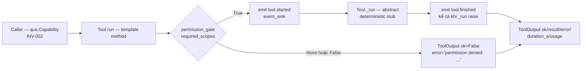

# TASK-014 — M2-P4: Tools 6 loại (Python · Docker · REST · MCP · Shell · Git) + Tool Registry + capability binding

**Metadata**
- Task ID: `TASK-014`
- Milestone / Phase: M2 (Developer Edition) / P4 (Tools + Skills + Sandbox Pool)
- Ngày: 2026-08-13
- Trạng thái: `draft` (chờ critique ×2 + review)
- Owner: AIOS Orchestrator
- Module đích: `backend/src/aios_core/tools/` (package mới — Execution Plane, Tầng 6 theo `docs/architecture.md` §7)
- Baseline: **549 tests pass + 0 skip** (TASK-013), coverage 96.03%

---

## 1. Mục tiêu

Xây **Execution Plane tools** theo PLAN.md P4: 6 loại tool (Python · Docker · REST · MCP · Shell · Git) + `ToolRegistry` + **capability binding** (auto-map tool ↔ capability như mục "Capability Discovery động" PLAN.md: *"Tool tự khai báo `capabilities: [...]` trong ToolContract. Runtime scan registry → auto-map capability ↔ tool. Capability có thể map nhiều tool; router chọn theo health/availability/priority"*).

Điểm cốt lõi của task:

1. **ToolContract chuẩn hóa** — mọi tool khai báo `id`, `capabilities: list[str]`, `metadata: AiOSMetadata`, `available()` (health), `run(ToolInput, ToolContext) -> ToolOutput`; `ToolInput`/`ToolOutput`/`ToolContext` là contract dùng chung (M4 tool usage tracking, dashboard Tool Usage view, capability router P3/M4 đều đọc từ đây).
2. **Offline-first tuyệt đối** — 6 tool là **deterministic stub**, KHÔNG exec/network/docker/git thật (0 side effect), kiểm chứng M2 *"hoạt động offline khi không có LLM"* và mở đường sandbox thật (P4 sandbox pool / M4).
3. **Tuân bất biến kiến trúc TASK-016** — `tools/` là Tầng 6 (Execution Plane), **dưới** Capability (INV-002, INV-004). `tools/` KHÔNG import kernel (`aios_core.kernel.*`), KHÔNG import orchestrator/agents/capabilities — permission gate + event sink đều **qua context injectable** (giống pattern `agents/` TASK-013), để khi sandbox thật/kernel wiring vào M4 không phải sửa contract.
4. **Permission-first**: tool KHÔNG tự quyết — `required_scopes` khai báo trong contract, `ToolContext.permission_gate` (callable injectable) quyết định; gate deny hoặc **gate None (fail-closed)** → `ToolOutput(ok=False, error="permission denied: <scope>")`. Invariant test bắt buộc: tool không bao giờ thực thi side effect nếu không có gate.
5. **Capability binding không sửa `CapabilityRegistry`** — dùng API hiện có (`register_capability` + `bind_tool` — đã idempotent: `if tool_id not in cap.tools: append`), nối qua **callable injectable** để `tools/` không import `capabilities/`.

Khi `tools/` ra đời: `test_inv004_capability_no_tool_impl` (đã cấm `aios_core.tools` từ `capabilities/`) và `test_inv002_worker_no_direct_tool` (agents/ không import tools — đã bật từ TASK-013) **vẫn PASS**; **rule allow-list mới cho `tools/`** được thêm vào `tests/test_architecture.py` — mốc kiểm chứng cứng của task (baseline 549 pass + 0 skip + test mới).

## 2. Phạm vi

### In (thuộc `backend/src/aios_core/tools/`)

1. `base.py` — `ToolInput`, `ToolOutput`, `ToolContext`, `Tool` (ABC + template method `run`), contract event sink + permission gate
2. `python_tool.py` — `PythonTool` (capability `execute_code`, stub: `ast.parse` validate, KHÔNG exec)
3. `docker_tool.py` — `DockerTool` (capability `manage_container`, stub: trạng thái giả)
4. `rest_tool.py` — `RestTool` (capability `call_api`, stub: validate URL/method, mock response, KHÔNG network)
5. `mcp_tool.py` — `McpTool` (capability `mcp_call`, stub: registry MCP server giả, KHÔNG kết nối)
6. `shell_tool.py` — `ShellTool` (capability `run_shell`, stub: KHÔNG exec, LUÔN require scope `shell`)
7. `git_tool.py` — `GitTool` (capability `git_ops`, stub: trạng thái giả, KHÔNG gọi git)
8. `registry.py` — `ToolRegistry` (register/get/list/list_by_capability/tools_for_capability/all_available/capabilities/bind_capabilities, RLock, duplicate → `ValueError`)
9. `__init__.py` — exports + `build_default_tools()` + `build_tool_registry()`; cập nhật `aios_core/__init__.py` (line 5 import list) + `tests/test_import.py`
10. Mở rộng `tests/test_architecture.py`: **rule allow-list mới cho `tools/`** (`test_inv_tools_import_allowlist` — mục 4.2)
11. 3 file test mới (`test_tools_base.py`, `test_tool_stubs.py`, `test_tool_registry.py`) + cập nhật `test_import.py` (chi tiết mục 8)

### Out (không làm — tránh scope creep)

- **KHÔNG thực thi thật bất cứ điều gì**: không `exec`/`eval`/`subprocess`/`os.system`, không gọi Docker daemon, không HTTP/network, không gọi git CLI, không kết nối MCP server thật — v1 100% stub deterministic
- **KHÔNG làm sandbox** (sandbox pool là task P4 riêng, nằm `backend/sandbox/` — sau task này)
- **KHÔNG làm MCP client thật / framework MCP** (chỉ registry giả demo)
- **KHÔNG tích hợp LangChain/LangGraph tool abstraction** (engine-independence ADR-0001 — tools/ là contract thuần)
- **KHÔNG sửa kernel**: `EventType.TOOL_STARTED/TOOL_FINISHED` (`tool.started`/`tool.finished`) **ĐÃ tồn tại** (kernel/events.py:23-24) — không thêm event; không sửa `PermissionService`/`PolicyService`
- **KHÔNG sửa `CapabilityRegistry` API** (`capabilities/registry.py`) — binding qua callable, dùng `bind_tool` có sẵn
- **KHÔNG sửa orchestrator** (capability router chọn tool → M4 / task nối Orchestrator); `tools/` đứng độc lập, test tích hợp dùng `CapabilityRegistry` thật
- **KHÔNG nối `agents/`** — INV-002 giữ nguyên (agent chỉ qua Capability; wiring agent↔tool qua capability → task sau)
- **KHÔNG nối gate với `PermissionService`/`PermissionBroker` thật (C1-16)** — v1 stub gate độc lập (callable test); wiring thật → M4
- **KHÔNG làm CLI expose / API endpoint** cho tool
- **KHÔNG làm streaming / async / retry / timeout thật** (timeout chỉ là field, không enforce)

## 3. Input / Output

**Input (phụ thuộc có sẵn — đều KHÔNG import, dùng value/pattern):**
- TASK-004: `EventType.TOOL_STARTED = "tool.started"` / `TOOL_FINISHED = "tool.finished"` (kernel/events.py:23-24 — **string literal** trong tools/, như agents/ dùng `"agent.started"`)
- TASK-004: `PermissionScope` 8 giá trị (`filesystem`/`network`/`docker`/`shell`/`clipboard`/`git`/`browser`/`camera` — permissions.py:18-27) — tools/ dùng **string literal** scope: python→`"filesystem"`, docker→`"docker"`, rest→`"network"`, mcp→`"network"`, shell→`"shell"`, git→`"git"`
- TASK-009: `CapabilityRegistry.bind_tool(capability, tool_id)` — idempotent, raise `CapabilityError` nếu capability chưa register (chỉ dùng từ layer ngoài/tests qua callable — tools/ KHÔNG import)
- TASK-016: `tests/_arch_scan.py` (`collect_imports`/`dir_imports` — đếm MỌI Import node kể cả TYPE_CHECKING), `tests/test_architecture.py` (pattern allow-list `test_inv_agents_import_allowlist` làm mẫu)
- TASK-013: pattern `agents/` — event sink best-effort, injectable callables, allow-list 2 set
- `aios_core/metadata.py`: `AiOSMetadata` + `make_component_metadata` (DUY NHẤT module aios_core được phép import từ tools/)
- pydantic v2 (đã có)

**Output:**
- `tools/` package (9 file) + 3 file test + cập nhật `test_architecture.py`/`test_import.py`/`aios_core/__init__.py`
- Rule allow-list `tools/` mới PASS; INV-001/002/004 vẫn PASS; **0 skip** (baseline 549 + test mới)
- Coverage module `aios_core/tools/` ≥ 80%
- Commit + cập nhật `PROGRESS.md`/`LOG.md`

## 4. Kiến trúc

### 4.1 Vị trí module

```
backend/src/aios_core/
├── kernel/                     # Runtime Plane (M1 — ĐÓNG BĂNG, tools/ không import)
│   └── services/               # EventService, PermissionService, ... (CẤM từ tools/)
├── capabilities/               # Tầng 5 — Capability Registry (INV-004: KHÔNG import tools/;
│   └── registry.py             #   tools/ CŨNG không import capabilities/ — binding qua callable)
├── agents/                     # Tầng 7 — Worker Plane (INV-002: agents/ không import tools/;
│                               #   tools/ không import agents/ — allow-list bao phủ)
├── orchestrator/               # Control Plane (INV-005 — tools/ không import)
├── models/                     # (tools/ không cần — không import, không như agents/)
├── metadata.py                 # AiOSMetadata + make_component_metadata (DUY NHẤT được import)
└── tools/                      # ★ TASK-014 — Execution Plane (package mới, Tầng 6)
    ├── __init__.py             # exports + build_default_tools() + build_tool_registry()
    ├── base.py                 # ToolInput / ToolOutput / ToolContext / Tool (ABC)
    ├── python_tool.py          # PythonTool      — capability execute_code
    ├── docker_tool.py          # DockerTool      — capability manage_container
    ├── rest_tool.py            # RestTool        — capability call_api
    ├── mcp_tool.py             # McpTool         — capability mcp_call
    ├── shell_tool.py           # ShellTool       — capability run_shell (scope shell BẮT BUỘC)
    ├── git_tool.py             # GitTool         — capability git_ops
    └── registry.py             # ToolRegistry + binding
```

### 4.2 QUYẾT ĐỊNH: Import allow-list cứng cho `tools/` (rule mới — bổ sung vào `test_architecture.py`)

**Cho phép:** `aios_core.metadata` (AiOSMetadata, make_component_metadata — metadata là Infra contract-level M1, không phụ thuộc kernel/services), pydantic, stdlib (`typing`, `collections`, `abc`, `re`, `logging`, `ast`, `threading`, `functools`, `time`, `enum`, `urllib` — `urllib.parse` cho RestTool validate URL; `dataclasses` nếu cần), `__future__`.

**Cấm (mọi Import node — kể cả TYPE_CHECKING, try/except, function-local — `_arch_scan.collect_imports` đếm hết):**
- `aios_core.kernel.*` (mọi thứ) — Execution Plane không phụ thuộc Runtime Plane; event/permission qua context injectable
- `aios_core.capabilities` (INV-004 chiều ngược — binding qua callable)
- `aios_core.agents`, `aios_core.orchestrator`, `aios_core.workflow`, `aios_core.models`, `aios_core.healthcheck`, `aios_core.memory`, `aios_core.contracts`, ... (mọi aios_core khác ngoài `aios_core.metadata` — tools/ là tầng thấp nhất có logic, không phụ thuộc gì ngoài Infra)
- Ngoại trừ intra-package `aios_core.tools*` (R-rule: loại trừ trước khi check subset — copy đúng bài học R1.2 TASK-013)

Enforcement: test mới `test_inv_tools_import_allowlist` trong `test_architecture.py` — **loop `TOOLS_DIR.rglob("*.py")` + `collect_imports(SRC_ROOT, rel)` gộp set → loại trừ `aios_core.tools*` → check CẢ 2 ràng buộc** (kiểu `test_inv_agents_import_allowlist`): `aios_mods ⊆ {"aios_core.metadata"}` VÀ `external_top_level ⊆ {"pydantic", "urllib"} ∪ stdlib_allowed` (stdlib_allowed = {typing, collections, abc, re, logging, ast, threading, functools, time, enum, dataclasses}). Skip condition: `not TOOLS_DIR.is_dir()`. **C1-04 — chặn module con urllib: scan thêm — mọi import chạm `urllib.*` phải == `urllib.parse` (raw source KHÔNG chứa `urllib.request`/`urllib.error`/`urllib.robotparser`)** — đóng lỗ hổng network.

**Hệ quả lưu ý:** `AiOSMetadata` chain-import `healthcheck.py` (transitive) — KHÔNG bị AST scan (scan không đệ quy); không tạo vòng import vì `metadata.py` không import tools/.

### 4.3 QUYẾT ĐỊNH WIRING: permission gate + event sink qua `ToolContext`; capability binding qua callable

- **Tool KHÔNG giữ tham chiếu service nào** — `run()` nhận `ToolContext` (per `run` call, không lưu state):
  - `permission_gate: Callable[[list[str]], bool] | None` — nhận list scope string → True/False; **None = DENY hết (fail-closed)** — invariant: không gate thì không side effect (v1 stub không side effect, nhưng contract chặn từ bây giờ)
  - `event_sink: Callable[[str, dict], None] | None` — `(event_type: str, payload: dict)`; dùng string literal `"tool.started"`/`"tool.finished"` (khớp `EventType.TOOL_STARTED.value`/`TOOL_FINISHED.value` — caller bridge: `lambda et, pl: event_service.emit(EventType(et), pl, source="tools")`); **best-effort** (sink raise → warning + tiếp tục, pattern `EventService._audit` swallow)
  - `extra: dict[str, Any] = Field(default_factory=dict)` — dự phòng (request_id, timeout, ...)
- **Binding qua callable** (không import capabilities/): `ToolRegistry.bind_capabilities(bind_tool: Callable[[str, str], None]) -> int` — gọi `bind_tool(capability, tool_id)` cho từng cặp (tool, cap theo thứ tự register, dedupe cap trong tool). Layer ngoài/tests wire: `lambda cap, tid: capability_registry.bind_tool(cap, tid)`. **Không tự `register_capability`** (CapabilityRegistry là nguồn sự thật capability — nếu cap chưa register → `CapabilityError` propagate fail-fast, rõ ràng).
- `ToolRegistry.capabilities() -> dict[str, list[str]]` — map capability → sorted tool_ids (từ registry state, độc lập CapabilityRegistry — fallback khi chưa bind).

Wiring mẫu (nằm ở layer ngoài — tests / task nối Orchestrator, KHÔNG trong tools/):
```python
from aios_core.capabilities import CapabilityRegistry
from aios_core.tools import build_tool_registry

cr = CapabilityRegistry()
for cap, desc in CAP_DESCRIPTIONS.items():      # execute_code, manage_container, call_api, mcp_call, run_shell, git_ops
    cr.register_capability(cap, desc)
reg = build_tool_registry()
n = reg.bind_capabilities(lambda cap, tid: cr.bind_tool(cap, tid))   # n = 6
assert cr.tools_for("execute_code") == ["tool.python"]
```

### 4.4 Luồng dữ liệu (template method `Tool.run`)



### 4.5 Quan hệ invariant

| Invariant | Trạng thái | Cách tuân thủ |
|---|---|---|
| INV-001 (Worker không chạm Runtime Service) | Giữ nguyên (PASS từ TASK-013) | agents/ không import kernel — tools/ không liên quan; tools/ CŨNG không import kernel (allow-list mới) |
| INV-002 (Agent không gọi Tool trực tiếp) | Giữ nguyên (PASS từ TASK-013) | agents/ không import `aios_core.tools` (test đã bật); chiều ngược tools/→agents cũng cấm (allow-list mới) |
| INV-004 (Capability không phụ thuộc Tool cụ thể) | Giữ nguyên (PASS từ TASK-009) | `capabilities/` không import tools (forbidden đã có sẵn trong test); binding ngược qua callable — tools/ không import capabilities |
| INV-005 (Control Plane Isolation) | Giữ nguyên | tools/ không import orchestrator (allow-list mới) |
| INV-006 (Contracts purity) | Giữ nguyên | tools/ không import kernel.services/events (allow-list mới) |
| INV-007 (Policy first) | Giữ nguyên | Tool chỉ thực thi sau gate (policy/permission nằm ở caller/kernel); v1 stub + fail-closed gate = không side effect không kiểm soát |

## 5. Đặc tả chi tiết từng thành phần

Quy ước chung: mọi model `pydantic.BaseModel` + `model_config = ConfigDict(extra="forbid")` + `Field(default_factory=...)`; `from __future__ import annotations`; validate constructor (sai → `ValueError`/`TypeError` kèm message rõ — bài học TASK-013); **KHÔNG import kernel/capabilities/agents/orchestrator** — dùng string literal scope/event (mục 4.2/4.3).

### 5.1 `base.py` — contract chung

```python
class ToolInput(BaseModel):
    model_config = ConfigDict(extra="forbid")
    tool_id: str                     # phải khớp tool.id — mismatch → ToolOutput(ok=False, error="tool_id mismatch: ...")
    arguments: dict[str, Any] = Field(default_factory=dict)
    session_id: str | None = None

class ToolOutput(BaseModel):
    model_config = ConfigDict(extra="forbid")
    ok: bool
    result: Any = None               # deterministic stub result (dict)
    error: str = ""                  # message lỗi khi ok=False
    duration_s: float = 0.0          # đo thực tế bằng time.perf_counter (≥ 0)
    usage: dict[str, Any] = Field(default_factory=dict)   # {"mode": "stub", "tool_type": ..., "capabilities": [...]}

class ToolContext(BaseModel):
    model_config = ConfigDict(extra="forbid")
    permission_gate: Callable[[list[str]], bool] | None = None   # None = DENY (fail-closed)
    event_sink: Callable[[str, dict], None] | None = None        # (event_type: str, payload: dict)
    extra: dict[str, Any] = Field(default_factory=dict)
```

`Tool` (ABC):
- class attributes (định danh bất biến — không thể override per-instance nếu không cần): `tool_type: Literal[...]`, `required_scopes: tuple[str, ...]`, `capabilities: tuple[str, ...]` — per-tool khai báo; instance attributes: `id`, `name`, `description` (string), `metadata: AiOSMetadata` (constructor: `metadata=None` → `make_component_metadata(id=f"tool.{tool_type}", name=name, version="1.0.0", tags=["tool", tool_type])`), `_available: bool = True` (constructor param `available: bool = True`, validate bool). **C1-06 — `required_scopes` RỖNG → `ValueError` khi init** (cấm carve-out — invariant tuyệt đối "side effect ↔ gate"; 6 tool đều có scope). **C1-14 — contract thread-safe: `_run` KHÔNG mutate instance state (stateless; `_servers` của McpTool read-only sau init)** — instance dùng chung qua registry.
- `available() -> bool` — trả `self._available` (v1 deterministic; subclass override sau này cho health thật).
- `run(self, input: ToolInput, context: ToolContext) -> ToolOutput` — **template method, không override** (C2-02 — đánh số lại 1–6, 1 bước validate duy nhất):
  1. **Validate tool_id**: `input.tool_id != self.id` → `ToolOutput(ok=False, error=f"tool_id mismatch: expected {self.id}, got {input.tool_id}")` (C1-15/C2-02 — trước gate để mismatch không bị che bởi deny; error không chứa scope).
  2. **Gate check (C1-02 — gate raise → fail-closed)**: `context.permission_gate` None → `ToolOutput(ok=False, error=f"permission denied: {', '.join(required_scopes)} (no gate)")`; gate trả False → `ToolOutput(ok=False, error=f"permission denied: {', '.join(required_scopes)}")`; **gate RAISE → bọc try/except Exception → `ToolOutput(ok=False, error="permission denied: ... (gate error)")`** — KHÔNG emit event, KHÔNG gọi _run (side effect bị chặn từ đầu).
  3. Emit `"tool.started"` — payload `{"tool_id": self.id, "tool_type": self.tool_type, "capabilities": list(self.capabilities), "session_id": input.session_id}`.
  4. `t0 = time.perf_counter()` (C2-07 — chốt perf_counter); gọi `self._run(input, context)` (C2-01); bọc `except Exception` (không bắt BaseException — bài học TASK-013) → `ToolOutput(ok=False, error=f"{self.id} failed: {exc}")`; `duration_s = time.perf_counter() - t0` (≥ 0, không sleep — deterministic).
  5. Emit `"tool.finished"` — payload `{"tool_id": self.id, "tool_type": self.tool_type, "capabilities": list(self.capabilities), "session_id": input.session_id, "ok": bool, "duration_s": float}` — **emit kể cả khi _run raise** (status ok=False). (C1-13 — finished có capabilities, đối xứng started, trace cho M4.)
  6. Trả output.
- `_run(self, input: ToolInput, context: ToolContext) -> ToolOutput` — abstract (C1-03: **signature nhận context từ bây giờ** — M4 real exec cần context; stub bỏ qua nhưng contract ổn định); subclass implement stub. **Stub output phải điền `usage = {"mode": "stub", "tool_type": ..., "capabilities": [...]}`** (base helper `_stub_usage()`). **Error paths (deny/mismatch/_run raise) → `usage={}` + `duration_s=0.0` (cố ý — C1-12/C2-07)**; success → usage stub + duration_s ≥ 0 (time.perf_counter — không so sánh trong determinism).
- `__init__` nhận `event_sink: Callable[[str, dict], None] | None = None` — lưu làm **default context sink** khi `ToolContext.event_sink` None (rút gọn wiring; context vẫn override được). **C2-09 — context sink None → dùng constructor sink (KHÔNG có cơ chế tắt per-run v1 — chấp nhận; muốn tắt → truyền sink no-op)**. **Best-effort**: sink raise → `logging.getLogger("aios.tools").warning(...)` + tiếp tục.

**Constructor thống nhất (C2-10):** mọi tool `__init__(self, event_sink=None, available=True, metadata=None, **tool_specific)` — 5.2.1 làm mẫu, áp dụng cả 6 (build_default_tools không rẽ nhánh).

**Event sink contract (bắt buộc — mọi tool dùng chung qua base):** `Callable[[str, dict], None]`; event_type string literal `"tool.started"`/`"tool.finished"` khớp chính xác `EventType.TOOL_STARTED.value`/`TOOL_FINISHED.value` (kernel/events.py:23-24 — caller bridge `EventType(et)` an toàn); sink None → bỏ qua emit.

**Permission gate contract:** `Callable[[list[str]], bool]` — nhận list scope string (`["shell"]`, `["docker"]`, ...) → True cho phép chạy / False từ chối. Scope string literal khớp `PermissionScope.value` (permissions.py:18-27) — cross-check bằng test tích hợp layer ngoài (mục 7 AC9).

### 5.2 6 tool types (deterministic stubs — chi tiết contract từng tool)

Chung (C2-05 — MỌI tool): **`_run` validate arguments: thiếu key bắt buộc hoặc sai kiểu → `ok=False, error="invalid argument: <key> (expected str)"`** — convention thống nhất cả 6 tool (không để KeyError/TypeError bị bọc thành "tool.x failed"). Mỗi tool có `id` cố định, `name`, `description` 1 dòng, `capabilities` (đúng 1 capability v1 — nhưng field là list để forward-compat multi-cap), `required_scopes`, `metadata`. **Mọi stub 0 side effect, 0 sleep, deterministic** — cùng input + context → cùng `result/ok/error/usage` (duration_s chỉ assert ≥ 0). **Không tool nào gọi `exec`/`eval`/`subprocess`/`os.system`/`socket`/`urllib.request`/`requests`/docker/git CLI.** **C1-07 — global no-syscall test: monkeypatch `socket.socket`, `subprocess.run`/`Popen`, `os.system`, `urllib.request.urlopen` → raise AssertionError; chạy 6 tool với input hợp lệ → vẫn ok (chứng minh không syscall/network).**

#### 5.2.1 `python_tool.py` — `PythonTool`
- `id="tool.python"`, `tool_type="python"`, `capabilities=("execute_code",)`, `required_scopes=("filesystem",)` (v1 stub không exec — scope filesystem chỉ là khai báo contract; **C1-08: P4 real exec PHẢI renegotiate scope theo sandbox/capability (code thật đọc/ghi file, network, process — filesystem không mô tả đủ); CALLER WIRING CẢNH BÁO: KHÔNG map gate python→filesystem theo default ALLOW của PermissionService (default filesystem=ALLOW → auto-allow exec code — nguy hiểm)**)
- `__init__(self, event_sink=None, execute: bool = False, available: bool = True, metadata=None)` — **`execute` flag mặc định False; v1 kể cả True VẪN KHÔNG exec** (forward-compat cho sandbox thật — ghi rõ trong `result["note"]`)
- `arguments`: `{"code": str (bắt buộc), "timeout": int | None (field, không enforce)}`
- `_run`: code rỗng/whitespace → `ok=False, error="empty code"`; **`ast.parse(code)`** → syntax lỗi → `ok=False, error=f"python syntax error: {exc.msg} (line {exc.lineno})"`; parse OK → `result = {"mode": "stub", "syntax_ok": True, "executed": False, "note": "not executed (v1 stub — sandbox in P4)"}`. **KHÔNG chạy code** — test invariant: code chứa side effect (`import os; os.remove(...)`) → không có tác động thật.

#### 5.2.2 `docker_tool.py` — `DockerTool`
- `id="tool.docker"`, `tool_type="docker"`, `capabilities=("manage_container",)`, `required_scopes=("docker",)`
- class attr `MOCK_IMAGES: tuple[str, ...] = ("python:3.12-slim", "node:20-alpine", "nginx:latest")` (deterministic, ghi rõ là mock)
- `arguments`: `{"action": str, "image": str | None}` — action whitelist `{"list_images", "inspect", "status"}`
- `_run`: action rỗng/lạ → `ok=False, error="unsupported action: {action}"`; `list_images` → `result={"mode": "stub", "images": list(MOCK_IMAGES), "count": 3}`; `inspect` → `{"mode": "stub", "image": image or "python:3.12-slim", "state": "mock running"}`; `status` → `{"mode": "stub", "daemon": "mock ok", "containers_running": 0}`

#### 5.2.3 `rest_tool.py` — `RestTool`
- `id="tool.rest"`, `tool_type="rest"`, `capabilities=("call_api",)`, `required_scopes=("network",)`
- `arguments`: `{"method": str, "url": str, "headers": dict = {}, "body": dict = {}}`
- `_run`: method uppercase không thuộc `{"GET","POST","PUT","DELETE","PATCH","HEAD"}` → `ok=False, error="unsupported method: ..."`; URL parse bằng `urllib.parse.urlparse` → scheme không phải `http`/`https` HOẶC netloc rỗng → `ok=False, error="invalid url: ..."`; hợp lệ → `result={"mode": "stub", "status_code": 200, "body": {"mock": True, "echo": {"method": method.upper(), "url": url, "body": body}}}` — **KHÔNG gọi network** (không socket/urllib.request/requests)

#### 5.2.4 `mcp_tool.py` — `McpTool`
- `id="tool.mcp"`, `tool_type="mcp"`, `capabilities=("mcp_call",)`, `required_scopes=("network",)` (MCP thật kết nối network — stub không kết nối)
- `_run`: **validate `servers` khi init (C1-10): `dict[str, list[str]]` — key không rỗng, mọi method là str không rỗng, cho phép dict rỗng; C2-08 — cho phép list method RỖNG cho 1 server (server tồn tại nhưng mọi call → "unknown method")**; method không thuộc server → `ok=False, error="unknown method"`; hợp lệ → `result={"mode": "stub", "server": name, "method": method, "response": {"mock": True}}`
- class attr `MCP_SERVERS: dict[str, list[str]] = {"filesystem": ["read_file", "write_file", "list_dir"], "fetch": ["fetch_url"]}` (demo giả — ghi rõ); constructor nhận `servers: dict[str, list[str]] | None = None` (override cho test — validate dict hợp lệ khi init)
- `arguments`: `{"server": str, "method": str, "params": dict = {}}`
- `_run`: server không tồn tại → `ok=False, error="unknown mcp server: {server}"`; method không nằm trong danh sách server → `ok=False, error="unknown method: {server}.{method}"`; hợp lệ → `result={"mode": "stub", "server": ..., "method": ..., "result": {"mock": True, "params": params}}`

#### 5.2.5 `shell_tool.py` — `ShellTool`
- `id="tool.shell"`, `tool_type="shell"`, `capabilities=("run_shell",)`, `required_scopes=("shell",)` — **scope `shell` LUÔN bắt buộc** (safety — kể cả stub; gate deny → từ chối)
- `arguments`: `{"command": str (bắt buộc), "cwd": str | None, "timeout": int | None (field, không enforce)}`
- `_run`: command rỗng/whitespace → `ok=False, error="empty command"`; hợp lệ → `result={"mode": "stub", "executed": False, "exit_code": 0, "stdout": "stub: no execution", "stderr": ""}` — **KHÔNG parse sâu command** (v1 không cần — không bao giờ exec; test invariant: `"touch marker.txt"`/`"rm -rf /"` → không tác động gì)

#### 5.2.6 `git_tool.py` — `GitTool`
- `id="tool.git"`, `tool_type="git"`, `capabilities=("git_ops",)`, `required_scopes=("git",)`
- class attr `MOCK_REPO_STATE: dict = {"branch": "main", "status": "clean", "commits": ["abc1234 init"]}` (mock)
- `arguments`: `{"action": str, "repo": str | None}` — action whitelist `{"status", "branch", "log"}`
- `_run`: action lạ → `ok=False, error="unsupported action: ..."`; `status` → `{"mode": "stub", "branch": "main", "status": "clean"}`; `branch` → `{"mode": "stub", "branch": "main"}`; `log` → `{"mode": "stub", "commits": [...MOCK_REPO_STATE["commits"]]}` — **KHÔNG gọi git CLI**

### 5.3 `registry.py` — ToolRegistry

```python
class ToolRegistry:
    def register(self, tool: Tool) -> None          # None/non-Tool → TypeError/ValueError; trùng id → ValueError
    def get(self, tool_id: str) -> Tool | None      # unknown → None (không raise — như AssistantRegistry)
    def list(self) -> list[Tool]                    # theo thứ tự register
    def list_by_capability(self, capability: str) -> list[Tool]   # tool.capabilities chứa cap; cap lạ → []
    def tools_for_capability(self, capability: str) -> list[Tool] # alias của list_by_capability (API friendly — user yêu cầu cả 2)
    def all_available(self) -> list[Tool]           # lọc available() == True, giữ thứ tự register
    def capabilities(self) -> dict[str, list[str]]  # cap → sorted tool_ids (độc lập CapabilityRegistry)
    def bind_capabilities(self, bind_tool: Callable[[str, str], None]) -> int   # trả số cặp đã bind
```
- **Thread-safe**: 1 `threading.RLock` bao toàn bộ method mutating + reading (register/get/list/list_by_capability/all_available/capabilities/bind_capabilities — copy bài học TASK-013).
- `bind_capabilities`: duyệt tool theo thứ tự register; với mỗi tool, từng cap trong `tool.capabilities` (dedupe giữ thứ tự): `bind_tool(cap, tool.id)`; đếm cặp; **raise propagate** (fail-fast — cap chưa register → `CapabilityError` từ caller). **C2-06 — KHÔNG rollback khi raise giữa chừng (caller tự xử lý — fail-fast đủ v1)**. **Idempotent**: bind 2 lần → không trùng tool_id trong capability (nhờ `CapabilityRegistry.bind_tool` đã idempotent — verify: capabilities/registry.py `if tool_id not in cap.tools: cap.tools.append(tool_id)`).

### 5.4 `__init__.py` + factory

- Exports: `Tool, ToolInput, ToolOutput, ToolContext, PythonTool, DockerTool, RestTool, McpTool, ShellTool, GitTool, ToolRegistry, build_default_tools, build_tool_registry`.
- `build_default_tools() -> list[Tool]` — 6 tool metadata mặc định (version `"1.0.0"`, author `"AIOS"`, license `"MIT"`, tags `["tool", <tool_type>]`), thứ tự cố định: python, docker, rest, mcp, shell, git — **deterministic**.
- `build_tool_registry() -> ToolRegistry` — register 6 tool từ `build_default_tools()`.
- Cập nhật `aios_core/__init__.py` line 5: thêm `tools` vào import list (tools/ chỉ phụ thuộc pydantic + metadata — không circular).
- Cập nhật `tests/test_import.py`: `from aios_core.tools import ...` smoke test.

## 6. Ràng buộc & bài học áp dụng

1. **`tools/` import rule là hard gate**: KHÔNG import `aios_core.kernel.*`, `aios_core.capabilities`, `aios_core.agents`, `aios_core.orchestrator`, `aios_core.models`, `aios_core.healthcheck` — kể cả TYPE_CHECKING (`collect_imports` đếm MỌI Import node). Mọi tương tác = callable injectable (`permission_gate`, `event_sink`, `bind_tool`).
2. **Allow-list rule mới cho tools/** (mục 4.2): chỉ `aios_core.metadata` + pydantic + stdlib — copy đúng pattern `test_inv_agents_import_allowlist` (2 set + loại trừ intra-package trước khi check subset).
3. **Offline-first tuyệt đối**: stub deterministic, 0 exec/network/docker/git/MCP thật — test invariant bắt buộc (side-effect code không có tác động; no-exec marker test).
4. **Fail-closed permission**: `permission_gate=None` = DENY — không có ngoại lệ; test verify mọi tool.
5. **Event string literal**: `"tool.started"`/`"tool.finished"` khớp `EventType` value — kernel đóng băng, không thêm gì (đã tồn tại từ TASK-011/F-005).
6. **Scope string literal** khớp `PermissionScope.value` (`filesystem/network/docker/shell/git`) — cross-check bằng test layer ngoài import `PermissionScope` (tools/ không import nhưng test được phép).
7. **pydantic v2**: `extra="forbid"` mọi model; `Field(default_factory=...)` cho mutable; `Literal` cho tool_type; validate constructor fail-fast (`ValueError`/`TypeError` rõ message).
8. **`from __future__ import annotations`** + type hints đầy đủ (DI-compatible — đăng ký Container/M4 sau này không phải sửa).
9. **Best-effort event sink** (bài học `EventService._audit` swallow — TASK-013): sink raise → warning + response vẫn ok.
10. **Exception phân biệt** (bài học TASK-010/013): `run` bắt `Exception` (không bắt BaseException); message có ngữ cảnh (`f"{id} failed: {exc}"`); lỗi lập trình validate tại constructor.
11. **Determinism kiểm chứng được**: 2 lần run cùng input+context → cùng `result/ok/error/usage` (duration_s chỉ assert ≥ 0); output stub pin chuỗi trong test.
12. **Không sửa API có sẵn**: CapabilityRegistry giữ nguyên (dùng `bind_tool` idempotent); kernel giữ nguyên; `agents/` giữ nguyên.
13. **Capability-first (ADR-0002)**: tool khai báo capability, registry map — orchestrator sau này chỉ chọn capability (PLAN P3), không chọn tool trực tiếp.

## 7. Tiêu chí chấp nhận (Acceptance Criteria)

Mỗi AC kiểm chứng bằng test thật (pytest, offline, 0 side effect).

- [ ] **AC1 — Package + exports + architecture rules**: `from aios_core.tools import Tool, ToolInput, ToolOutput, ToolContext, PythonTool, DockerTool, RestTool, McpTool, ShellTool, GitTool, ToolRegistry, build_default_tools, build_tool_registry` pass; **`test_inv_tools_import_allowlist` PASS** (tools/ chỉ import `aios_core.metadata` + pydantic + stdlib; KHÔNG kernel/capabilities/agents/orchestrator/models/healthcheck); **INV-001/002/004 vẫn PASS** (không hồi quy); pytest toàn bộ **0 skip** (có test).
- [ ] **AC2 — ToolContract models + template method**: `ToolInput`/`ToolOutput`/`ToolContext` extra="forbid", defaults đúng; `ToolOutput.duration_s >= 0`; `input.tool_id` mismatch → `ok=False, error` chứa "tool_id mismatch"; `_run` raise → `ok=False, error=f"{id} failed: ..."` + finished event status error; constructor validate sai kiểu → `TypeError`/`ValueError` (có test).
- [ ] **AC3 — PythonTool stub**: code hợp lệ → `result["syntax_ok"]=True, executed=False`, usage mode=stub; **syntax lỗi → `ok=False, error` chứa "python syntax error"**; **code rỗng → error "empty code"**; **arguments thiếu key/sai kiểu → error "invalid argument: code (expected str)" (C1-05)**; **NO-EXEC invariant (C1-01 — assertion ĐÚNG CHIỀU): tạo marker trước → chạy code `"import os; os.remove('<marker>')"` + gate allow → marker VẪN tồn tại (không bị xóa → chứng minh không exec)**; `execute=True` vẫn không exec (`executed=False` + note); 2 lần run cùng input → cùng result (có test).
- [ ] **AC4 — DockerTool stub**: `list_images` → 3 images mock đúng thứ tự; `inspect`/`status` → result đúng; **action lạ/trống → `ok=False, error` chứa "unsupported action"**; không gọi docker thật (chỉ assert stub result) (có test).
- [ ] **AC5 — RestTool stub**: GET/POST hợp lệ → `status_code=200`, body echo đúng method/url/body; **method không thuộc whitelist → error "unsupported method"**; **URL sai scheme (`ftp://`, `not-a-url`) → error "invalid url"**; KHÔNG network (test chạy offline, không socket) (có test).
- [ ] **AC6 — McpTool stub**: `servers={"filesystem": [...]}` default → `read_file` OK; **server lạ → error "unknown mcp server"**; **method lạ → error "unknown method"**; inject `servers` override → dùng đúng registry inject; `servers` sai kiểu → `ValueError` khi init (có test).
- [ ] **AC7 — ShellTool stub**: command hợp lệ → `executed=False, exit_code=0, stdout="stub: no execution"`; command rỗng → error "empty command"; **NO-EXEC invariant: `"touch marker.txt"` (hoặc `"rm -rf"`) + gate allow → marker KHÔNG được tạo**; **gate deny scope "shell" → `ok=False, error` chứa "permission denied: shell"** (có test).
- [ ] **AC8 — GitTool stub**: `status`/`branch`/`log` → result mock đúng (`branch="main"`, `status="clean"`); action lạ → error "unsupported action"; không gọi git CLI (có test).
- [ ] **AC9 — Permission gate invariants (MỌI tool, tham số hóa)**: gate trả False cho scope cần thiết → `ok=False, error` chứa `"permission denied: <scope>"` (python→filesystem, docker→docker, rest→network, mcp→network, shell→shell, git→git) + **KHÔNG emit started/finished**; **gate None (fail-closed) → `ok=False` error chứa "no gate"**; **gate RAISE → `ok=False` error chứa "(gate error)" + KHÔNG emit event (C1-02)**; **cross-check: scope string khớp `PermissionScope.value`** (test layer ngoài import `aios_core.kernel.services.permissions` — tools/ không import, test được phép) (có test).
- [ ] **AC10 — Event contract**: run thành công → emit đúng 2 event `"tool.started"` + `"tool.finished"` payload chuẩn (tool_id/tool_type/capabilities/session_id; finished có ok + duration_s); `_run` raise → vẫn emit finished status ok=False; **event_sink raise → output vẫn ok (best-effort)**; sink None (context + constructor) → không crash (có test).
- [ ] **AC11 — Registry**: register/get/list đúng thứ tự; **register trùng id → `ValueError`**; get unknown → `None`; register None/non-Tool → `TypeError`/`ValueError`; `list_by_capability` và alias `tools_for_capability` trả đúng tool; cap lạ → `[]`; `all_available()` lọc tool `available()=False` (set qua constructor) giữ thứ tự; `capabilities()` map đúng cap → sorted tool_ids; **2 thread register/list đồng thời → không crash, dữ liệu nhất quán (C1-17: register xong → get/list thấy ngay; count đúng; không mất update; không exception) (RLock)** (có test).
- [ ] **AC12 — Capability binding**: dùng `CapabilityRegistry` THẬT (layer ngoài) + lambda → `bind_capabilities` trả **số cặp ĐÃ xử lý = tổng capabilities khai báo (luôn 6 kể cả lần 2 — C1-11)**; `cr.tools_for("execute_code") == ["tool.python"]`, `tools_for("run_shell") == ["tool.shell"]`, ...; **idempotent: bind 2 lần → tools_for không trùng (C1-11 — test lần 2 pin kết quả = 6, tools_for vẫn 1 phần tử)**; **capability chưa register → raise propagate** (test: `bind_capabilities` với registry rỗng → `CapabilityError`); **minh chứng capability-first: register capability trước + tool swap (bind tool khác vào cùng cap) → `tools_for` cập nhật, không đổi tool contract** (có test).
- [ ] **AC13 — Factory + metadata**: `build_default_tools()` trả đúng 6 tool (đủ 6 loại, thứ tự cố định, id `tool.python`...); `build_tool_registry()` register đủ 6 + `get("tool.python")` trả PythonTool; mỗi tool có `metadata.version` semver hợp lệ + `available()` mặc định True; `metadata` inject custom được (có test).
- [ ] **AC14 — Determinism + chất lượng tổng**: mọi tool — 2 lần run cùng input + context → `result/ok/error/usage` giống hệt (duration_s ≥ 0); `test_import.py` cập nhật pass; **pytest toàn bộ pass (baseline 549 + test mới, 0 skip)**; **coverage `aios_core/tools/` ≥ 80%**; git sạch sau commit (yêu cầu quy trình).

## 8. Kế hoạch test

3 file test mới trong `backend/tests/` + cập nhật `test_architecture.py` + `test_import.py`:

### `tests/test_tools_base.py` (AC1-part, AC2, AC9-part, AC10)
- `test_tools_exports` — import smoke (test_import.py cũ, bổ sung)
- `test_inv_tools_import_allowlist` — rule mới (test_architecture.py cũ, bổ sung — skip nếu `TOOLS_DIR` chưa tồn tại)
- `test_tool_input_output_context_contract` — extra=forbid, defaults, duration_s ≥ 0 (AC2)
- `test_tool_id_mismatch_error` / `test_run_process_raises_error_status` (AC2)
- `test_permission_gate_denied_all_tools` — tham số hóa 6 tool (AC9)
- `test_permission_gate_none_fail_closed` (AC9)
- `test_scope_strings_match_permission_scope` — cross-check `PermissionScope` (AC9)
- `test_tool_events_started_finished` / `test_tool_events_on_error` / `test_event_sink_raises_best_effort` / `test_event_sink_none` (AC10)

### `tests/test_tool_stubs.py` (AC3–AC8 + no-exec invariants)
- `test_python_tool_ok` / `test_python_tool_syntax_error` / `test_python_tool_empty_code` / `test_python_tool_invalid_argument` (C2-05) / `test_python_tool_no_exec_side_effect` (marker file — C1-01 assert marker VẪN tồn tại) / `test_python_tool_execute_flag_no_exec` / `test_python_tool_deterministic` (AC3)
- `test_docker_tool_list_inspect_status` / `test_docker_tool_unsupported_action` / `test_docker_tool_invalid_argument` (AC4, C2-05)
- `test_rest_tool_ok` / `test_rest_tool_unsupported_method` / `test_rest_tool_invalid_url` / `test_rest_tool_invalid_argument` (AC5, C2-05)
- `test_mcp_tool_ok` / `test_mcp_tool_unknown_server` / `test_mcp_tool_unknown_method` / `test_mcp_tool_inject_servers` / `test_mcp_tool_invalid_servers_raises` / `test_mcp_tool_invalid_argument` (AC6, C2-05)
- `test_shell_tool_ok` / `test_shell_tool_empty_command` / `test_shell_tool_no_exec_side_effect` (marker) / `test_shell_tool_invalid_argument` (AC7, C2-05)
- `test_git_tool_status_branch_log` / `test_git_tool_unsupported_action` / `test_git_tool_invalid_argument` (AC8, C2-05)
- **`test_no_syscall_all_tools` (C2-03 — global): monkeypatch `socket.socket`, `subprocess.run`/`Popen`, `os.system`, `urllib.request.urlopen` → raise AssertionError; chạy 6 tool với input hợp lệ → ok=True (chứng minh 0 syscall/network)** (AC4/5/6/8 no-syscall)

### `tests/test_tool_registry.py` (AC11, AC12, AC13, AC14)
- `test_register_get_list` / `test_register_duplicate_raises` / `test_register_invalid_raises` / `test_get_unknown_none` / `test_list_by_capability_and_alias` / `test_all_available_filters` / `test_capabilities_map` / `test_concurrent_register_list` — thread test dùng prefix riêng (bài học STATS #23) (AC11)
- `test_bind_capabilities_with_real_registry` / `test_bind_idempotent` (lần 2 pin = 6, tools_for vẫn 1 phần tử — C1-11) / `test_bind_unknown_capability_raises` / `test_capability_swap_tools` — dùng `CapabilityRegistry` thật từ layer ngoài (AC12)
- `test_build_default_tools` / `test_build_tool_registry` / `test_tool_metadata_valid` (AC13)
- `test_tools_deterministic_repeat_run` — tham số hóa 6 tool, 2 lần run so sánh (AC14)
- **`test_tool_concurrent_runs_same_instance` (C2-04): 2 thread × N run cùng 1 PythonTool instance + cùng input → cùng result/ok/usage** (contract stateless — C1-14)

### Chạy & đánh giá
- `pytest` toàn bộ pass: baseline 549 (TASK-013) + test mới, **0 skip** (INV-001/002/004 + allow-list mới pass)
- `coverage` module `aios_core/tools/` ≥ 80%
- Mọi test offline: không exec/network/docker/git thật, không sleep, không LLM

## Phụ thuộc

- TASK-004: `EventType.TOOL_STARTED/TOOL_FINISHED` values `tool.started`/`tool.finished` (đã tồn tại — dùng string literal, KHÔNG import kernel); `PermissionScope` values (filesystem/network/docker/shell/git — string literal, cross-check ở test)
- TASK-009: `CapabilityRegistry` (`register_capability` + `bind_tool` idempotent — chỉ dùng từ layer ngoài qua callable)
- TASK-016: `_arch_scan.py` + `test_architecture.py` (pattern allow-list `test_inv_agents_import_allowlist` làm mẫu; INV-004 forbidden đã có `aios_core.tools`)
- TASK-013: pattern `agents/` (injectable callables, event sink best-effort, allow-list 2 set, RLock registry) — tham khảo, KHÔNG import
- `aios_core/metadata.py`: `AiOSMetadata` + `make_component_metadata` (import hợp lệ duy nhất)
- Không dependency mới (pydantic v2 + stdlib đã có)

## Rủi ro

- **R1 — Lọt import kernel/capabilities/orchestrator vào tools/** (kể cả TYPE_CHECKING): bị allow-list test bắt ngay lúc `pytest`; giảm thiểu: rule mới `test_inv_tools_import_allowlist` + spec cấm tường minh; mọi service qua context injectable.
- **R2 — Stub bị "nâng cấp" vô tình thành exec thật** (thêm `exec`/`subprocess`/requests vào `_run`): bị no-exec invariant test bắt (marker file test cho PythonTool + ShellTool) + review; v1 cứng nhắc stub-only.
- **R3 — Drift scope string vs `PermissionScope` / event string vs `EventType`**: string literal cố định khớp giá trị hiện có; test cross-check AC9/AC10 dùng enum thật bắt drift ngay khi kernel đổi.
- **R4 — Gate None bị hiểu là "cho phép"**: fail-closed rõ trong spec + test AC9 riêng; error message chứa "(no gate)" để debug dễ.
- **R5 — Bind vào capability chưa register làm crash flow**: propagate fail-fast + spec yêu cầu caller register trước; test AC12 xác nhận hành vi (không nuốt lỗi — lỗi wiring phải lộ).
