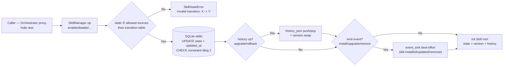

# TASK-015 — M2-P4: Skills (lifecycle 10 trạng thái) + Skill Manager (zip/git/pip) + Sandbox Pool

**Metadata**
- Task ID: `TASK-015`
- Milestone / Phase: M2 (Developer Edition) / P4 (Tools + Skills + Sandbox Pool)
- Ngày: 2026-08-13
- Trạng thái: `draft` (chờ critique ×2 + review)
- Owner: AIOS Orchestrator
- Module đích: `backend/src/aios_core/skills/` + `backend/src/aios_core/sandbox/` (2 package mới — Execution Plane, Tầng 6 theo `docs/architecture.md` §7)
- Baseline: **622 tests pass + 0 skip** (TASK-014), coverage 96.15%

---

## 1. Mục tiêu

Xây **Execution Plane skills + sandbox** theo PLAN.md P4:

1. **Skill Lifecycle đầy đủ 10 trạng thái** (PLAN.md "Skill Lifecycle đầy đủ"): `Resolve → Validate → Install → Enable → Disable → Unload → Reload → Upgrade → Rollback → Remove` — *"Enable/Disable/Unload cho phép tắt tạm plugin không cần gỡ. Trạng thái persist trong DB."*
2. **Skill Manager** (PLAN.md "Skill Manager Proxy" — logic tách ra `skills/`): *"tìm/cài/update/rollback/enable/disable skill, resolve dependency, kiểm tra compatibility"* — 3 nguồn `zip/git/pip` qua `source_loader` injectable, **v1 100% stub deterministic, offline-first** (0 download/network/git/pip thật — kiểm chứng M2 *"hoạt động offline khi không có LLM"*).
3. **Sandbox Pool** (PLAN.md "Sandbox Pool"): *"Pool tái sử dụng container theo ngôn ngữ (python/node/go...), warm-start, health check, reset state giữa lần chạy, eviction khi idle"* — v1 stub deterministic, KHÔNG Docker thật.
4. **Kiến trúc ràng buộc (TASK-016)**: `skills/` + `sandbox/` là Execution Plane (giống `tools/` TASK-014) — allow-list import cứng, mọi service qua callable injectable, tuân INV-001/002/004/005/006.

Điểm cốt lõi:

- **State machine 10 trạng thái TƯỜNG MINH**: bảng transitions đầy đủ (mục 5.1.2), enforce 2 tầng — mã nguồn (`SkillState` + transition map) + **CHECK constraint trong SQLite** (bài học TASK-012: state machine enforced cả code lẫn DB).
- **DB là nguồn sự thật duy nhất cho trạng thái skill** (pattern TASK-012: connection-per-call + `busy_timeout` + `closing`): mọi lifecycle op đều ghi state vào bảng `skills`; `SkillRegistry` là **read-through view đọc thẳng DB** (không in-memory state riêng → không drift); restart manager (instance mới, cùng `db_path`) → trạng thái + history còn nguyên.
- **Upgrade/Rollback theo history stack**: `upgrade(id, new_version)` push manifest+version hiện tại vào `history_json`, so sánh semver nội bộ (stdlib-only — `aios_core.semver` nằm ngoài allow-list); `rollback(id)` pop stack → về version trước; rollback khi history rỗng → `SkillStateError`.
- **Event sink best-effort**: 3 event `SKILL_INSTALLED`/`SKILL_UPDATED`/`SKILL_REMOVED` **ĐÃ tồn tại** (`kernel/events.py:30-32`: `skill.installed`/`skill.updated`/`skill.removed` — đã verify) — dùng string literal, **KHÔNG sửa kernel, KHÔNG thêm event mới**; install/upgrade/remove emit, các op còn lại không emit (không có EventType tương ứng — ghi rõ trong mục 5.2).
- **SandboxPool reuse + warm-start + evict**: acquire ưu tiên idle cùng language (warm) → tạo mới (cold, nếu dưới `max_size`) → evict idle hết hạn khi đầy → raise nếu vẫn đầy; `evict_idle()` thủ công (KHÔNG thread nền — deterministic, 0 flaky); RLock (KHÔNG Condition — không blocking wait).

Khi `skills/` + `sandbox/` ra đời: toàn bộ test invariant hiện có vẫn PASS; **2 rule allow-list mới** được thêm vào `tests/test_architecture.py` (mục 4.2) — mốc kiểm chứng cứng của task (baseline 622 pass + 0 skip + test mới).

## 2. Phạm vi

### In (thuộc `backend/src/aios_core/skills/` + `backend/src/aios_core/sandbox/`)

1. `skills/base.py` — `SkillState` (10 trạng thái), `SkillManifest`, `Skill`, transition map + helper `assert_transition`
2. `skills/manager.py` — `SkillManager` (lifecycle 10 op: resolve/validate/install/enable/disable/unload/reload/upgrade/rollback/remove + SQLite persist + event sink)
3. `skills/registry.py` — `SkillRegistry` (read-through DB: register/get/list/list_by_state/list_by_capability, RLock, duplicate → `ValueError`)
4. `skills/zip_source.py` — `ZipSource` (stub deterministic, KHÔNG zipfile/network)
5. `skills/git_source.py` — `GitSource` (stub deterministic, KHÔNG git CLI)
6. `skills/pip_source.py` — `PipSource` (stub deterministic, KHÔNG pip/network)
7. `skills/__init__.py` — exports + `build_skill_manager()`; cập nhật `aios_core/__init__.py` (line 5 import list) + `tests/test_import.py`
8. `sandbox/sandbox.py` — `SandboxState`, `Sandbox`, `SandboxResult`, `SandboxPoolError`
9. `sandbox/pool.py` — `SandboxPool` (acquire/release/execute/health/evict_idle, RLock)
10. `sandbox/__init__.py` — exports + `build_sandbox_pool()`
11. Mở rộng `tests/test_architecture.py`: **2 rule allow-list mới** (`test_inv_skills_import_allowlist` + `test_inv_sandbox_import_allowlist` — mục 4.2)
12. 4 file test mới (`test_skills_base.py`, `test_skill_manager.py`, `test_skill_sources.py`, `test_sandbox_pool.py`) + cập nhật `test_import.py` (chi tiết mục 8)

### Out (không làm — tránh scope creep)

- **KHÔNG download/cài thật**: không tải zip, không clone git, không pip install, không network, không `subprocess`/`os.system`/`zipfile` đọc file thật — 3 source 100% stub deterministic từ dữ liệu cấu hình/dict mẫu
- **KHÔNG Docker thật**: sandbox là mock in-memory (không container, không image, không exec code)
- **KHÔNG cơ chế plugin runtime thật** (load module skill vào tiến trình): enable/disable/unload/reload chỉ là state transition + persist (không đụng `importlib`/module loading thật)
- **KHÔNG skill marketplace** (M3 P5 — Skill Marketplace view; M5 — marketplace server)
- **KHÔNG upgrade pipeline đầy đủ M4/P7** (Compatibility Check → Dependency Resolution → Backup → Migration → Health Check → Rollback): v1 chỉ version bump + history stack; contract compatibility sâu → P7
- **KHÔNG sửa kernel**: `EventType.SKILL_*` (3 giá trị) ĐÃ tồn tại — không thêm event; không sửa `EventService`/`PermissionService`/`PolicyService`
- **KHÔNG sửa `orchestrator/`**: `skill_manager_proxy` (Control Plane) nối vào `skills/` → task nối Orchestrator sau (M2 còn lại / M3); `skills/` đứng độc lập, test tích hợp dùng callable
- **KHÔNG import `tools/`, `contracts/`, `capabilities/`, `semver`** vào `skills/`/`sandbox/` (allow-list mục 4.2 — kể cả `aios_core.semver`: so sánh semver bằng helper nội bộ stdlib-only)
- **KHÔNG nối `agents/`** (INV-001/002 giữ nguyên — agent chỉ qua Capability)
- **KHÔNG thread nền trong sandbox** (không eviction tự động, không warm-up background — deterministic, tránh flaky test); `evict_idle()` gọi thủ công
- **KHÔNG persist sandbox pool** (in-memory — sandbox là runtime resource; persist → M4)
- **KHÔNG CLI expose / API endpoint** cho skill/sandbox
- **KHÔNG async/streaming/timeout thật** trong sandbox execute (timeout chỉ là field)
- **KHÔNG cho phép re-install cùng id sau `removed`** (soft-delete giữ record; v1 không cho resolve lại id đã tồn tại — mục 5.2)

## 3. Input / Output

**Input (phụ thuộc có sẵn — đều KHÔNG import, dùng value/pattern):**
- PLAN.md: "Skill Lifecycle đầy đủ" (10 trạng thái, persist DB), "Sandbox Pool" (reuse theo ngôn ngữ, warm-start, health, reset state, evict idle), "Skill Manager Proxy" (find/install/update/rollback/enable/disable, resolve dependency, compatibility)
- TASK-004/TASK-011: `EventType.SKILL_INSTALLED = "skill.installed"` / `SKILL_UPDATED = "skill.updated"` / `SKILL_REMOVED = "skill.removed"` (kernel/events.py:30-32 — **đã verify tồn tại**; dùng **string literal** trong skills/, như tools/ dùng `"tool.started"`)
- TASK-012: pattern SQLite `orchestrator/goals/` — connection-per-call + `PRAGMA busy_timeout=5000` + `closing` + `mkdir(parents=True, exist_ok=True)` + state machine enforce 2 tầng (code + CHECK constraint)
- TASK-014: pattern `tools/` — allow-list cứng, event sink best-effort injectable, template method, RLock registry, `EVENT_*` string literal constants, fail-closed gate
- TASK-016: `tests/_arch_scan.py` (`collect_imports`/`dir_imports` — đếm MỌI Import node kể cả TYPE_CHECKING), `tests/test_architecture.py` (pattern allow-list `test_inv_tools_import_allowlist` làm mẫu)
- `aios_core/metadata.py`: `AiOSMetadata` + `make_component_metadata` (DUY NHẤT module aios_core được phép import từ `skills/`; `sandbox/` không import gì từ aios_core)
- `aios_core/semver.py`: **KHÔNG import** (ngoài allow-list) — helper so sánh semver nội bộ stdlib-only trong `skills/base.py` (mục 5.1.1)
- pydantic v2 (đã có), stdlib (`sqlite3`, `contextlib.closing`, `threading`, `uuid`, `time`, `re`, `enum`, `dataclasses`, `json`, `pathlib`...)

**Output:**
- `skills/` package (6 file) + `sandbox/` package (3 file) + 4 file test + cập nhật `test_architecture.py`/`test_import.py`/`aios_core/__init__.py`
- 2 rule allow-list mới PASS; INV-001/002/004/005/006 vẫn PASS; **0 skip** (baseline 622 + test mới)
- Coverage module `aios_core/skills/` + `aios_core/sandbox/` ≥ 80%
- Commit + cập nhật `PROGRESS.md`/`LOG.md`

## 4. Kiến trúc

### 4.1 Vị trí module

```
backend/src/aios_core/
├── kernel/                     # Runtime Plane (M1 — ĐÓNG BĂNG, skills/ sandbox/ không import)
│   └── events.py               # EventType.SKILL_INSTALLED/UPDATED/REMOVED (đã tồn tại — verify)
├── contracts/                  # (skills/ KHÔNG import — compatibility v1 nội bộ; contract sâu → P7)
├── capabilities/               # (skills/ KHÔNG import — INV-004; registry nội bộ cho deps check)
├── agents/                     # Worker Plane (INV-002 — không liên quan skills/)
├── orchestrator/               # Control Plane (INV-005 — skill_manager_proxy nối sau, KHÔNG import ngược)
├── tools/                      # Execution Plane TASK-014 (skills/ KHÔNG import — allow-list)
├── semver.py                   # (skills/ KHÔNG import — ngoài allow-list; helper nội bộ)
├── metadata.py                 # AiOSMetadata (DUY NHẤT skills/ được import; sandbox/ không cần)
├── skills/                     # ★ TASK-015 — Execution Plane (package mới)
│   ├── __init__.py             # exports + build_skill_manager()
│   ├── base.py                 # SkillState / SkillManifest / Skill + transition map + semver helper
│   ├── manager.py              # SkillManager — lifecycle 10 op + SQLite + events
│   ├── registry.py             # SkillRegistry — read-through DB
│   ├── zip_source.py           # ZipSource (stub)
│   ├── git_source.py           # GitSource (stub)
│   └── pip_source.py           # PipSource (stub)
└── sandbox/                    # ★ TASK-015 — Execution Plane (package mới)
    ├── __init__.py             # exports + build_sandbox_pool()
    ├── sandbox.py              # SandboxState / Sandbox / SandboxResult / SandboxPoolError
    └── pool.py                 # SandboxPool
```

### 4.2 QUYẾT ĐỊNH: Import allow-list cứng cho `skills/` + `sandbox/` (2 rule mới — bổ sung `test_architecture.py`)

**`skills/` — cho phép:** `aios_core.metadata` (AiOSMetadata — Infra contract-level M1), pydantic, stdlib (`sqlite3`, `typing`, `collections`, `abc`, `re`, `logging`, `threading`, `functools`, `time`, `enum`, `dataclasses`, `json`, `uuid`, `pathlib`, `contextlib`), `__future__`. **Cấm:** mọi aios_core khác — **bao gồm `aios_core.tools`, `aios_core.contracts`, `aios_core.semver`, `aios_core.capabilities`, `aios_core.kernel.*`, `aios_core.agents`, `aios_core.orchestrator`, `aios_core.workflow`, `aios_core.models`, `aios_core.healthcheck`, ...** — mọi service qua callable injectable (`source_loader`, `event_sink`); dependency check dùng registry nội bộ + semver helper nội bộ; loại trừ intra-package `aios_core.skills*` trước khi check subset (bài học R1.2 TASK-013).

**`sandbox/` — cho phép:** KHÔNG import gì từ aios_core (**empty set** — sandbox thuần stdlib + pydantic), pydantic, stdlib (`threading`, `time`, `uuid`, `dataclasses`, `enum`, `typing`, `logging`, `collections`), `__future__`. Lý do: sandbox không cần metadata/skill contract — chỉ quản lý container mock (id/language/state/timestamp); giữ allow-list tối thiểu nhất có thể để dễ mở rộng sau.

Enforcement: 2 test mới trong `test_architecture.py` — **loop `dir.rglob("*.py")` + `collect_imports(SRC_ROOT, rel)` gộp set → loại trừ intra-package → check CẢ 2 ràng buộc** (kiểu `test_inv_tools_import_allowlist`):
- `test_inv_skills_import_allowlist`: `aios_mods ⊆ {"aios_core.metadata"}` VÀ `external_top_level ⊆ {"pydantic"} ∪ stdlib_allowed` (stdlib_allowed = {sqlite3, typing, collections, abc, re, logging, threading, functools, time, enum, dataclasses, json, uuid, pathlib, contextlib})
- `test_inv_sandbox_import_allowlist`: `aios_mods ⊆ {}` VÀ `external_top_level ⊆ {"pydantic"} ∪ stdlib_sandbox`
- Skip condition: `not SKILLS_DIR.is_dir()` / `not SANDBOX_DIR.is_dir()`

**Hệ quả lưu ý:** `AiOSMetadata` chain-import `healthcheck.py` (transitive) — KHÔNG bị AST scan (scan không đệ quy); không tạo vòng import vì `metadata.py` không import skills/; `aios_core/__init__.py` thêm `skills, sandbox` vào import line 5 — `skills/`/`sandbox/` không phụ thuộc module nào khác nên không circular.

### 4.3 QUYẾT ĐỊNH WIRING: mọi service qua callable injectable (pattern TASK-013/014)

- **`SkillManager` KHÔNG giữ tham chiếu service nào** — constructor nhận:
  - `db_path: Path | str` — SQLite DB (mặc định `<backend>/data/skills.db`; tests dùng `tmp_path`)
  - `source_loader: Callable[[str, str], SkillManifest] | None` — `(source: str, ref: str) -> SkillManifest`; `None` → default loader nội bộ dispatch theo source (zip/git/pip); loader raise → `SkillError` propagate (fail-fast — lỗi nguồn phải lộ)
  - `event_sink: Callable[[str, dict], None] | None` — `(event_type: str, payload: dict)`; dùng string literal `"skill.installed"`/`"skill.updated"`/`"skill.removed"` (khớp `EventType.SKILL_*.value` — caller bridge: `lambda et, pl: event_service.emit(EventType(et), pl, source="skills")`); **best-effort** (sink raise → warning + tiếp tục, pattern `tools/`)
- **`SkillRegistry(db_path)`** — nhận `db_path` (CÙNG DB với manager — registry read-through, không nhận manager instance để tránh coupling); manager và registry chia sẻ schema qua `skills/schema.py`? — Quyết định: DDL nội bộ trong `manager.py` (`_SCHEMA_SQL` hằng số) + registry dùng `INIT_SKILLS_SCHEMA` từ manager? — tránh vòng import: đặt DDL trong **`base.py`** (hằng số `SKILLS_SCHEMA_SQL` — base không import manager; cả manager lẫn registry import base — 1 chiều, không vòng). Quyết định cuối: DDL đặt trong `base.py`.
- **`SandboxPool` thuần tự chứa** — không nhận service nào (không event, không DB, không policy) — v1 độc lập hoàn toàn; policy/event nối khi sandbox thật (M4).

### 4.4 Luồng dữ liệu (lifecycle op — template `SkillManager._transition`)



### 4.5 Quan hệ invariant

| Invariant | Trạng thái | Cách tuân thủ |
|---|---|---|
| INV-001 (Worker không chạm Runtime Service) | Giữ nguyên (PASS) | skills/ sandbox/ không import kernel — allow-list mới; mọi service qua callable |
| INV-002 (Agent không gọi Tool trực tiếp) | Giữ nguyên (PASS) | agents/ không import tools/ (đã có); skills/ sandbox/ không import agents/ (allow-list mới); agent → skill qua Capability → task nối sau |
| INV-004 (Capability không phụ thuộc Tool cụ thể) | Giữ nguyên (PASS) | skills/ không import capabilities/ (allow-list mới); dependency check dùng registry nội bộ |
| INV-005 (Control Plane Isolation) | Giữ nguyên | skills/ sandbox/ không import orchestrator/ (allow-list mới); chiều ngược: `skill_manager_proxy` nối sau KHÔNG được import skills/ sai tầng (ghi nhận — không làm task này) |
| INV-006 (Contracts purity) | Giữ nguyên | skills/ không import `kernel.services/events` (allow-list mới) — event qua sink |
| INV-007 (Policy first) | Giữ nguyên | skill không tự quyết chạy; sandbox execute là stub không side effect; policy gate nối khi sandbox thật (M4) |
| INV-009 (Event driven) | Giữ nguyên | skills/ emit 3 SKILL_* có sẵn qua sink — kernel/events.py KHÔNG đổi |

## 5. Đặc tả chi tiết từng thành phần

Quy ước chung: mọi model `pydantic.BaseModel` + `model_config = ConfigDict(extra="forbid")` + `Field(default_factory=...)`; `from __future__ import annotations`; validate constructor fail-fast (`ValueError`/`TypeError` rõ message — bài học TASK-013/014); **KHÔNG import kernel/tools/contracts/semver/capabilities/agents/orchestrator** (mục 4.2/4.3); enum state dùng `str, Enum` (pattern `GoalStatus` TASK-012).

### 5.1 `skills/base.py` — SkillState / SkillManifest / Skill + transition map

#### 5.1.1 `SkillManifest` (pydantic, `extra="forbid"`)

```python
class SkillSource(str, Enum):
    ZIP = "zip"
    GIT = "git"
    PIP = "pip"

class SkillManifest(BaseModel):
    model_config = ConfigDict(extra="forbid")
    id: str                        # không rỗng, không whitespace (validator)
    name: str                      # không rỗng
    version: str                   # semver hợp lệ (regex nội bộ — KHÔNG import aios_core.semver;
                                   #   regex sao chép SEMVER_RE pattern từ metadata.py — stdlib re)
    description: str = ""
    source: SkillSource            # enum zip/git/pip
    dependencies: list[str] = Field(default_factory=list)   # skill id, hoặc "id@>=X.Y.Z" (constraint tối giản — mục 5.2)
    capabilities: list[str] = Field(default_factory=list)   # tên capability skill cung cấp (khai báo — binding → task nối sau)
    permissions: list[str] = Field(default_factory=list)    # scope skill yêu cầu (khai báo — policy nối sau)
    metadata: AiOSMetadata | None = None                    # author/license/tags/... (import hợp lệ duy nhất)
```

- Validator: `id`/`name` không rỗng (strip); `version` khớp semver regex; `dependencies` mỗi phần tử không rỗng; `capabilities`/`permissions` không rỗng phần tử. Sai → `ValueError` rõ message (fail-fast).
- **Semver helper nội bộ** `_parse_semver(version) -> tuple[int, int, int]` + `compare_versions(a, b) -> int` (stdlib `re` + `tuple` compare; xử lý pre-release: so sánh phần (major, minor, patch) trước, pre-release chỉ dùng cho equal-check đơn giản — ghi chú giới hạn; KHÔNG import `aios_core.semver`).

#### 5.1.2 `SkillState` + state machine 10 trạng thái (QUYẾT ĐỊNH CHỐT)

```python
class SkillState(str, Enum):
    RESOLVED = "resolved"          # manifest đã resolve từ nguồn (record mới trong DB)
    VALIDATED = "validated"        # manifest + deps + compatibility đã kiểm tra OK
    INSTALLED = "installed"        # đã ghi nhận cài đặt (chưa kích hoạt)
    ENABLED = "enabled"            # đang hoạt động
    DISABLED = "disabled"          # tắt tạm (không gỡ)
    UNLOADED = "unloaded"          # gỡ khỏi runtime, vẫn trong DB
    RELOADED = "reloaded"          # đã load lại (hoạt động trở lại)
    UPGRADED = "upgraded"          # version đã tăng (state version-centric)
    ROLLED_BACK = "rolled_back"    # version đã về bản trước
    REMOVED = "removed"            # soft-delete — TERMINAL
```

**Bảng transitions (bắt buộc — code + CHECK constraint khớp 100%):**

| # | Op | Từ (source — hợp lệ) | Đến (target) | Event | Ghi chú |
|---|---|---|---|---|---|
| T1 | `resolve` | record mới (id chưa tồn tại) | `resolved` | — | id đã tồn tại (kể cả removed) → `SkillError` |
| T2 | `validate` | `resolved` | `validated` | — | deps + compatibility check |
| T3 | `install` | `validated` | `installed` | `skill.installed` | `installed_at` set |
| T4 | `enable` | `installed`, `disabled`, `unloaded`, `upgraded`, `rolled_back` | `enabled` | — | reversible với disable |
| T5 | `disable` | `enabled`, `reloaded` | `disabled` | — | reversible với enable |
| T6 | `unload` | `enabled`, `disabled`, `reloaded`, `upgraded`, `rolled_back` | `unloaded` | — | reversible với reload |
| T7 | `reload` | `unloaded` | `reloaded` | — | reversible với unload |
| T8 | `upgrade` | `installed`, `enabled`, `disabled`, `unloaded`, `reloaded`, `upgraded`, `rolled_back` | `upgraded` | `skill.updated` | `new_version > current` (semver); push history |
| T9 | `rollback` | `enabled`, `disabled`, `unloaded`, `reloaded`, `upgraded`, `rolled_back` | `rolled_back` | — | **yêu cầu history ≠ ∅** → nếu rỗng: `SkillStateError` |
| T10 | `remove` | `resolved`, `validated`, `installed`, `enabled`, `disabled`, `unloaded`, `reloaded`, `upgraded`, `rolled_back` | `removed` | `skill.removed` | soft-delete — TERMINAL |

- **`removed` là terminal**: mọi op khác (trừ query) trên skill `removed` → `SkillStateError` ("skill removed — terminal state").
- **Lý do thiết kế**: (a) enable/disable/unload/reload tạo 2 cặp reversible độc lập (enabled↔disabled, enabled→unloaded→reloaded→unloaded...); (b) `reloaded → enable` KHÔNG có (reloaded đã = active — tránh 2 đường vào enabled); (c) muốn active sau unload → **bắt buộc reload** (con đường tường minh duy nhất); (d) upgraded/rolled_back là state version-centric — skill vẫn cài, active-ness do op tiếp theo quyết (cho phép enable/disable/unload từ 2 state này — bảng T4/T5/T6); (e) upgrade từ `installed` hợp lệ (nâng cấp trước khi enable); (f) rollback nhiều bước: `rolled_back → rollback` chỉ khi history còn (T9 từ rolled_back).
- Enforce: `_TRANSITIONS: dict[SkillState, dict[str, SkillState]]` (op → allowed sources → target) trong `base.py` + `assert_transition(current, op, target)` raise `SkillStateError`; manager gọi trước mọi UPDATE; **DB CHECK constraint** (mục 5.2.1) là tầng 2 (bài học TASK-012).

#### 5.1.3 `Skill` (pydantic view)

```python
class Skill(BaseModel):
    model_config = ConfigDict(extra="forbid")
    id: str
    name: str
    version: str
    source: SkillSource
    state: SkillState
    description: str = ""
    dependencies: list[str] = Field(default_factory=list)
    capabilities: list[str] = Field(default_factory=list)
    permissions: list[str] = Field(default_factory=list)
    metadata: AiOSMetadata | None = None
    history: list[dict[str, Any]] = Field(default_factory=list)   # [{"version":..., "manifest":{...}}] — stack
    installed_at: str | None = None
    created_at: str
    updated_at: str

    @property
    def manifest(self) -> SkillManifest   # build từ chính các field (id/name/version/source/...)
    def is_active(self) -> bool           # state ∈ {enabled, reloaded} — helper cho caller
```

### 5.2 `skills/manager.py` — SkillManager (lifecycle 10 op)

```python
class SkillManager:
    def __init__(self, db_path: Path | str,
                 source_loader: Callable[[str, str], SkillManifest] | None = None,
                 event_sink: Callable[[str, dict], None] | None = None) -> None
    # Lifecycle API (mỗi op: load row → assert_transition → UPDATE → (history/events) → trả Skill mới)
    def resolve(self, source: str | SkillSource, ref: str) -> Skill       # T1 — loader → INSERT state=resolved
    def validate(self, skill_id: str) -> Skill                            # T2 — deps + compatibility check
    def install(self, skill_id: str) -> Skill                             # T3 — emit skill.installed
    def enable(self, skill_id: str) -> Skill                              # T4
    def disable(self, skill_id: str) -> Skill                             # T5
    def unload(self, skill_id: str) -> Skill                              # T6
    def reload(self, skill_id: str) -> Skill                              # T7
    def upgrade(self, skill_id: str, new_version: str) -> Skill           # T8 — bump + history push + emit skill.updated
    def rollback(self, skill_id: str) -> Skill                            # T9 — history pop + version/manifest swap
    def remove(self, skill_id: str) -> Skill                              # T10 — state=removed + emit skill.removed
    # Query (delegate registry — cùng DB)
    def get(self, skill_id: str) -> Skill | None
    def list(self) -> list[Skill]
    def list_by_state(self, state: SkillState | str) -> list[Skill]
    def list_by_capability(self, capability: str) -> list[Skill]
    def register(self, skill_id: str) -> Skill | None    # (pattern ToolRegistry.register — xem 5.3)
```

#### 5.2.1 SQLite schema (DDL trong `base.py` — `SKILLS_SCHEMA_SQL`)

```sql
CREATE TABLE IF NOT EXISTS skills (
    id            TEXT PRIMARY KEY,
    name          TEXT NOT NULL,
    version       TEXT NOT NULL,
    source        TEXT NOT NULL CHECK (source IN ('zip','git','pip')),
    state         TEXT NOT NULL CHECK (state IN ('resolved','validated','installed','enabled',
                    'disabled','unloaded','reloaded','upgraded','rolled_back','removed')),
    manifest_json TEXT NOT NULL,
    history_json  TEXT NOT NULL DEFAULT '[]',
    installed_at  TEXT,
    created_at    TEXT NOT NULL,
    updated_at    TEXT NOT NULL
);
```

- Pattern TASK-012: `_connect()` = `sqlite3.connect(db_path)` + `PRAGMA busy_timeout=5000`; mọi thao tác `with closing(self._connect()) as conn, conn:`; `_init_db()` = `db_path.parent.mkdir(parents=True, exist_ok=True)` + `executescript(SKILLS_SCHEMA_SQL)`; row↔`Skill` converter; **CHECK constraint là tầng 2 của state machine** (SQL chèn state sai → `sqlite3.IntegrityError` — test xác nhận).
- **Thread-safety**: 1 `threading.RLock` bao toàn bộ mutation (resolve→remove) — mutation serialize, đọc song song qua connection-per-call (bài học TASK-012 goals).
- `manifest_json`: toàn bộ `SkillManifest.model_dump_json()`; `history_json`: `[{"version": str, "manifest": dict}]` — push khi upgrade, pop khi rollback.

#### 5.2.2 Chi tiết từng op

- **`resolve(source, ref)`** (T1): gọi `source_loader(source, ref)` → `SkillManifest` (loader raise → `SkillError` wrap: `"failed to resolve <source>:<ref>: ..."`); id đã tồn tại trong DB (bất kỳ state — kể cả removed) → `SkillError("skill already exists: <id>")` (v1 không cho re-resolve); INSERT state=`resolved`. Default loader (khi `source_loader=None`): dispatch theo `SkillSource` → `ZipSource/GitSource/PipSource` instance mặc định (mục 5.4).
- **`validate(skill_id)`** (T2): đọc manifest từ DB → kiểm tra: (a) manifest pydantic đã đảm bảo schema (re-parse `SkillManifest.model_validate_json(manifest_json)` — lỗi → `SkillError` "invalid manifest"); (b) **dependencies resolve**: mỗi dep phải tồn tại trong registry (cùng DB) — `id` không có record → `SkillError("dependency not found: <dep>")`; (c) **dependency installed**: state của dep ∈ {installed, enabled, disabled, unloaded, reloaded, upgraded, rolled_back} (đã cài) — chưa cài → `SkillError("dependency not installed: <dep>")`; (d) **compatibility tối giản**: dep dạng `id@>=X.Y.Z` → so version đã cài với constraint bằng `compare_versions` nội bộ — fail → `SkillError("dependency not compatible: <dep> (need >=X.Y.Z, have A.B.C)")`. Contract compatibility sâu (contract_version/schema_version) → P7 — ghi chú rõ.
- **`install(skill_id)`** (T3): set `installed_at=now_iso()`; emit `"skill.installed"` payload `{"skill_id", "name", "version", "source", "state": "installed"}`.
- **`enable/disable/unload/reload`** (T4–T7): thuần state transition + persist (v1 không load module thật — không `importlib`; ghi rõ trong docstring: runtime loading thật → M4/sandbox thật).
- **`upgrade(skill_id, new_version)`** (T8): `compare_versions(new_version, current) <= 0` → `SkillError("new version must be greater: ...")`; push `{"version": current_version, "manifest": manifest_dict}` vào history (giữ toàn bộ — không giới hạn độ sâu v1); swap manifest.version = new_version; emit `"skill.updated"` payload `{"skill_id", "name", "old_version", "new_version", "state": "upgraded"}`.
- **`rollback(skill_id)`** (T9): history rỗng → `SkillStateError("no history to rollback")`; pop cuối → khôi phục version + manifest; KHÔNG emit (không có EventType rollback trong kernel — ghi rõ; audit qua LOG.md/PROGRESS).
- **`remove(skill_id)`** (T10): set state=`removed` (soft-delete — giữ record cho audit); emit `"skill.removed"` payload `{"skill_id", "name", "version", "source", "state": "removed"}`.
- **Event sink contract**: `Callable[[str, dict], None]`; string literal khớp chính xác `EventType.SKILL_*.value` (verify kernel/events.py:30-32); sink raise → `logging.getLogger("aios.skills").warning(...)` + tiếp tục (best-effort — pattern `tools/`); sink None → bỏ qua.
- Lỗi phân biệt: `SkillError` (nghiệp vụ: dep thiếu, version không tăng, id trùng...) / `SkillStateError(SkillError)` (transition sai, terminal, không history) — message có ngữ cảnh (`f"<op> <id>: ..."`).

### 5.3 `skills/registry.py` — SkillRegistry (read-through DB)

```python
class SkillRegistry:
    def __init__(self, db_path: Path | str) -> None        # cùng DB với manager; read-through — không cache in-memory
    def register(self, skill_id: str) -> Skill | None      # tương đương manager.get — đọc DB; id không tồn tại → None
    def get(self, skill_id: str) -> Skill | None           # unknown → None (không raise — pattern ToolRegistry)
    def list(self) -> list[Skill]                          # mọi record (kể cả removed) — thứ tự created_at
    def list_by_state(self, state: SkillState | str) -> list[Skill]   # state lạ → SkillError (enum validate)
    def list_by_capability(self, capability: str) -> list[Skill]      # cap lạ → [] (không raise — như tools)
```
- **Thiết kế**: KHÔNG in-memory state riêng → DB là nguồn sự thật duy nhất, registry là view đọc (SQL query `WHERE state=?` / `WHERE manifest_json LIKE '%"capability"%'` — v1 query `json_extract`? SQLite JSON1 có sẵn từ 3.38; quyết định: list_by_capability load `list()` + lọc Python (đơn giản, deterministic, lượng skill nhỏ v1) — ghi rõ). RLock bao read (query nhanh — phòng race với manager mutation giữa 2 query? không cần vì connection-per-call mỗi query 1 connection — RLock chỉ để API nhất quán khi gọi nhiều query lồng nhau).
- `register(skill_id)` trả `Skill | None` — nếu id đã tồn tại → trả Skill hiện tại (không raise — khác ToolRegistry: register ở đây chỉ là "đảm bảo record đọc được"); quyết định ghi rõ để tránh hiểu nhầm với duplicate-raise của ToolRegistry (registry là view, không phải store — manager mới là store).

### 5.4 3 sources (stub deterministic — offline-first tuyệt đối)

Interface chung (mỗi source): `source_type: Literal["zip", "git", "pip"]` + `resolve(ref: str) -> SkillManifest`. `ref` là key định danh nguồn (không đọc file/network):

- **`zip_source.py` — `ZipSource(manifest: SkillManifest | dict)`**: constructor nhận manifest mẫu (dict cũng được — validate qua pydantic khi resolve); `resolve(ref)` trả manifest (không đọc ref — ref chỉ được lưu vào docstring/log nếu cần; `ref` rỗng → `ValueError`). **KHÔNG dùng `zipfile`** — v1 không đọc file zip thật (đọc zip → M4 upgrade pipeline). Deterministic: cùng manifest + ref → cùng kết quả.
- **`git_source.py` — `GitSource(repo: dict[str, SkillManifest | dict])`**: map `ref → manifest` (repo là dict mẫu: `{"main": manifest_v1, "feature/x": manifest_v2}`); `resolve(ref)` — ref không có trong repo → `SkillError("unknown ref: <ref>")`. **KHÔNG gọi git CLI**.
- **`pip_source.py` — `PipSource(packages: dict[str, SkillManifest | dict])`**: map `package name → manifest`; `resolve(ref)` — ref lạ → `SkillError("unknown package: <ref>")`. **KHÔNG gọi pip/network**.
- Constructor mọi source validate: manifest không phải `SkillManifest` hợp lệ → `ValueError`; dict → `SkillManifest(**dict)` fail-fast.
- Default loader trong manager: `lambda source, ref: {"zip": ZipSource(...), "git": GitSource(...), "pip": PipSource(...)}[source].resolve(ref)` với 3 instance mặc định (manifest mẫu: `skill.coding-helper` v1.0.0 zip, `skill.health-kb` v1.0.0 git, `skill.artifact-lint` v1.0.0 pip — **fixtures dùng chung với test**); source lạ → `SkillError("unknown source: <source>")`.
- **No-syscall invariant** (bài học C2-03 TASK-014): test monkeypatch `socket.socket`, `subprocess.run/Popen`, `os.system`, `urllib.request.urlopen` → raise; resolve 3 source → vẫn OK (chứng minh 0 network/syscall).

### 5.5 `sandbox/` — Sandbox + SandboxPool

#### 5.5.1 `sandbox/sandbox.py` — models

```python
class SandboxState(str, Enum):
    IDLE = "idle"            # sẵn sàng trong pool (reuse được)
    BUSY = "busy"            # đã acquire, đang dùng
    DESTROYED = "destroyed"  # đã evict — không còn trong pool

class Sandbox(BaseModel):
    model_config = ConfigDict(extra="forbid")
    id: str                  # uuid4 (tạo khi acquire mới)
    language: str            # python/node/go/... — normalize lowercase (validator: không rỗng)
    state: SandboxState = SandboxState.IDLE
    created_at: float        # time.time() — epoch
    last_used_at: float      # epoch; update khi acquire/release/evict check
    warm: bool = False       # True = container đã pre-tạo (warm-start) / False = cold-start

class SandboxResult(BaseModel):
    model_config = ConfigDict(extra="forbid")
    ok: bool
    sandbox_id: str
    language: str
    output: str = ""         # stub deterministic: f"[stub:{language}] executed {len(code)} chars"
    error: str = ""          # khi ok=False (sandbox lạ/không busy/...)
    duration_s: float = 0.0  # time.perf_counter đo thật (≥ 0, không sleep)
    warm: bool               # sandbox này có được reuse (warm) hay tạo mới (cold)
    usage: dict[str, Any] = Field(default_factory=dict)  # {"mode": "stub", "language": ...}

class SandboxPoolError(Exception): ...
```

#### 5.5.2 `sandbox/pool.py` — SandboxPool (QUYẾT ĐỊNH CHỐT)

```python
class SandboxPool:
    def __init__(self, max_size: int = 4, idle_timeout_s: float = 300.0) -> None
    # validate: max_size >= 1 (int), idle_timeout_s > 0 (float) — sai → ValueError fail-fast

    def acquire(self, language: str) -> Sandbox
    def release(self, sandbox_id: str) -> Sandbox           # reset state (idle + last_used_at=now)
    def execute(self, sandbox_id: str, code: str) -> SandboxResult
    def health(self) -> dict[str, Any]
    def evict_idle(self, now: float | None = None) -> int   # trả số sandbox bị evict
    def stats(self) -> dict[str, Any]                       # alias thô cho test (counts per language/state)
```

- **`acquire(language)` — thứ tự quyết định (warm-start ưu tiên)**:
  1. Tìm sandbox `state=IDLE` cùng language (ưu tiên `warm=True` trước — thứ tự created_at làm tie-break deterministic) → set `BUSY` + `last_used_at=now` → trả về (`warm=True`).
  2. Không có → nếu tổng số sandbox đang quản lý (idle+busy) `< max_size` → tạo mới (`id=uuid4()`, `warm=False` — cold-start) → `BUSY` → trả về.
  3. Tổng `= max_size` → gọi `evict_idle()` → thử lại bước 1–2 → vẫn không có chỗ → `SandboxPoolError("pool full: <max_size> (no idle <language>)")`.
- **`release(sandbox_id)`**: sandbox không tồn tại → `SandboxPoolError("unknown sandbox: <id>")`; `BUSY` → `IDLE` + `last_used_at=now` (reset state giữa lần chạy — mock: không có state thật để reset, ghi rõ); đã `IDLE` → `SandboxPoolError("sandbox not busy")` (double-release bị chặn — fail-fast); `DESTROYED` → `SandboxPoolError` (đã evict).
- **`execute(sandbox_id, code)`**: sandbox không tồn tại hoặc `DESTROYED` → `SandboxResult(ok=False, error="unknown sandbox")`; `IDLE` → `SandboxResult(ok=False, error="sandbox not busy — acquire first")` (chỉ execute khi đã acquire — tường minh); `BUSY` → stub deterministic `output = f"[stub:{language}] executed {len(code)} chars"`, `duration_s = time.perf_counter()` đo thật (≥ 0 — không sleep), `warm` = sandbox.warm. **KHÔNG exec code** (không eval/exec/subprocess — no-syscall test).
- **`evict_idle(now=None)`**: với mỗi sandbox `IDLE` có `last_used_at + idle_timeout_s <= now` (mặc định `now = time.time()`) → `DESTROYED` + xóa khỏi pool → đếm; trả số lượng. **KHÔNG thread nền** — gọi thủ công (từ acquire bước 3 / test / caller). `DESTROYED` không nằm trong `health()` total.
- **`health()`**: `{"total": n, "by_language": {"python": {"idle": 1, "busy": 2}, ...}, "idle": n, "busy": n, "max_size": ..., "pool_full": bool, "warm_available": n}` — deterministic theo trạng thái hiện tại.
- **Thread-safety**: 1 `threading.RLock` bao toàn bộ method (acquire/release/execute/evict_idle/health/stats — mutate + read cùng lock); **KHÔNG `Condition`** (không blocking wait — pool full raise ngay; quyết định: v1 fail-fast thay vì wait — tránh deadlock + deterministic; blocking acquire → M4).
- **Không import gì từ aios_core** (allow-list empty) — không metadata, không event (sandbox stub không emit event v1 — ghi rõ; event nối khi sandbox thật M4).

### 5.6 `__init__.py` + factories + integration

- `skills/__init__.py` exports: `SkillState, SkillSource, SkillManifest, Skill, SkillManager, SkillRegistry, ZipSource, GitSource, PipSource, SkillError, SkillStateError, build_skill_manager`; `build_skill_manager(db_path, source_loader=None, event_sink=None) -> SkillManager` (factory rút gọn wiring).
- `sandbox/__init__.py` exports: `Sandbox, SandboxState, SandboxResult, SandboxPool, SandboxPoolError, build_sandbox_pool`; `build_sandbox_pool(max_size=4, idle_timeout_s=300.0) -> SandboxPool`.
- Cập nhật `aios_core/__init__.py` line 5: thêm `skills, sandbox` vào import list (cả 2 chỉ phụ thuộc pydantic + stdlib [+ metadata cho skills] — không circular).
- Cập nhật `tests/test_import.py`: smoke test `from aios_core.skills import ...` + `from aios_core.sandbox import ...`.

## 6. Ràng buộc & bài học áp dụng

1. **`skills/` + `sandbox/` import rule là hard gate**: KHÔNG import `aios_core.kernel.*`, `tools`, `contracts`, `semver`, `capabilities`, `agents`, `orchestrator`, `models`, `healthcheck`, `workflow` — kể cả TYPE_CHECKING (`collect_imports` đếm MỌI Import node); `skills/` chỉ `aios_core.metadata`; `sandbox/` không import aios_core nào. Mọi service = callable injectable (`source_loader`, `event_sink`).
2. **2 allow-list rule mới** (mục 4.2) copy đúng pattern `test_inv_tools_import_allowlist` (2 set + loại trừ intra-package trước khi check subset — bài học R1.2 TASK-013).
3. **State machine 2 tầng** (bài học TASK-012): transition map trong code + **CHECK constraint trong DB** — test chèn SQL state sai trực tiếp → `sqlite3.IntegrityError` (bằng chứng tầng 2).
4. **SQLite pattern TASK-012**: connection-per-call + `PRAGMA busy_timeout=5000` + `closing` + `mkdir` + `executescript` DDL idempotent (`CREATE TABLE IF NOT EXISTS`); DB là nguồn sự thật duy nhất (registry read-through, restart manager → state còn nguyên).
5. **Offline-first tuyệt đối**: 0 download/network/git/pip/docker/zipfile thật; 0 exec code; no-syscall invariant test (monkeypatch socket/subprocess/os.system/urllib → resolve + execute vẫn OK).
6. **Upgrade phải tăng version** (semver so sánh nội bộ stdlib-only — không import `aios_core.semver`); rollback cần history (rỗng → `SkillStateError`); history là stack không giới hạn v1.
7. **Event string literal** `"skill.installed"/"skill.updated"/"skill.removed"` khớp chính xác `EventType.SKILL_*.value` (kernel/events.py:30-32 — verify); **kernel đóng băng — không thêm event mới**; sink best-effort (raise → warning + tiếp tục); cross-check bằng test layer ngoài import `EventType`.
8. **pydantic v2**: `extra="forbid"` mọi model; `Field(default_factory=...)` cho mutable; enum `str, Enum` cho state/source; validate constructor fail-fast (`ValueError` rõ message — bài học TASK-013/014).
9. **`from __future__ import annotations`** + type hints đầy đủ (DI-compatible — Container/M4 sau này không phải sửa).
10. **Exception phân biệt**: `SkillError` (nghiệp vụ) / `SkillStateError` (state machine — subclass SkillError) / `SandboxPoolError`; bắt `Exception` (không bắt BaseException — bài học TASK-013); message có ngữ cảnh (`f"<op> <id>: ..."`).
11. **Determinism kiểm chứng được**: 2 lần chạy cùng input → cùng kết quả (state/version/history/output — duration_s chỉ assert ≥ 0); stub output pin chuỗi trong test.
12. **Thread-safe**: RLock mutation path (manager + pool); registry read-through an toàn qua connection-per-call; thread test dùng prefix/state riêng (bài học STATS #23 — tránh flaky).
13. **Không sửa API có sẵn**: kernel giữ nguyên; `tools/`/`agents/`/`capabilities/` giữ nguyên; `orchestrator/` giữ nguyên (proxy nối → task sau).
14. **removed là soft-delete terminal**: record giữ lại (audit), không cho re-resolve cùng id v1 — quyết định ghi rõ trong spec (tránh ambiguity khi critique).

## 7. Tiêu chí chấp nhận (Acceptance Criteria)

Mỗi AC kiểm chứng bằng test thật (pytest, offline, 0 side effect).

- [ ] **AC1 — Package + exports + architecture rules**: `from aios_core.skills import Skill, SkillManifest, SkillState, SkillSource, SkillManager, SkillRegistry, ZipSource, GitSource, PipSource, SkillError, SkillStateError, build_skill_manager` và `from aios_core.sandbox import Sandbox, SandboxState, SandboxResult, SandboxPool, SandboxPoolError, build_sandbox_pool` pass; **`test_inv_skills_import_allowlist` PASS** (skills/ chỉ import `aios_core.metadata` + pydantic + stdlib; KHÔNG kernel/tools/contracts/semver/capabilities/agents/orchestrator) và **`test_inv_sandbox_import_allowlist` PASS** (sandbox/ không import aios_core nào); **INV-001/002/004/005/006 vẫn PASS** (không hồi quy); pytest toàn bộ **0 skip** (có test).
- [ ] **AC2 — SkillManifest contract**: extra="forbid" (field lạ → `ValueError`); `version` sai semver (`1.0`, `abc`, rỗng) → `ValueError`; `source` sai enum → `ValueError`; id/name rỗng → `ValueError`; defaults đúng (description="", dependencies/capabilities/permissions=[]); `metadata: AiOSMetadata` inject được (có test).
- [ ] **AC3 — State machine 10 trạng thái (bảng transitions đầy đủ, tham số hóa)**: MỌI transition hợp lệ trong bảng T1–T10 → state đích đúng (test từng dòng bảng — ít nhất 1 case mỗi dòng); transition sai (VD `validated→enable`, `resolved→install`, `enabled→reload`, `removed→enable`, `upgraded→rollback` khi history rỗng...) → `SkillStateError` với message chứa `"invalid transition"`; `removed` terminal (mọi op → `SkillStateError`) (có test).
- [ ] **AC4 — resolve (T1)**: `resolve("zip", ref)` với default loader → Skill state=`resolved`, manifest đúng fixture; **id trùng (bất kỳ state, kể cả removed) → `SkillError("skill already exists")`**; `source_loader` inject (trả manifest tùy biến) → resolve dùng đúng loader; loader raise → `SkillError` wrap (fail-fast) (có test).
- [ ] **AC5 — validate (T2)**: deps đều tồn tại + đã cài → state=`validated`; **dep không tồn tại → `SkillError("dependency not found")`**; **dep chưa cài (state=resolved/validated/removed) → `SkillError("dependency not installed")`**; **dep constraint `id@>=X.Y.Z` fail (version cài thấp hơn) → `SkillError("dependency not compatible")`**; dep constraint pass → validated (có test).
- [ ] **AC6 — install (T3) + event + DB persist**: state=`installed`, `installed_at` set; **event_sink nhận `("skill.installed", payload)`** payload chứa skill_id/name/version/source/state; sink raise → op vẫn thành công (best-effort); mở manager MỚI cùng `db_path` → `get(id).state == "installed"` (persist) (có test).
- [ ] **AC7 — Enable/Disable/Unload/Reload reversible**: `installed→enabled→disabled→enabled→unloaded→reloaded→unloaded→reloaded→disabled→enabled` (chuỗi hợp lệ duy nhất, từng bước assert state); `enabled→unload→unloaded` + `unloaded→reload→reloaded` + `reloaded→unload→unloaded` (reversible pair unload↔reload); mỗi op persist DB ngay (có test).
- [ ] **AC8 — upgrade (T8)**: `upgrade(id, "2.0.0")` từ enabled → state=`upgraded`, version=`2.0.0`, **history = [{"version": "1.0.0", ...}]**; **upgrade version ≤ current → `SkillError("new version must be greater")`**; upgrade từ `installed` hợp lệ; upgrade từ `upgraded` (2.0.0→3.0.0) push tiếp (history 2 phần tử); **event `"skill.updated"` payload chứa old_version/new_version** (có test).
- [ ] **AC9 — rollback (T9)**: sau upgrade → `rollback(id)` → state=`rolled_back`, version về `1.0.0`, history pop còn 0 phần tử; **rollback khi history rỗng → `SkillStateError("no history to rollback")`**; rollback 2 bước (history 2 phần tử) → về đúng version cũ hơn; **không emit event khi rollback** (sink không nhận gì) (có test).
- [ ] **AC10 — remove (T10)**: remove từ enabled → state=`removed` + event `"skill.removed"`; remove từ resolved/validated/installed đều hợp lệ; **sau removed: mọi op → `SkillStateError`**; **resolve lại cùng id → `SkillError`** (soft-delete giữ record — `get(id).state == "removed"`) (có test).
- [ ] **AC11 — DB schema + CHECK constraint (tầng 2)**: bảng `skills` tạo đúng (source/state CHECK); **SQL chèn trực tiếp state sai (`state='bogus'` hoặc `state='enabled'` với source sai) → `sqlite3.IntegrityError`**; restart manager → state + history_json + manifest_json còn nguyên; `history_json` sai format (không phải JSON list) → load → `SkillError` (có test).
- [ ] **AC12 — SkillRegistry**: register/get/list đúng (thứ tự created_at); get unknown → `None`; `list_by_state("enabled")` đúng; `list_by_capability` đúng (cap lạ → `[]`); state lạ truyền vào list_by_state → `SkillError`; **registry đọc được dữ liệu manager vừa ghi (cùng db_path — read-through, không cache cũ)**; 2 thread mutation + read đồng thời → không crash, dữ liệu nhất quán (RLock) (có test).
- [ ] **AC13 — Events contract + cross-check**: 3 string literal khớp chính xác `EventType.SKILL_INSTALLED.value`/`SKILL_UPDATED.value`/`SKILL_REMOVED.value` (test layer ngoài import `EventType` — skills/ không import, test được phép); sink nhận đúng event đúng lúc (install/upgrade/remove) và KHÔNG nhận event khi enable/disable/unload/reload/rollback; sink raise → warning + op vẫn OK; sink None → không crash (có test).
- [ ] **AC14 — 3 sources stub deterministic**: ZipSource/GitSource/PipSource `resolve(ref)` trả manifest đúng fixture, cùng ref 2 lần → cùng manifest; **GitSource/PipSource ref lạ → `SkillError("unknown ref/package")`**; ZipSource ref rỗng → `ValueError`; constructor dict sai kiểu → `ValueError`; **NO-SYSCALL: monkeypatch `socket.socket`, `subprocess.run/Popen`, `os.system`, `urllib.request.urlopen` → raise; resolve 3 source → vẫn OK** (chứng minh 0 network/syscall/zipfile) (có test).
- [ ] **AC15 — SandboxPool acquire/release/warm reuse**: acquire("python") lần 1 → sandbox mới (`warm=False`, state=BUSY); release → IDLE + last_used_at update; **acquire("python") lần 2 → CÙNG sandbox id (`warm=True` — reuse)**, không vượt pool size; acquire("node") → sandbox mới khác id; acquire language rỗng → `ValueError` (có test).
- [ ] **AC16 — SandboxPool full + evict + health**: `max_size=1` → acquire("python") busy → acquire("python") lần 2 → `SandboxPoolError("pool full")`; **evict_idle: 2 sandbox idle, 1 sandbox mới `last_used_at` (giả lập quá khứ qua `time`/monkeypatch hoặc truyền now) → evict đúng 1, state DESTROYED, `evict_idle()` trả 1**; sau evict → acquire tạo mới được (không còn full); `health()` trả đúng total/idle/busy/by_language/max_size/pool_full/warm_available (có test).
- [ ] **AC17 — SandboxPool execute + reset + thread-safe**: acquire → execute → `ok=True`, output `"[stub:python] executed N chars"` (pin chuỗi), `warm` đúng, duration_s ≥ 0; **execute khi sandbox IDLE → `ok=False, error="sandbox not busy"`**; **execute sandbox lạ → `ok=False, error="unknown sandbox"`**; **release 2 lần (double-release) → `SandboxPoolError`**; **NO-EXEC: code `"import os; os.remove(...)"` không có tác động (marker còn nguyên)**; 2 thread × N acquire/release cùng language → tổng sandbox ≤ max_size, không crash, không exception (RLock) (có test).
- [ ] **AC18 — Determinism + chất lượng tổng**: skill lifecycle chạy 2 lần cùng input → cùng state/version/history/output (duration_s chỉ assert ≥ 0); sandbox execute 2 lần cùng code → cùng output; `test_import.py` cập nhật pass; **pytest toàn bộ pass (baseline 622 + test mới, 0 skip)**; **coverage `aios_core/skills/` + `aios_core/sandbox/` ≥ 80%**; git sạch sau commit (yêu cầu quy trình).

## 8. Kế hoạch test

4 file test mới trong `backend/tests/` + cập nhật `test_architecture.py` + `test_import.py`:

### `tests/test_skills_base.py` (AC1-part, AC2, AC3)
- `test_skills_exports` — import smoke (test_import.py bổ sung)
- `test_inv_skills_import_allowlist` + `test_inv_sandbox_import_allowlist` — 2 rule mới (test_architecture.py bổ sung — skip nếu dir chưa tồn tại)
- `test_skill_manifest_contract` / `test_skill_manifest_invalid_version` / `test_skill_manifest_invalid_source` / `test_skill_manifest_empty_id_name` / `test_skill_manifest_extra_field_forbidden` / `test_skill_manifest_metadata_inject` (AC2)
- `test_skill_state_transition_table` — tham số hóa MỌI dòng bảng T1–T10 (AC3)
- `test_skill_state_invalid_transition` — tham số hóa các transition cấm (AC3)
- `test_skill_removed_terminal` (AC3)
- `test_skill_compare_versions_helper` — semver helper nội bộ (AC2/AC8 phụ)

### `tests/test_skill_manager.py` (AC4–AC13)
- fixture: `make_skill_manager(tmp_path, sink)` — manager + registry cùng db_path; fixture `FIXTURE_MANIFESTS` (zip/git/pip — 3 skill mẫu: `skill.coding-helper`, `skill.health-kb`, `skill.artifact-lint`)
- `test_resolve_ok` / `test_resolve_duplicate_id_raises` / `test_resolve_inject_loader` / `test_resolve_loader_raises_wrapped` (AC4)
- `test_validate_ok` / `test_validate_dep_not_found` / `test_validate_dep_not_installed` / `test_validate_dep_constraint_fail` / `test_validate_dep_constraint_ok` (AC5)
- `test_install_sets_state_and_installed_at` / `test_install_emits_skill_installed` / `test_install_sink_raises_best_effort` / `test_persist_across_restart` (AC6, AC11)
- `test_reversible_enable_disable_unload_reload_chain` (AC7)
- `test_upgrade_bump_and_history` / `test_upgrade_same_or_lower_version_raises` / `test_upgrade_from_installed` / `test_upgrade_twice_history_depth2` / `test_upgrade_emits_skill_updated` (AC8)
- `test_rollback_restores_previous_version` / `test_rollback_no_history_raises` / `test_rollback_two_steps` / `test_rollback_no_event` (AC9)
- `test_remove_from_allowed_states` / `test_remove_emits_skill_removed` / `test_remove_terminal_ops_raise` / `test_remove_then_resolve_raises` (AC10)
- `test_db_schema_check_constraint` (SQL chèn state/source sai → IntegrityError) / `test_restart_preserves_history` / `test_history_json_corrupt_raises` (AC11)
- `test_registry_read_through` / `test_registry_list_by_state` / `test_registry_list_by_capability` / `test_registry_get_unknown_none` / `test_registry_invalid_state_raises` / `test_registry_concurrent_read_write` (AC12)
- `test_event_strings_match_eventtype` — cross-check `EventType` (layer ngoài) / `test_no_events_on_non_emit_ops` / `test_sink_none_no_crash` (AC13)

### `tests/test_skill_sources.py` (AC14)
- `test_zip_source_resolve_ok` / `test_zip_source_empty_ref_raises` / `test_zip_source_deterministic`
- `test_git_source_resolve_ok` / `test_git_source_unknown_ref_raises`
- `test_pip_source_resolve_ok` / `test_pip_source_unknown_package_raises`
- `test_source_constructor_invalid_manifest_raises`
- **`test_no_syscall_all_sources` (bài học C2-03 TASK-014): monkeypatch `socket.socket`, `subprocess.run`/`Popen`, `os.system`, `urllib.request.urlopen` → raise; resolve 3 source → OK** (chứng minh 0 syscall/network)
- `test_default_loader_dispatch` — manager default loader đúng 3 nguồn + source lạ → `SkillError("unknown source")`

### `tests/test_sandbox_pool.py` (AC15–AC17)
- `test_acquire_new_cold` / `test_release_to_idle` / `test_acquire_reuse_warm` (cùng id + warm=True) / `test_acquire_different_language_new` / `test_acquire_empty_language_raises` (AC15)
- `test_pool_full_raises` (max_size=1) / `test_evict_idle_expired` (monkeypatch `time.time` hoặc truyền now — trả số evict, DESTROYED, xóa khỏi pool) / `test_evict_idle_not_expired_kept` / `test_evict_then_acquire_ok` / `test_health_report` (AC16)
- `test_execute_busy_ok` (output pin) / `test_execute_idle_error` / `test_execute_unknown_sandbox_error` / `test_execute_no_exec_side_effect` (marker file — C1-01 style) / `test_release_double_raises` / `test_release_unknown_raises` / `test_release_destroyed_raises` (AC17)
- `test_pool_concurrent_acquire_release` — 2 thread × N (thread-safe, tổng ≤ max_size, không crash) (AC17)
- `test_pool_deterministic_repeat` — execute 2 lần cùng code → cùng output (AC18)

### Chạy & đánh giá
- `pytest` toàn bộ pass: baseline 622 (TASK-014) + test mới, **0 skip** (2 allow-list mới + INV hiện có pass)
- `coverage` module `aios_core/skills/` + `aios_core/sandbox/` ≥ 80%
- Mọi test offline: không download/network/git/pip/docker/exec thật, không sleep, không LLM, không thread nền

## Phụ thuộc

- TASK-004/TASK-011: `EventType.SKILL_INSTALLED/UPDATED/REMOVED` values `skill.installed`/`skill.updated`/`skill.removed` (kernel/events.py:30-32 — **đã verify tồn tại**; dùng string literal, KHÔNG import kernel)
- TASK-012: pattern SQLite `orchestrator/goals/` (connection-per-call + busy_timeout + closing + mkdir + state machine 2 tầng + CHECK constraint) — tham khảo, KHÔNG import
- TASK-014: pattern `tools/` (allow-list 2 set + R1.2 intra-package exclude, event sink best-effort, fail-fast constructor, no-syscall test, string literal constants) — tham khảo, KHÔNG import
- TASK-016: `_arch_scan.py` + `test_architecture.py` (pattern allow-list `test_inv_tools_import_allowlist` làm mẫu; INV-001/002/004/005/006 phải giữ nguyên PASS)
- `aios_core/metadata.py`: `AiOSMetadata` + `make_component_metadata` (import hợp lệ duy nhất cho skills/; sandbox/ không cần)
- `aios_core/semver.py`: **KHÔNG import** (ngoài allow-list) — helper so sánh semver nội bộ stdlib-only
- Không dependency mới (pydantic v2 + stdlib + sqlite3 đã có)

## Rủi ro

- **R1 — Lọt import kernel/tools/contracts/semver vào skills/ hoặc sandbox/**: bị 2 allow-list test bắt ngay lúc `pytest`; giảm thiểu: rule mới `test_inv_skills_import_allowlist` + `test_inv_sandbox_import_allowlist` + spec cấm tường minh; mọi service qua callable injectable.
- **R2 — State machine code ↔ DB CHECK không khớp** (sửa 1 chỗ quên chỗ kia): test AC11 chèn SQL trực tiếp + test AC3 đi hết bảng → drift bị bắt; giảm thiểu: bảng transition là 1 hằng số duy nhất (`_TRANSITIONS`), CHECK constraint sinh từ danh sách state (hằng số `_ALL_STATES` dùng chung khi build SQL — không hardcode 2 nơi).
- **R3 — Drift event string vs `EventType.SKILL_*`**: string literal cố định khớp giá trị hiện có; test cross-check AC13 dùng enum thật bắt drift ngay khi kernel đổi.
- **R4 — Pool leak** (acquire không release → pool đầy giả): release fail-fast (double-release/unknown → raise) + test AC17 thread; evict_idle thủ công là escape hatch; v1 không thread nền → không leak ẩn.
- **R5 — Flaky thread/evict test** (time phụ thuộc): evict_idle nhận `now` param (truyền được) + thread test dùng pool riêng/prefix riêng (bài học STATS #23); không sleep trong test.
- **R6 — Re-install cùng id sau remove gây nhầm lẫn**: v1 chặn (resolve → `SkillError`) + ghi rõ trong spec AC4/AC10; re-install flow → M4 (upgrade pipeline).
- **R7 — "Validate" bị hiểu là import contracts**: compatibility v1 chỉ deps + constraint semver nội bộ (không import `aios_core.contracts` — ngoài allow-list); contract compatibility sâu → P7; ghi rõ trong mục 5.2.2 để critique không bắt nhầm.
