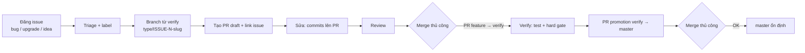

# TASK-077 — Quy trình Issue → Branch → PR → Merge thủ công → verify → master

## 1. Mục tiêu

Thiết lập quy trình vòng đời phát triển đầy đủ cho repo `mrdanhdanh/aios-python`:

1. **Đăng yêu cầu lên GitHub Issue** — 3 loại: bug / nâng cấp (feature/upgrade) / ý tưởng thay đổi hệ thống (idea/proposal), có template chuẩn.
2. **Nhận issue → tạo nhánh** — tên nhánh có quy ước hệ thống, tạo TỪ `verify` (theo ADR-0005).
3. **Tạo PR rồi mới sửa** (PR-driven) — PR được tạo sớm (draft), mọi commit tiếp theo đẩy lên chính PR đó; có PR template chuẩn.
4. **Duyệt & merge thủ công** — KHÔNG bot tự merge; người dùng review + merge bằng tay.
5. **Xác nhận nguồn verify → master dựa trên PR** — code chỉ về `master` qua một PR "promotion" riêng (`verify` → `master`) do người dùng duyệt và merge thủ công.

Quy trình này mở rộng ADR-0005 (branching model) thành **Issue-Driven Development + PR-based promotion**, đồng thời là chuẩn bắt buộc cho cả người dùng lẫn AIOS Orchestrator.

## 2. Phạm vi

**Trong phạm vi (tạo mới):**
- `.github/ISSUE_TEMPLATE/` — 3 template dạng GitHub issue forms (YAML): `bug-report.yml`, `feature-upgrade.yml`, `idea-proposal.yml` + `config.yml` (chỉ `blank_issues_enabled: false` + `contact_links` — KHÔNG có khái niệm label defaults trong config.yml; label gợi ý đặt trong frontmatter `labels:` của từng template).
- `.github/pull_request_template.md` — template PR chuẩn (bắt buộc link issue).
- `.github/workflows/pr-validation.yml` — GitHub Action **validate nhẹ** (không tự merge, không approve): kiểm tra title format + body có link issue (cho phép ngoại lệ `[bypass]` cho fix nhỏ).
- `docs/workflows/issue-pr-workflow.md` — tài liệu hướng dẫn quy trình chi tiết từng bước (cho người + agent).
- `docs/adr/0006-issue-pr-workflow.md` — ADR ghi quyết định (extends ADR-0005).
- `aios/progress/tasks/TASK-077/` — 8-file hard gate.

**Cập nhật:**
- `AGENTS.md` — thêm §4.2 Issue-Driven Development (quy trình bắt buộc cho mọi agent).
- `docs/PLAN.md` — cập nhật mục Branching Model / ADR list (link ADR-0006 + workflow docs).

**Ngoài phạm vi (KHÔNG làm):**
- Không đổi tên nhánh `master` → `main` (giữ nguyên `master`; ghi chú "main = master" trong tài liệu).
- Không cấu hình bot tự merge / auto-approve / auto-label.
- Không tạo issue mẫu (sample issue) trên GitHub.
- Không sửa code backend/dashboard/extension.
- Không cài external GitHub Actions (chỉ dùng `actions/checkout` + `actions/github-script` chính thức).

## 3. Đầu vào / Đầu ra

**Input:** yêu cầu người dùng 2026-08-16 (4 luồng: đăng issue / nhận issue + branch + PR rồi sửa / duyệt merge thủ công / xác nhận verify → main qua PR). Hiện trạng: ADR-0005 (master ← verify ← feature branch), repo PUBLIC trên GitHub, có sẵn `.github/workflows/secret-scan.yml`.

**Output:**
- 3 issue templates + config
- PR template
- 1 workflow GitHub Action validate PR
- 1 tài liệu hướng dẫn quy trình
- 1 ADR (0006)
- AGENTS.md + PLAN.md cập nhật
- 8-file hard gate đầy đủ

## 4. Quy trình chuẩn (được mô tả trong docs/workflows/issue-pr-workflow.md)

### Giai đoạn 1 — Đăng issue
- Người dùng/agent mở issue trên GitHub theo 1 trong 3 template (bug / feature-upgrade / idea-proposal).
- Template bắt buộc: mô tả rõ, môi trường (bug), expected/actual (bug), phạm vi + lý do (feature/idea), checklist.
- Issue được GitHub đánh số tự động → `#N` (gọi là `ISSUE-N`).
- Gợi ý label: `bug`, `enhancement`, `idea`, `upgrade`, `priority: high|medium|low` (không bắt buộc, do người dùng gán).

### Giai đoạn 2 — Nhận issue → tạo nhánh
- AiOS Orchestrator nhận issue: nếu task > ~30 phút / chạm nhiều file → mở TASK-xxx qua hard gate (ghi issue link vào spec.md); fix nhỏ → bypass hợp lệ (ghi LOG.md `[bypass]` + ghi chú issue nếu có).
- **Refresh `verify` TRƯỚC khi tạo nhánh** (tránh drift local):
  ```powershell
  git fetch origin
  git checkout verify
  git pull origin verify
  ```
- Tạo nhánh **TỪ `verify`** (KHÔNG từ master): `git checkout -b <type>/ISSUE-<N>-<slug> origin/verify`
- Quy ước tên nhánh (`<type>` map theo loại issue):
  - Bug → `fix/ISSUE-<N>-<slug>`
  - Nâng cấp/tính năng → `feature/ISSUE-<N>-<slug>`
  - Ý tưởng/thay đổi hệ thống → `feature/ISSUE-<N>-<slug>` (sau khi triển khai) hoặc `docs/ISSUE-<N>-<slug>` (nếu chỉ tài liệu/đề xuất)
  - Tài liệu/quy trình → `docs/ISSUE-<N>-<slug>`
  - Khác (refactor/test/operation) → prefix tương ứng hiện có.
  - Fix nhỏ không có issue → `fix/bypass-<slug>` (hoặc `hotfix/bypass-<slug>` cho fix khẩn cấp — biến thể ưu tiên của bypass); bắt buộc kèm dòng `[bypass]` trong PR body.
- `<slug>` = 2–5 từ viết thường, nối bằng `-`, mô tả ngắn nội dung.

> ⚠️ **Danh sách prefix nằm ở 2 nơi**: docs này (GĐ2) + regex trong `pr-validation.yml`. Thêm prefix mới phải cập nhật ĐỒNG BỘ cả 2 nơi (xem ADR-0006).

### Giai đoạn 3 — Tạo PR rồi mới sửa (PR-driven)
- **Tooling bắt buộc: GitHub CLI `gh`** (yêu cầu `gh auth login` một lần). Mọi lệnh tạo issue/PR dùng `gh` — agent có thể thực thi được, không phụ thuộc thao tác tay trên web.
- Sau commit đầu tiên có ý nghĩa → **tạo PR ngay**, đánh **draft** nếu chưa xong:
  ```powershell
  gh pr create --draft --base verify --title "<type>/ISSUE-<N>: <mô tả>" --body-file pr-body.md
  ```
- PR title: `<type>/ISSUE-<N>: <mô tả ngắn>` (khớp regex action). **Ngoại lệ bypass** (fix nhỏ không có issue): `<type>/bypass-<slug>: <mô tả>` (vd `fix/bypass-login-typo: sửa typo`) — bắt buộc kèm dòng `[bypass]` trong body.
- PR body: theo template — **bắt buộc** link issue (`Fixes #N` / `Refs #N` — KHÔNG dùng `Closes #N` cho PR feature→verify vì GitHub tự đóng issue ngay khi merge vào verify, trước khi promotion lên master; đóng issue thủ công SAU khi promotion), mô tả thay đổi, test đã chạy, checklist.
- Mọi commit tiếp theo push lên chính nhánh → PR tự cập nhật. Không tạo PR mới cho cùng issue.
- Có thể mở nhiều PR từ 1 issue nếu chia nhỏ — mỗi PR vẫn phải link issue đó.
- ⚠️ **PR đầu tiên của chính workflow này (khi chưa merge vào default branch) KHÔNG chạy action** — GitHub chỉ chạy workflow có sẵn trên default branch. Chấp nhận; xác nhận action hoạt động bằng PR thử nghiệm nhỏ SAU khi workflow đã vào `verify`/`master`.

### Giai đoạn 4 — Duyệt & merge thủ công
- Người dùng review trên GitHub (hoặc agent trình bày tóm tắt để người dùng quyết định).
- **Reject (Request changes)**: sửa tiếp trên CÙNG nhánh → push → re-request review. KHÔNG tạo PR mới.
- **Conflict khi merge feature → verify**: `git rebase origin/verify` (hoặc merge) rồi push — resolve trên nhánh feature trước.
- **Merge thủ công** — chỉ người dùng bấm nút Merge trên GitHub. KHÔNG có bot tự merge.
- PR nhánh chức năng → **merge vào `verify`** (KHÔNG merge thẳng master). Merge local bằng `git` CHỈ hợp lệ cho feature → verify (trường hợp không dùng GitHub); `master` KHÔNG BAO GIỜ cập nhật bằng lệnh git local — chỉ qua merge button của PR promotion.
- Sau merge: trên `verify` chạy đủ test + hard gate + review (đối chiếu AGENTS.md §2).

### Giai đoạn 5 — Xác nhận nguồn verify → master (qua PR)
- Sau khi verify PASS: tạo **PR promotion** `verify` → `master` (agent chuẩn bị nội dung + lệnh `gh pr create --base master --head verify`, người dùng bấm create/merge — trách nhiệm cuối thuộc người dùng).
- PR title: `release: verify → master (YYYY-MM-DD)` (ngày tránh trùng; promote thường xuyên, nhỏ, nhanh — promotion là all-or-nothing: gộp MỌI thay đổi đã vào verify).
- PR body: mục **bắt buộc** `Issues included: #N, #M...` (traceability) + danh sách commit/thay đổi đã verify + kết quả test/hard gate (bằng chứng từ `aios/progress/`).
- Người dùng review diff + bằng chứng → **merge thủ công** → `master` cập nhật.
- Sau merge: xóa nhánh chức năng đã gộp (`git push origin --delete <branch>` + `git branch -d <branch>`); giữ `verify` sát `master` (sau promotion master ≡ verify; refresh verify trước mỗi feature mới — GĐ2).

### Sơ đồ luồng



## 5. Tiêu chí chấp nhận (AC)

- **AC1**: 3 issue templates tồn tại trong `.github/ISSUE_TEMPLATE/` (bug / feature-upgrade / idea-proposal) + `config.yml` (`blank_issues_enabled: false` + `contact_links`), parse được bằng YAML, đúng cấu trúc GitHub issue forms: frontmatter `name` (bắt buộc, ≤80 ký tự), `about` (bắt buộc, ≤190 — KHÔNG dùng `description`), `title` (string, optional), `labels` (string HOẶC list, optional); `body` là list bắt buộc, mỗi phần tử có `type ∈ {markdown, input, textarea, dropdown, checkboxes}` và `validations.required` (nếu có) là boolean.
- **AC2**: `.github/pull_request_template.md` tồn tại, chứa mục bắt buộc: link issue, mô tả thay đổi, test đã chạy, checklist, section `[bypass]` cho fix nhỏ không có issue.
- **AC3**: `.github/workflows/pr-validation.yml` — Action chỉ validate (KHÔNG auto-merge/approve/label), dùng `actions/github-script@v7` + `permissions: {contents: read, issues: read}` (KHÔNG dùng checkout — đọc thẳng từ event payload). **Luồng quyết định tuyến tính** (đúng thứ tự, dừng ở bước đầu tiên khớp):
  1. **Draft** → skip check (success, không fail) — validate thật khi `ready_for_review`.
  2. **Title `^release: verify → master`** → `base.ref` phải là `master`; skip body-check. (Khớp `→` bằng `\u2192` trong JS — KHÔNG đặt trực tiếp trong YAML pattern.)
  3. **Base branch**: `base.ref` phải là `verify` cho mọi PR thường; không phải → fail (chặn merge nhầm thẳng master).
  4. **Body có `[bypass]`** (case-insensitive) → PASS ngay (bypass hợp lệ — không cần title chuẩn; dành cho fix nhỏ không có issue, dogfooding).
  5. **Title `^(feature|fix|docs|operation|refactor|test)/ISSUE-\d+`** → body phải chứa link issue (`#\d+`/`ISSUE-\d+`, khuyến nghị `Fixes #N`/`Refs #N`); thiếu → fail.
  6. **Title `^(feature|fix|docs|operation|refactor|test)/(bypass|hotfix)-[a-z0-9-]+`** → body PHẢI có `[bypass]`; thiếu → fail.
  7. **Còn lại** → fail (title không đúng quy ước).
  - Optional (bước 5): `github.rest.issues.get` xác minh issue tồn tại — try/catch MỌI lỗi (403/404/rate-limit); 404 → chỉ warning, KHÔNG fail (traceability ≠ gate).
  - Fail check → status check failed (PR ✗); merge chỉ THỰC SỰ bị chặn khi người dùng bật required status checks trong branch protection (docs hướng dẫn bước này). KHÔNG tự sửa/comment tự động.
- **AC4**: Action dùng CHỈ `actions/github-script@v7` (action chính thức của GitHub) — không external action, không checkout; YAML parse được (pattern regex dùng single-quoted YAML để tránh escape lỗi — `\d` không hợp lệ trong double-quoted); có `concurrency: {group: pr-${{ github.event.pull_request.number }}, cancel-in-progress: true}` (tránh nhiễu khi push nhanh); logic luồng quyết định đúng (test bằng script mô phỏng ≥12 case, ≥2 case/nhánh).
- **AC5**: `docs/workflows/issue-pr-workflow.md` mô tả đủ 5 giai đoạn + quy ước tên nhánh + map loại issue → prefix + sơ đồ + ví dụ lệnh `gh`/git thực tế (Windows PowerShell), gồm: cài & auth `gh` (`gh auth login` + `gh auth setup-git` cho git push HTTPS), refresh `verify` trước khi tạo nhánh, tạo PR draft, xử lý reject/conflict, xóa nhánh sau merge, PR promotion (agent chuẩn bị, người dùng merge; title release dùng đúng ký tự `→` — copy từ template, gõ `->` sẽ fail regex `\u2192`).
- **AC6**: `docs/adr/0006-issue-pr-workflow.md` — Status accepted, Context/Decision/Consequences, extends ADR-0005, ghi rõ "main = master (giữ nguyên master)".
- **AC7**: `AGENTS.md` có §4.2 Issue-Driven Development — quy trình bắt buộc: issue → branch (từ verify) → PR (draft sớm) → sửa → merge thủ công → verify → PR promotion → master; vi phạm = sai quy trình.
- **AC8**: `docs/PLAN.md` cập nhật: mục Branching Model/Workflow thêm link ADR-0006 + `docs/workflows/issue-pr-workflow.md`.
- **AC9**: Test thật chạy: (1) YAML parse 3 templates + `config.yml` + 1 workflow; (2) **schema assertions** theo AC1 (frontmatter `name`/`about`/`labels`/body types) + workflow có `name/on/jobs` + `types` đúng (`opened/edited/synchronize/reopened/ready_for_review`) + `concurrency`; (3) script mô phỏng **luồng quyết định action** (draft → release → base → bypass body → ISSUE title → bypass title → fail) với bộ test case ≥ 14 case, ≥ 2 case/nhánh — 100% case đúng; (4) markdown docs đủ heading/mục theo checklist; (5) hard gate TASK-077 đủ 8-file.
- **AC10**: Commit trên nhánh `docs/issue-pr-workflow` (tạo từ `verify`), working tree sạch khi kết thúc; LOG.md + PROGRESS.md cập nhật. **Dogfooding**: PR của chính TASK-077 không có ISSUE-N → body PR sẽ có dòng `[bypass]` (process/không issue) → PASS theo nhánh 4 của luồng quyết định (body `[bypass]` override title check); LƯU Ý: PR đầu tiên này KHÔNG chạy action (workflow chưa trên default branch — C2-05) → kiểm chứng thật bằng AC9-3 (script mô phỏng) + PR thử nghiệm nhỏ sau khi workflow vào verify/master.

## 6. Rủi ro & giả định

- **Giả định**: Repo dùng `master` (không đổi tên). GitHub default branch hiện là `master` (remote HEAD → origin/master). Người dùng đồng ý giữ `master`, ghi chú "main = master".
- **Rủi ro R1**: Action chặn PR bypass gây phiền → giảm nhẹ: nhánh 4 luồng quyết định — body `[bypass]` → PASS (AC3), title bypass-style là khuyến khích không bắt buộc.
- **Rủi ro R2**: Regex chứa ký tự đặc biệt trong YAML — dùng single-quoted YAML cho mọi pattern (tránh escape lỗi như `\d` trong double-quoted); ký tự `→` trong regex so khớp bằng `\u2192` bên trong github-script (JS string), KHÔNG đặt trực tiếp trong YAML pattern. Test kỹ ở AC9.
- **Rủi ro R3**: Người dùng merge nhầm thẳng master → giảm nhẹ 2 lớp: (1) action check base branch (AC3 bước 2–3) — PR feature base master sẽ fail; (2) docs + AGENTS.md nhấn mạnh; branch protection (required status checks + base rules) là việc người dùng tự bật trên GitHub settings — docs hướng dẫn, ngoài phạm vi code.
- **Rủi ro R4**: `issues.get` fail do thiếu quyền/403/404 → wrap try/catch toàn diện, không bao giờ block vì lý do này (AC3 optional).
