# AIOS — Kiến trúc hệ thống (v3 — AIOS 1.0 CERTIFIED · M11 DONE · M12 IN-PROGRESS)

> **📌 TÀI LIỆU HIỆN HÀNH** — thay thế `docs/architecture-v2.md` (giữ làm lịch sử).
> Nguồn sự thật: `docs/PLAN.md` (master plan v6) + `aios/progress/PROGRESS.md` (trạng thái build thực tế).
> Cập nhật lần cuối: **2026-08-16** — phản ánh **M0–M10 DONE (AIOS 1.0 CERTIFIED)** + **M11 DONE** (Deterministic Artifact & Interaction Runtime — INV-035, full suite **2052 tests**, `aiagent conformance` 10 areas/6 gates) + **M12 IN-PROGRESS** (AIOS 1.1 Compatibility — TASK-084..088, version 1.0→1.1, nhánh `feature/ISSUE-7-aios-1-1-compatibility`).
> Định dạng: **Markdown + Mermaid diagrams** (flowchart / sequenceDiagram / stateDiagram-v2) — render được trên GitHub và VS Code preview. Quyết định đảo quy ước "markdown thuần" (TASK-063) theo yêu cầu người dùng 2026-08-15.

## 0. Cách đọc tài liệu này

- **Nguồn dữ liệu**: mọi trạng thái/số liệu lấy từ `aios/progress/PROGRESS.md` (2026-08-16) và `docs/PLAN.md`; mọi module code đối chiếu `backend/src/aios_core/` (bao gồm package M11 mới: `rendering/`, `verification/`).
- **Quy ước ký hiệu**: `✅` = đã build + test thật (kèm số tests); `🔲` = chưa làm (todo — không còn task nào ở M10).
- **Mô hình tầng**: 7 tầng L1..L7 theo `docs/architecture/layer-model.md` (**FROZEN tại M10**) — KHÁC thứ tự mô tả "chức năng" của v2; v3 lấy layer-model làm chuẩn.
- **Bất biến kiến trúc (INV)**: xem §12 + `docs/architecture/constitution-1.0.md`; enforcement tự động qua `backend/tests/test_architecture.py` (AST) + runtime scanner `observability/arch_health.py` + release gates TASK-073.
- **Thứ tự đọc đề xuất**: §1 (tổng quan 7 tầng) → §2 (4 plane) → §3 (Orchestrator) → §4 (luồng request) → §5–§7 → §8 (Autonomous) → §9 (M10) → §10–§11 (tiến độ) → §12 (INV) → §13 (Safety/Kill Switch) → §14 (nguồn).

---

## 1. Kiến trúc tổng thể — 7 tầng L1..L7 (FROZEN theo layer-model.md)

```mermaid
flowchart TD
    USER["USER / SYSTEM"] --> L1
    subgraph L1["L1 - UI / SDK / API"]
        DASH["Dashboard SPA (11 tabs + Execution Timeline)"]
        EXT["VS Code Extension (9 commands)"]
        CLI["CLI aiagent (doctor / conformance / run ...)"]
        SDK["AIOS SDK Python + TypeScript (M8 public API)"]
        API["REST API + WebSocket (FastAPI 9 routers)"]
    end
    L1 --> L2
    subgraph L2["L2 - AUTONOMY CONTROL (M9)"]
        GOAL["Goal Engine (13 state)"]
        PL["Planner (World-based)"]
        WM["World Model (World != Memory)"]
        GOV["Governor (INV-030 - moi action qua Governor)"]
        LOOP["Autonomy Loop (Observe->...->Learn)"]
    end
    L2 -->|"dinh huong (khong thay the)"| L3
    subgraph L3["L3 - ORCHESTRATOR CONTROL PLANE (M2-M4)"]
        DP["Decision Pipeline 4 tang (offline-first)"]
        AS["Agent Selector / Capability Router"]
        PB["Permission Broker / Policy"]
        GM["Goal Manager + Task Queue"]
        SK["System Knowledge + Catalog"]
    end
    L3 --> L4
    subgraph L4["L4 - WORKFLOW / AGENT / CAPABILITY"]
        WF["Workflow Definition (YAML declarative)"]
        AG["Worker Agents: General / Coder / Doctor / System Doctor"]
        CAP["Capability Registry (INV-002: agent khong cham Tool truc tiep)"]
    end
    L4 --> L5
    subgraph L5["L5 - RUNTIME KERNEL (9 services + DI)"]
        EX["Execution / Context / Event / Artifact"]
        PM["Permission / Policy / Scheduler / State / Resource"]
    end
    L5 --> L6
    subgraph L6["L6 - TOOLS / STATE / EVENTS"]
        T1["Tools: Python / Docker / REST / MCP / Shell / Git"]
        ST["State machine + Checkpoint/Snapshot"]
        EV["Event Bus + Audit SQLite"]
        SB["Sandbox Pool"]
    end
    L6 --> L7
    subgraph L7["L7 - INFRA (dung chung + mo rong)"]
        INF["Models (Mock/OpenAI/Ollama) - Memory 4 loai - Knowledge + Graph"]
        OBS["Observability - Upgrade - Catalog"]
        HARN["AIOS Harness (M6)"]
        ENT["Enterprise (M7)"]
        ECO["Ecosystem: plugins / extension / ecosystem (M8)"]
        VERIF["Verification pkg (M11: INV-035 state model + fail-closed)"]
        REND["Rendering pkg (M11: RenderReplay / VisualEvidence)"]
    end
```

> **Lưu ý chuẩn 1.0 (khác v2)**:
> - **Autonomous = L2** (định hướng Orchestrator, không phải "lớp mở rộng") — v2 xếp sai điểm này.
> - Harness (M6) / Enterprise (M7) / Ecosystem (M8) là **lớp mở rộng thuộc L7** — không phải tầng riêng.
> - **M10 là nhóm đảm bảo** (Freeze → Harden → Secure → Productize → Certify), KHÔNG phải tầng L8.
> - **M11 bổ sung (DONE 2026-08-16)**: package `rendering/` (RenderReplay / VisualEvidence / VisualRegressionProbe) + `verification/` (INV-035 Verification State Model) + Asset Pipeline (registry `kind=asset`, Discovery/Routing) — đặt trong L6/L7 theo layer-model frozen, **không đổi cấu trúc 7 tầng**.

### 1.1 Bảng 7 tầng (theo `layer-model.md` frozen)

| Tầng | Tên | Package chính (`backend/src/aios_core/`) | Milestone |
|------|-----|------------------------------------------|-----------|
| L1 | UI / SDK / API | `api/` (FastAPI + WS), `dashboard/`, `extension/`, `sdk/python`, `sdk/typescript` | M3, M8, M10 |
| L2 | Autonomy Control | `autonomous/` (goal, planner, world, governor, loop, recovery, long_horizon, memory, stuck, experimentation, evaluation, multi_agent, scheduler) | M9 |
| L3 | Orchestrator Control Plane | `orchestrator/` (+ `goals/`, `planning/`) | M2, M4 |
| L4 | Workflow / Agent / Capability | `workflow/`, `agents/`, `capabilities/` | M1, M2 |
| L5 | Runtime Kernel | `kernel/` (9 services + `graph/` + `scheduler/`) | M1, M5 |
| L6 | Tools / State / Events | `tools/`, `context/`, `sandbox/`, `kernel/events.py` | M1, M2 |
| L7 | Infra + Mở rộng | `models/`, `memory/`, `knowledge/`, `catalog/`, `observability/`, `upgrade/`, `enterprise/`, `harness/`, `plugins/`, `extension/`, `ecosystem/` | M1, M4, M6–M8 |

> **Dependency một chiều** (INV-004): Agent → Capability → Tool → Infrastructure. Runtime/Capability KHÔNG phụ thuộc ngược Infra. Enforcement: `tests/test_architecture.py` (AST) + `arch_health.py` (runtime scanner).

---

## 2. Ba mặt phẳng — Autonomy / Control / Worker / Execution

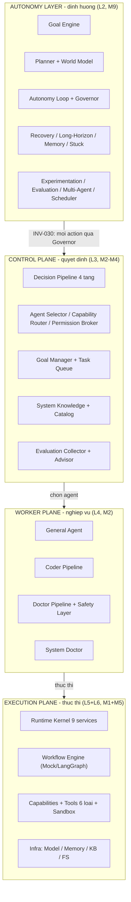

> **Nguyên tắc (INV-005, INV-016, INV-030)**: Orchestrator KHÔNG sở hữu Runtime Service — *request* Runtime qua Runtime API. Autonomy Layer KHÔNG thay Orchestrator — *định hướng* (`Autonomy → Orchestrator → Runtime`). Mọi action của Autonomy Loop phải qua Governor (INV-030).

---

## 3. Bên trong Orchestrator — Decision Pipeline 4 tầng (offline-first)

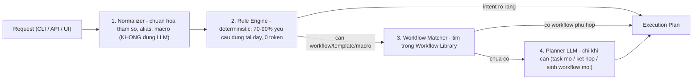

| Nhóm | Module | Trạng thái | Ghi chú |
|------|--------|------------|---------|
| **Điều phối & thực thi** | Agent Selector | ✅ M2 | resolve intent → General/Coder/Doctor/System Doctor |
| | Capability Router | ✅ M2 | chỉ chọn Capability, không chọn Tool trực tiếp (INV-002) |
| | Resource Scheduler | ✅ M1 | trao đổi ResourceService — grant/queue/reject |
| | Execution Supervisor | ✅ M4 | track running từ bus, stuck detect, queue hook |
| | Failure Recovery | ✅ M2 | retry → fallback → report |
| | Context Coordinator + Context Optimizer | ✅ M1+M5 | budget + priority (INV-012) |
| | Memory Coordinator | ✅ M5 | Agent KHÔNG truy cập Memory trực tiếp (INV-011) |
| | Model Router | ✅ M5 | chọn model theo policy + fallback (INV-013) |
| **Quản trị & policy** | Policy Engine | ✅ M1 | pre-check bất khả bypass (INV-007) |
| | Permission Broker | ✅ M2 | ask_scopes, default-deny khi không có approver |
| | Skill Manager | ✅ M2 | lifecycle 10 states + zip/git/pip |
| | Goal Manager + Goal Reporter | ✅ M2+M4 | goal dài hạn nhiều phiên, progress tracking |
| | Task Queue | ✅ M2 | atomic dequeue, reorder, recover stale |
| | System Catalog | ✅ M1 | index + search toàn bộ registry, rebuild/is_stale |
| | System Knowledge | ✅ M2 | trả lời qua Catalog + Knowledge Graph (System Brain) |
| **Cải tiến & học hỏi** | Evaluation Collector | ✅ M4 | evaluator trên EvaluationStore — post-execution observer |
| | Improvement Advisor | ✅ M4 | 5 rules deterministic + suggestions (không tự áp dụng) |
| | Knowledge Graph | ✅ M1 | đồ thị Agent–Skill–Workflow–Capability–Tool–Artifact |
| | Observability | ✅ M4 | metrics · prompt history · profiler · doctor · arch-health |

---

## 4. Luồng xử lý một request — 12 bước

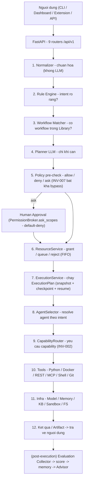

> **Thứ tự ưu tiên**: **1. Rule Engine (0 token) → 2. Workflow Library (tái sử dụng) → 3. Planner LLM (chỉ khi cần) → 4. Human Approval** (nếu policy yêu cầu). Evaluation = post-execution observer — KHÔNG nằm trong execution chain.

| # | Bước | Module thật | Trạng thái |
|---|------|-------------|------------|
| 1 | Normalizer | `orchestrator/normalizer.py` | ✅ TASK-010 |
| 2 | Rule Engine | `orchestrator/rule_engine.py` | ✅ TASK-010 |
| 3 | Workflow Matcher | `orchestrator/workflow_matcher.py` + Workflow Library | ✅ TASK-010 |
| 4 | Planner LLM | `orchestrator/planner.py` — đếm `llm_calls` | ✅ TASK-010 |
| 5 | Policy pre-check | `PolicyService` + `ask_scopes` (Permission Broker) | ✅ TASK-004/012 |
| 6 | Resource | `ResourceService` — Grant/Queue/Reject + `acquire_slot_wait` | ✅ TASK-005/011 |
| 7 | Execution | `ExecutionService` — nodes → snapshot/resume, emit `TOOL_STARTED/FINISHED`, `SNAPSHOT_SAVED`, `WORKFLOW_FAILED/CANCELLED` | ✅ TASK-005/021 |
| 8 | Agent Selector | `agents/registry.py` | ✅ TASK-010/013 |
| 9 | Capability Router | `tools/registry.py` + `capabilities/` | ✅ TASK-014 |
| 10 | Tools | 6 loại: Python (ast.parse, no-exec), Docker mock, REST validate, MCP, Shell (no-exec), Git mock | ✅ TASK-014 |
| 11 | Infra | Models (Mock/OpenAI/Ollama) · Memory 4 loại · KB · Sandbox Pool · Skills | ✅ TASK-006/007/015 |
| 12 | Observability | `metrics.py` · `evaluation_store` · `profiler` · `arch_health` · `advisor` | ✅ TASK-021/022 |

> **⚠️ Lưu ý thực tế**: Tools ở mức **stub an toàn** (Python `ast.parse` không exec, Shell no-exec, Docker/Git mock) — đúng thiết kế: ưu tiên kiến trúc + test; thực thi thật khi policy/sandbox chín muồi (M10 Safety chain + SandboxBoundary).

---

## 5. Runtime Kernel — 9 services (M1 + M5)

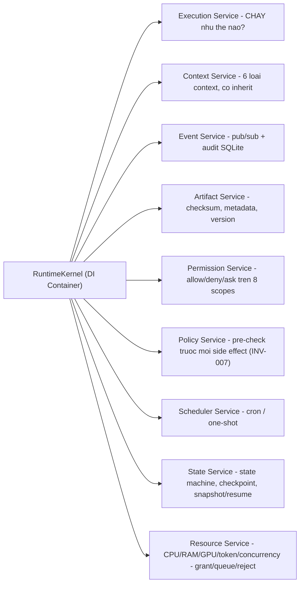

| # | Service | Trách nhiệm | Câu hỏi |
|---|---------|-------------|---------|
| 1 | Execution Service | chạy ExecutionPlan → nodes → snapshot/resume, retry/cancel/timeout | CHẠY như thế nào? |
| 2 | Context Service | 6 loại context (System/User/Workflow/Agent/Execution/Shared), có inherit | |
| 3 | Event Service | pub/sub event bus + audit SQLite | |
| 4 | Artifact Service | lưu/quản lý artifact (checksum, metadata, version) | |
| 5 | Permission Service | policy allow/deny/ask trên 8 scopes | |
| 6 | Policy Service | Policy Engine core — pre-check trước mọi side effect (INV-007) | Có được chạy không? |
| 7 | Scheduler Service | lịch chạy workflow (cron/one-shot) | WHEN chạy? |
| 8 | State Service | state machine, checkpoint, snapshot/resume | |
| 9 | Resource Service | CPU/RAM/GPU/token/concurrency — Grant/Queue/Reject (FIFO) | CÓ THỂ chạy không? |

---

## 6. Core Intelligence — M5 (INV-011..016)

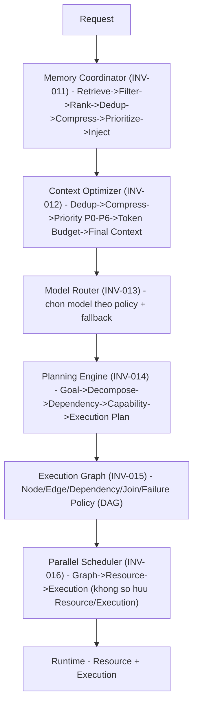

| Năng lực | Trả lời câu hỏi | Task | Trạng thái |
|----------|-----------------|------|------------|
| Memory Coordinator | AIOS cần nhớ gì? | TASK-023 | ✅ 855 tests · 10/10 AC · INV-011 |
| Context Optimizer | Đưa gì vào lần chạy này? | TASK-024 | ✅ 896 tests · 11/11 AC · INV-012 |
| Model Router | Dùng model nào? | TASK-025 | ✅ 949 tests · 11/11 AC · INV-013 |
| Planning Engine | Làm những bước nào? | TASK-026 | ✅ 1003 tests · 11/11 AC · INV-014 |
| Execution Graph | Các bước phụ thuộc nhau thế nào? | TASK-027 | ✅ 1055 tests · 13/13 AC · INV-015 |
| Parallel Scheduler | Chạy khi nào, song song ra sao? | TASK-028 | ✅ 1086 tests · 12/12 AC · INV-016 |

---

## 7. Lớp mở rộng — Harness (M6) · Enterprise (M7) · Ecosystem (M8)

> Cả 3 thuộc **L7** — mở rộng, không nằm trong chuỗi chính. **Autonomous = L2** (đã vẽ ở §1–§2).

### 7.1 AIOS Harness (M6) — tự kiểm thử/xác minh/quan sát/cải tiến chính nó

| Năng lực | Nội dung | Task | Trạng thái |
|----------|----------|------|------------|
| H1 — Harness Kernel | contracts chung + lifecycle 8-state + registry + runner + evidence | TASK-029 | ✅ 1124 tests · INV-017/018 |
| H2 — Execution Verification | Preconditions/Postconditions/Verdict + Evidence Package + Replay | TASK-030 | ✅ 1210 tests · INV-019 |
| H3 — Test & Simulation | Scenario + Simulation Mode (FakeRuntime, FaultInjector) | TASK-031 | ✅ 1299 tests |
| H4 — Evaluation + Benchmark | Evaluation model + suite + trajectory + Regression Gate | TASK-032/033 | ✅ 1387/1450 tests · INV-020/021 |
| H5 — Doctor & Readiness | Doctor architecture 13 kinds + Readiness Score + hard gates | TASK-034 | ✅ 1521 tests |

### 7.2 Enterprise (M7) — nền tảng vận hành an toàn quy mô doanh nghiệp

| Nhóm | Nội dung | Task | Trạng thái |
|------|----------|------|------------|
| E1 — Identity & Access | Principal (user/agent/service) + RBAC + ABAC + capability attenuation | TASK-035 | ✅ INV-022 |
| E2 — Multi-Tenancy | Tenant + TenantBoundary (deny-by-default) + MemoryNamespace | TASK-036 | ✅ INV-023 |
| E3 — Distributed Runtime | NodeRegistry + RuntimeRouter (tenant/region/capability/capacity/cost/health) | TASK-037 | ✅ INV-029 |
| E4 — Distributed Scheduler | single-active lease + failover/resume snapshot | TASK-038 | ✅ INV-026 |
| E5 — Resource Governance | QuotaManager (fairness) + CostGovernor (budget/cheaper route) | TASK-039 | ✅ INV-025 |
| E6 — Security & Isolation | CredentialBroker (scoped) + NetworkPolicy (default-deny) + SandboxBoundary | TASK-040 | ✅ INV-024/028 |
| E7 — Operations | CentralAuditStore (tamper-evident) + HealthMonitor + RecoveryManager + Dashboard | TASK-041/042 | ✅ INV-027 |

### 7.3 Ecosystem (M8) — hệ sinh thái mở rộng bên thứ ba

| Nhóm | Nội dung | Task | Trạng thái |
|------|----------|------|------------|
| E1 — Public SDK | `from aios import Agent, Tool, Capability, Workflow, Client`; độc lập, không import aios_core | TASK-043 | ✅ SDK Python |
| E2 — Plugin Runtime | lifecycle 10-state (reuse SkillState) + compat aios range + dependency check | TASK-044 | ✅ `plugins/` |
| E3 — Extension Contracts | Internal/Public/Extension/Experimental API + Compatibility Matrix | TASK-045 | ✅ `extension/` |
| E4 — Ecosystem Registry | Registry v2 + discovery (`aiagent ecosystem search`) | TASK-046 | ✅ `ecosystem/` |
| E5 — Developer Kit | scaffold (`aiagent plugin create`) | TASK-047 | ✅ `ecosystem/devkit.py` |
| E6 — Marketplace | Trust model + signature + HMAC (`aiagent marketplace publish`) | TASK-048 | ✅ `ecosystem/marketplace.py` |
| E7 — Certification | COMMUNITY → VERIFIED → CERTIFIED, Harness gate | TASK-049 | ✅ `ecosystem/certification.py` |

---

## 8. Autonomous Layer — L2 (M9, INV-030..034)

> `Autonomous = Goal-driven + Bounded + Observable + Reversible + Evaluated`. Autonomy Layer KHÔNG thay Orchestrator — định hướng Orchestrator (`Autonomy → Orchestrator → Runtime`).

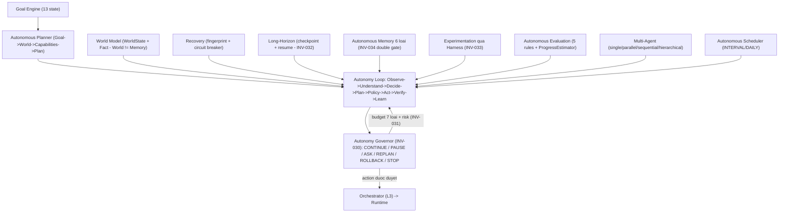

| Phase | Task | Nội dung | Trạng thái |
|-------|------|----------|------------|
| P1 — Foundation | TASK-050..054 | Goal Engine · Planner · World Model · Loop · Governor (INV-030/031) | ✅ |
| P2 — Long-running | TASK-055,056,057,061 | Recovery · Long-Horizon (INV-032) · Memory (INV-034) · Stuck 7 signals | ✅ |
| P3 — Adaptive | TASK-058,060 | Experimentation (INV-033) · Autonomous Evaluation | ✅ |
| P4 — Ecosystem | TASK-059,062 | Multi-Agent · Autonomous Scheduler | ✅ |

---

## 9. M10 — AIOS 1.0: 13 module đảm bảo (Freeze → Harden → Secure → Productize → Certify)

```mermaid
flowchart LR
    subgraph P1["P1 - Freeze"]
        F1["TASK-063: Architecture Freeze + Constitution (INV-001..034)"]
        F2["TASK-064: Contract 1.0 - freeze 10 contracts + contract-check"]
    end
    subgraph P2["P2 - Harden"]
        H1["TASK-065: Runtime Hardening - failure matrix 12 loai"]
        H2["TASK-066: Durable Execution 1.0 - journal + verify-before-resume"]
        H3["TASK-069: Reliability SLO - non-averaged gates"]
    end
    subgraph P3["P3 - Secure"]
        S1["TASK-067: Autonomy Safety - Action Proposal -> Governor -> Policy -> Tool"]
        S2["TASK-068: Kill Switch - stop + emergency-stop"]
        S3["TASK-070: Security Baseline 1.0 - 11 items + security-check"]
    end
    subgraph P4["P4 - Productize"]
        D1["TASK-071: Developer Experience - doctor first-class (100/100)"]
        D2["TASK-072: Dashboard 1.0 - 11 tabs + Execution Timeline"]
        D3["TASK-075: Performance & Cost - cost 5 chieu"]
    end
    subgraph P5["P5 - Certify"]
        C1["TASK-073: Certification Suite - 13 categories + GS-001..020 + 5 gates"]
        C2["TASK-074: Migration 1.0 - plan/backup/dry-run/validate/rollback"]
    end
    P1 --> P2 --> P3 --> P4 --> P5
```

### 9.1 Bảng tasks M10 (theo PROGRESS.md — 13/13 done)

| Task | Nội dung | Milestone | Trạng thái | Kết quả | Module thật |
|------|----------|-----------|------------|---------|-------------|
| TASK-063 | F1 Architecture Freeze — Constitution 1.0 (INV-001..034 frozen) + docs/architecture/* | M10-P1 | `done` ✅ | 19/19 PASS | `docs/architecture/*` |
| TASK-064 | F2 Contract 1.0 — freeze 10 contracts + `aiagent contract-check` | M10-P1 | `done` ✅ | 20/20 PASS | `contracts/{catalog,check}.py` |
| TASK-065 | F3 Runtime Hardening — failure matrix 12 loại (detect→contain→recover→resume) | M10-P2 | `done` ✅ | 18/18 PASS | `kernel/hardening.py` |
| TASK-066 | Durable Execution 1.0 — journal + verify-before-resume + idempotency | M10-P2 | `done` ✅ | 10/10 PASS | `kernel/durability.py` |
| TASK-069 | Reliability SLO — SLO registry + non-averaged gates | M10-P2 | `done` ✅ | 12/12 PASS | `observability/slo.py` |
| TASK-067 | F4 Autonomy Safety — Action Proposal → Risk → Governor → Policy → Permission → Capability → Tool | M10-P3 | `done` ✅ | 15/15 PASS | `autonomous/safety.py` |
| TASK-068 | Kill Switch — `aiagent stop execution/goal` + `emergency-stop` | M10-P3 | `done` ✅ | 13/13 PASS | `kernel/kill_switch.py` |
| TASK-070 | Security Baseline 1.0 — 11 items + `aiagent security-check` (9 PASS/2 WARN, SECURE) | M10-P3 | `done` ✅ | 8/8 PASS | `security/*` |
| TASK-071 | F7 Developer Experience — command tree + `aiagent doctor` first-class (Health 100/100) | M10-P4 | `done` ✅ | 10/10 PASS | `cli/{doctor,system}.py` |
| TASK-072 | Dashboard 1.0 — 11 tabs + Execution Timeline | M10-P4 | `done` ✅ | backend 5/5 + vitest 13/13 | `api/routers/m10.py`, `dashboard/src/views/*` |
| TASK-075 | Performance & Cost — cost 5 chiều + model independence | M10-P4 | `done` ✅ | 11/11 PASS | `observability/performance.py` |
| TASK-073 | F8 Certification Suite — 13 categories + GS-001..020 + `aiagent conformance` + 5 release gates | M10-P5 | `done` ✅ | 9/9 PASS — **AIOS 1.0 READY** | `harness/certification/*` |
| TASK-074 | Upgrade & Migration 1.0 — plan/backup/dry-run/validation/rollback | M10-P5 | `done` ✅ | 13/13 PASS | `upgrade/migration.py` |

### 9.2 Release Gates (TASK-073)

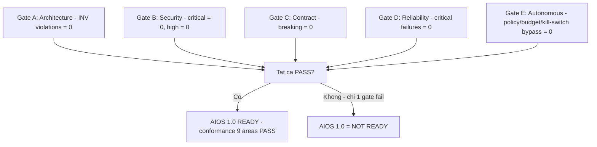

> **Kết quả M10 (2026-08-15)**: `aiagent conformance` → 9/9 areas · 20/20 GS · 5/5 gates → **AIOS 1.0 READY** · full suite **1939 pass** + vitest 13/13 · doctor 100/100 · review ACCEPTED. Coverage M10 = N/A (không có số coverage riêng cho M10 — không bịa).

---

## 9b. M11 — Deterministic Artifact & Interaction Runtime (DONE ✅ 2026-08-16)

> **Milestone M11** (Issue #4, PLAN.md §M11) — giới thiệu **INV-035** (Core Invariant MỚI, không vi phạm INV-001..034). Full suite **2052 tests**, `aiagent conformance` → **10 areas / 6 gates**. 6 task TASK-078..083, vòng đời khép kín qua PR #5/#6 → master `3b513c3`.

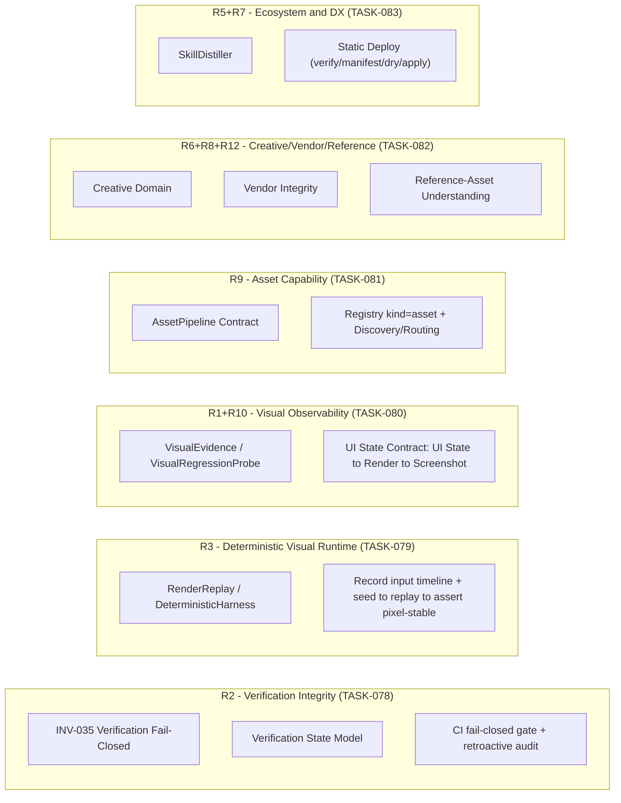

### 9b.1 Bảng tasks M11 (theo PROGRESS.md — 6/6 done)

| Task | Nội dung (R-tag) | Milestone | Trạng thái | Kết quả |
|------|----------|-----------|------------|---------|
| TASK-078 | R2 INV-035 Verification Fail-Closed + State Model + CI gate | M11-P0 | `done` ✅ | 12/12 AC · 1969 tests |
| TASK-079 | R3 RenderReplay / DeterministicHarness | M11-P1 | `done` ✅ | 10/10 AC · 1987 tests |
| TASK-080 | R1 VisualEvidence / VisualRegressionProbe + R10 UI State Contract | M11-P2 | `done` ✅ | 10/10 AC · 2003 tests |
| TASK-081 | R9 AssetPipeline Contract + R4 Registry kind=asset + R11 Routing | M11-P3 | `done` ✅ | 10/10 AC · 2018 tests |
| TASK-082 | R6 Creative Domain + R8 Vendor Integrity + R12 Reference-Asset | M11-P3b/c/d | `done` ✅ | 11/11 AC · 2034 tests |
| TASK-083 | R5 SkillDistiller + R7 Static Deploy | M11-P4a/b | `done` ✅ | 11/11 AC · 2052 tests · **M11 HOÀN TẤT** |

---

## 10. Tiến độ milestone — M0..M11 DONE + M12 IN-PROGRESS

```mermaid
flowchart LR
    M0["M0 - Foundation"] --> M1["M1 - Core Runtime (428 tests)"]
    M1 --> M2["M2 - Developer Edition (669)"]
    M2 --> M3["M3 - Desktop Edition (689 + 12 + 19)"]
    M3 --> M4["M4 - Platform Edition (809)"]
    M4 --> M5["M5 - Core Intelligence (1086)"]
    M5 --> M6["M6 - AIOS Harness (1521)"]
    M6 --> M7["M7 - Enterprise (1560)"]
    M7 --> M8["M8 - Ecosystem (1639)"]
    M8 --> M9["M9 - Autonomous (1780 @M9)"]
    M9 --> M10["M10 - AIOS 1.0 (1939 + conformance READY)"]
    M10 --> DONE["AIOS 1.0 CERTIFIED"]
    M10 --> M11["M11 - Deterministic Artifact and Interaction Runtime (2052)"]
    M11 --> M12["M12 - AIOS 1.1 Compatibility (IN-PROGRESS)"]
    M12 --> CUR["AIOS 1.1 (IN-PROGRESS)"]
```

| Milestone | Mô tả | Trạng thái | Số liệu (theo PROGRESS.md 2026-08-15) |
|-----------|-------|------------|----------------------------------------|
| M0 | Development Foundation — agents + progress system | ✅ done | 4 agents, hard gate |
| M1 | Core Runtime — kernel 9 services, models, memory, knowledge, workflow, capability, catalog | ✅ done | 428 tests · 95.76% |
| M2 | Developer Edition — orchestrator v1, assistants, tools, skills, sandbox, INV-001..010 | ✅ done | 669 tests · 95.51% |
| M3 | Desktop Edition — REST+WS API, Dashboard SPA, VS Code Extension | ✅ done | 689 pytest + 12 + 19 vitest |
| M4 | Platform Edition — upgrade pipeline, observability, orchestrator v2 | ✅ done | 809 tests · 94.92% |
| M5 | Core Intelligence — memory/context/model/planning/graph/scheduler, INV-011..016 | ✅ done | 1086 tests · 95.22% |
| M6 | AIOS Harness — H1..H5, INV-017..021 | ✅ done | 1521 tests · 95.35% |
| M7 | Enterprise — E1..E7, INV-022..029 | ✅ done | 1560 tests · 95.05% |
| M8 | Ecosystem — SDK, plugins, extension contracts, registry, marketplace, certification | ✅ done | 1639 tests |
| M9 | Autonomous — 13 task, INV-030..034 | ✅ done | 1780 tests @M9 · 94.46% (full suite 1793) |
| M10 | AIOS 1.0 — freeze INV-001..034, conformance, certification | ✅ done | **1939 tests + vitest 13/13 · conformance READY · doctor 100/100 · review ACCEPTED** |
| M11 | Deterministic Artifact & Interaction Runtime — INV-035, rendering/visual, asset pipeline | ✅ done | **2052 tests · conformance 10 areas/6 gates** (TASK-078..083) |
| M12 | AIOS 1.1 Compatibility (Issue #7) — version 1.0→1.1, migration, backward-compat, conformance area, ADR-0007 | 🔄 in-progress | TASK-084 (spec v3, paused) · TASK-085..088 todo |

---

## 11. Chi tiết tasks M1–M9 (giữ nguyên số liệu v2 — khớp PROGRESS.md)

| Task | Nội dung | Tests | Milestone |
|------|----------|-------|-----------|
| TASK-002 | Scaffold monorepo + aios_core (config/logging/metadata/healthcheck) | 32 | M1 |
| TASK-003 | Kernel Foundations — semver, contracts, DI, event bus, execution plan | 107 | M1 |
| TASK-004 | Kernel Services I — context, event+audit, artifact, permission, policy | 162 | M1 |
| TASK-005 | Kernel Services II — scheduler, state, resource, execution + RuntimeKernel | 207 | M1 |
| TASK-006 | Model Contract + providers (Mock/OpenAI/Ollama) + Registry | 233 | M1 |
| TASK-007 | Memory 4 loại + Knowledge pipeline | 270 | M1 |
| TASK-008 | Workflow Definition + Compilers + Library + CLI simulate | 300 | M1 |
| TASK-009 | Capability + Prompt Registry + Catalog + Knowledge Graph | 346 | M1 |
| TASK-011 | Remediation 9 P3 findings (M1 v2 review) | 428 | M1 |
| TASK-010 | Decision Pipeline (orchestrator v1) | 402 | M2 |
| TASK-012 | Goal Manager + Task Queue + Permission Broker + Failure Recovery | 490 | M2 |
| TASK-013 | Assistants (Worker Plane — INV-001/002) | 549 | M2 |
| TASK-014 | Tools 6 loại + Tool Registry + capability binding | 622 | M2 |
| TASK-015 | Skills lifecycle 10 states + Sandbox Pool | 669 | M2 |
| TASK-016 | Architecture Hardening — INV-001..010 + AST tests | 669+ | M2 |
| TASK-017 | FastAPI REST + WebSocket (9 routers, serve) | 689 | M3 |
| TASK-018 | Dashboard SPA (React+Vite+TS, 10 tabs, WS) | 12 vitest | M3 |
| TASK-019 | VS Code Extension (9 commands, TS) | 19 vitest | M3 |
| TASK-020 | Upgrade Pipeline (resolve/backup/migrate/pipeline) | 730 | M4 |
| TASK-021 | Observability (metrics/prompt_history/profiler/doctor/arch_health) | 779 | M4 |
| TASK-022 | Orchestrator v2 (advisor/supervisor/collector/goal_reporter) | 809 | M4 |
| TASK-023 | Memory Coordinator (INV-011) | 855 | M5 |
| TASK-024 | Context Optimizer (INV-012) | 896 | M5 |
| TASK-025 | Model Router (INV-013) | 949 | M5 |
| TASK-026 | Planning Engine (INV-014) | 1003 | M5 |
| TASK-027 | Execution Graph (INV-015) | 1055 | M5 |
| TASK-028 | Parallel Scheduler (INV-016) | 1086 | M5 |
| TASK-029 | H1 Harness Kernel (INV-017/018) | 1124 | M6 |
| TASK-030 | H2 Execution Verification (INV-019) | 1210 | M6 |
| TASK-031 | H3 Test & Simulation | 1299 | M6 |
| TASK-032 | H4 Evaluation Harness (INV-020) | 1387 | M6 |
| TASK-033 | H4 Benchmark + Regression Gate (INV-021) | 1450 | M6 |
| TASK-034 | H5 Doctor & Readiness | 1521 | M6 |
| TASK-035..042 | Enterprise E1–E7 (INV-022..029) | 1560 | M7 |
| TASK-043 | Public AIOS SDK | 5 SDK | M8 |
| TASK-044 | Plugin Runtime | 1584 | M8 |
| TASK-045..049 | Extension Contracts / Registry / DevKit / Marketplace / Certification | 1639 | M8 |
| TASK-050..062 | Autonomous (INV-030..034) | 1780 @M9 | M9 |
| TASK-078 | Verification Fail-Closed (INV-035) + State Model + CI gate | 1969 | M11 |
| TASK-079 | Deterministic Visual Runtime (RenderReplay/DeterministicHarness) | 1987 | M11 |
| TASK-080 | VisualEvidence/VisualRegressionProbe + UI State Contract | 2003 | M11 |
| TASK-081 | AssetPipeline Contract + Registry kind=asset + Routing | 2018 | M11 |
| TASK-082 | Creative Domain + Vendor Integrity + Reference-Asset | 2034 | M11 |
| TASK-083 | SkillDistiller + Static Deploy | 2052 | M11 |
| TASK-084 | M12-P0 Version & Compatibility Baseline (C1) — spec v3, paused | — | M12 |
| TASK-085 | M12-P1 Migration 1.0→1.1 (C2) | todo | M12 |
| TASK-086 | M12-P2 Backward Compatibility (C3) | todo | M12 |
| TASK-087 | M12-P3 Conformance area compatibility (C4) | todo | M12 |
| TASK-088 | M12-P4 ADR-0007 + migration guide (C5) | todo | M12 |

---

## 12. Architecture Invariants — INV-001..035 (FROZEN — vi phạm = release blocker; INV-035 thêm tại M11)

> Freeze tại M10 (TASK-063): vi phạm INV = **release blocker**, không còn warning. Enforcement: `backend/tests/test_architecture.py` (AST import-graph scan, nhãn canonical `test_inv0xx_*`) + runtime scanner `observability/arch_health.py` (layer/contract/policy) + Release Gates A–E (TASK-073). Quyết định: `docs/adr/0004-architecture-invariants.md` + `docs/architecture/constitution-1.0.md`.

| ID | Tên | Nội dung | Milestone |
|----|-----|----------|-----------|
| INV-001 | Runtime Isolation | Worker Agent không truy cập trực tiếp Runtime Service | M2 |
| INV-002 | Capability Isolation | Agent không gọi Tool trực tiếp — chỉ qua Capability | M2 |
| INV-003 | Workflow Independence | Workflow Definition không phụ thuộc engine (LangGraph) | M2 |
| INV-004 | Tool Independence | Capability không phụ thuộc implementation Tool cụ thể | M2 |
| INV-005 | Control Plane Isolation | Orchestrator điều phối, không chứa business implementation | M2 |
| INV-006 | Contract First | Cross-layer giao tiếp qua Contract | M2 |
| INV-007 | Policy First | Execution phải qua policy pre-check trước side effect | M2 |
| INV-008 | Artifact First | Output giữa boundary tham chiếu Artifact | M2 |
| INV-009 | Event Driven | Lifecycle quan trọng phát Event | M2 |
| INV-010 | Deterministic First | Rule/Registry/Workflow ưu tiên trước LLM | M2 |
| INV-011 | Memory Isolation | Agent KHÔNG truy cập Memory trực tiếp — qua Memory Coordinator | M5 |
| INV-012 | Context Budget | Context có token budget + priority (P0–P6), compression 3 cấp | M5 |
| INV-013 | Model Routing | Model chọn theo policy + fallback, availability flag tĩnh | M5 |
| INV-014 | Plan Validation | Planner tạo task graph hợp lệ, tách khỏi execution | M5 |
| INV-015 | Graph Acyclicity | Execution Graph hỗ trợ dependency + parallel + join/failure policy | M5 |
| INV-016 | Scheduler Non-Ownership | Scheduler KHÔNG sở hữu Resource/Execution | M5 |
| INV-017 | Harness Isolation | Harness không sửa Runtime — chỉ gọi qua API | M6 |
| INV-018 | Evidence First | Harness ghi evidence trước khi kết luận | M6 |
| INV-019 | Verification Before Verdict | Verify trước khi đưa verdict | M6 |
| INV-020 | Evaluation Determinism | Evaluation deterministic, reproducible | M6 |
| INV-021 | Release Gate | Benchmark/regression gate trước release | M6 |
| INV-022 | Identity First | Principal + RBAC/ABAC trước mọi quyết định | M7 |
| INV-023 | Tenant Isolation | TenantBoundary deny-by-default | M7 |
| INV-024 | Credential Isolation | CredentialBroker scoped | M7 |
| INV-025 | Resource Fairness | QuotaManager đảm bảo công bằng | M7 |
| INV-026 | Distributed Execution Safety | single-active lease, failover | M7 |
| INV-027 | Audit Completeness | CentralAuditStore tamper-evident | M7 |
| INV-028 | Sandbox Boundary | SandboxBoundary ngăn vượt ranh giới | M7 |
| INV-029 | Control Plane Isolation (M7) | Distributed runtime không phá vỡ control plane | M7 |
| INV-030 | Autonomous Action Boundary | Mọi action của Autonomy Loop qua Governor | M9 |
| INV-031 | Autonomy Bounded | Budget 7 loại (steps/llm/cost/duration/tool/retries/parallel) + risk | M9 |
| INV-032 | Long-running Resumable | Checkpoint/resume cho session dài | M9 |
| INV-033 | Self-Improvement via Harness | Experimentation qua Harness, evidence-first | M9 |
| INV-034 | Autonomous Memory No Unverified Promote | Memory promote phải qua kiểm chứng (double gate) | M9 |
| INV-035 | Verification Fail-Closed | Verification phải fail-closed (verdict=FAIL khi thiếu evidence/error); không auto-pass | M11 |

**4 invariant chốt cốt lõi (ADR-0004):**
1. **Orchestrator không phải God Object** — điều phối qua Runtime API, không sở hữu service (INV-005).
2. **Agent không được chạm Tool** — mọi truy cập qua Capability (INV-002).
3. **Workflow không biết Engine** — definition thuần declarative (INV-003).
4. **Execution không bypass Policy** — policy pre-check trước side effect (INV-007).

---

## 13. Autonomy Safety chain (M10-P3) + Kill Switch (M10-P3)

### 13.1 Safety chain — bắt buộc, stop-anywhere (TASK-067)

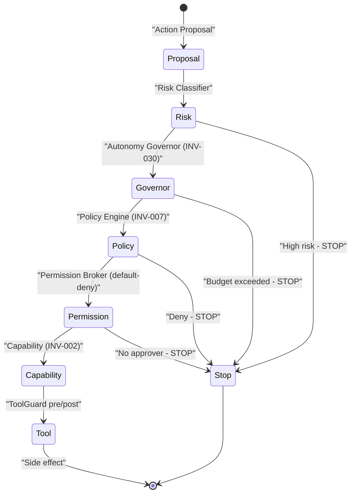

> Chuỗi bắt buộc: `Autonomous Agent → Action Proposal → Risk Classifier → Governor → Policy → Permission → Capability → Tool` — mọi bước có thể STOP; không shortcut (`❌ Agent → Tool`).

### 13.2 Kill Switch (TASK-068)

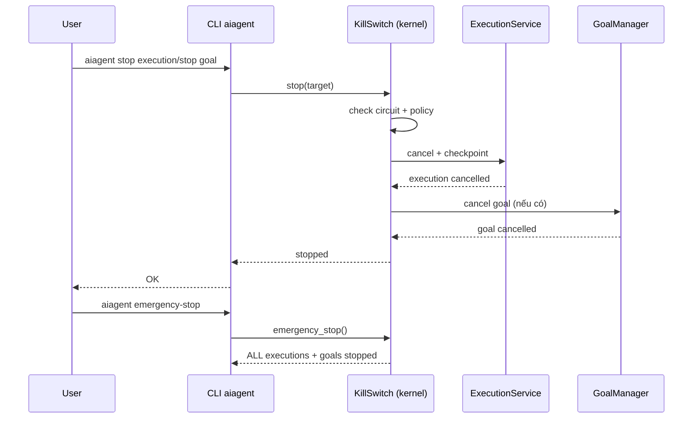

---

## 14. Nguồn & lịch sử

- Tài liệu này: `docs/architecture-v3.md` (cập nhật 2026-08-16 — gốc TASK-076, 2026-08-15) — **bản hiện hành** (AIOS 1.0 CERTIFIED + M11 DONE + M12 IN-PROGRESS, Mermaid). Cập nhật 2026-08-16: thêm §9b (M11 DONE) + M12 IN-PROGRESS + INV-035; version 1.1 planned (TASK-084..088).
- Quy ước Mermaid thay "markdown thuần" của v2 — quyết định người dùng 2026-08-15 (render được trên GitHub + VS Code preview).
- Bản cũ: `docs/architecture-v2.md` (2026-08-15, TASK-063) — markdown thuần, phản ánh đến M10 todo — **giữ làm lịch sử**.
- Bản gốc: `docs/architecture.md` — mô tả đến M5 in-progress — **giữ làm lịch sử**.
- Nguồn chính: `docs/PLAN.md` · `aios/progress/PROGRESS.md` · `aios/progress/LOG.md` · `docs/architecture/*` (frozen) · `docs/adr/` · `backend/tests/test_architecture.py` · `backend/src/aios_core/observability/arch_health.py`.
