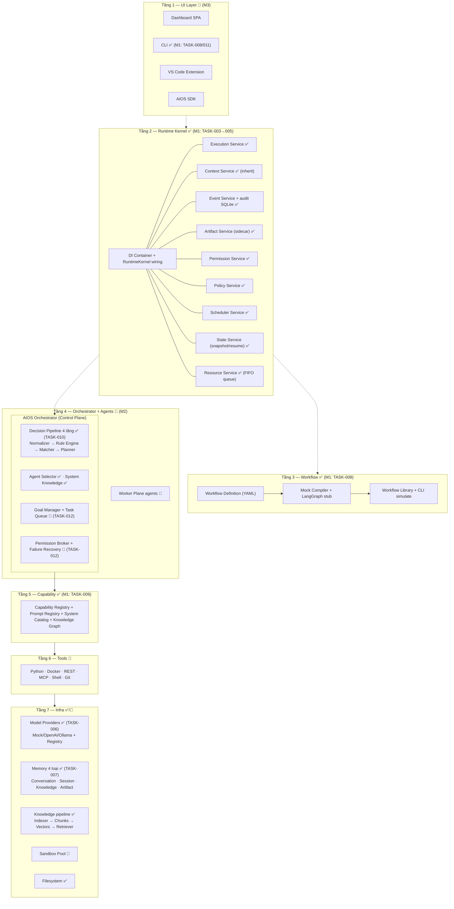
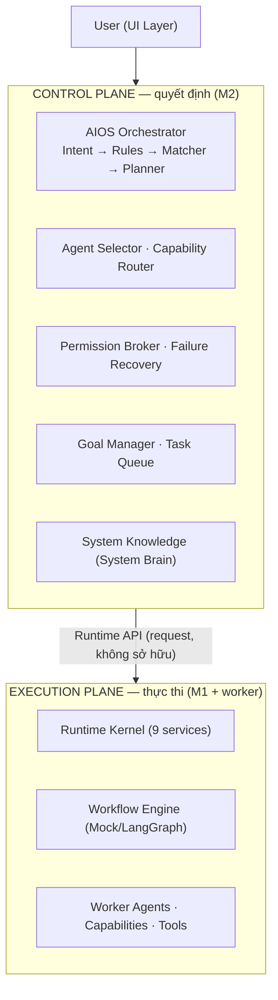

# AIOS — Kiến trúc hệ thống

> Tài liệu tham chiếu: kiến trúc 7 tầng + Orchestrator + tiến độ triển khai theo trạng thái hiện tại.
> Nguồn gốc: `docs/PLAN.md` (master plan v6) + `aios/progress/PROGRESS.md` (trạng thái build thực tế).
> Cập nhật lần cuối: 2026-08-13.

## 1. Kiến trúc tổng thể 7 tầng — theo trạng thái build



> **Dependency một chiều (INV-004, #4)**: Agent → Capability → Tool → Infrastructure.
> Runtime/Capability KHÔNG phụ thuộc ngược Infra. Enforcement: `tests/test_architecture.py` (AST).

### 1.1 Control Plane vs Execution Plane (#1, #11)



**Nguyên tắc**: Orchestrator KHÔNG sở hữu/trộn trách nhiệm Runtime Service — nó *request* Runtime thực hiện qua Runtime API (INV-005). Phân biệt Execution Plane (thực thi) với Control Plane (quyết định) — không phải tầng vật lý mới.

## 2. Bên trong Orchestrator — module theo trạng thái


## 3. Luồng xử lý một request

```mermaid
flowchart LR
    U["👤 User:<br/>CLI / API / Dashboard / SDK"] --> UI["UI Layer"]
    UI --> N["Normalizer<br/>(chuẩn hóa tham số, alias — không LLM)"]
    N --> R["Rule Engine<br/>(deterministic)"]
    R -->|"70–90% yêu cầu dừng tại đây"| W["Workflow Matcher"]
    W -->|"có workflow phù hợp"| P["Planner (LLM)<br/>chỉ khi thật cần"]
    P --> E["Execution Plan"]
    W -.->|"không tìm thấy"| P
    R -.->|"intent rõ ràng<br/>chat/coding/doctor/skill..."| E

    E --> POL["Policy Engine<br/>pre-check: allow / deny / ask?"]
    POL -->|allow| S["Execution Supervisor"]
    POL -->|ask| HU["⚠️ Human Approval"]
    HU --> S
    S --> A["Agent Selector → Worker Plane"]
    A --> CAP["Capability Router"]
    CAP --> T["Tools:<br/>Python · Docker · REST · MCP · Shell · Git"]
    T --> INF["Infra:<br/>Model · Memory · KB · Sandbox · FS"]
    INF --> RES["Kết quả / Artifact"]
    RES --> U["👤 User"]

    %% Evaluation = post-execution observer (#5) — KHÔNG nằm trong execution chain
    RES -.->|event| EV["Evaluation (post-execution observer)<br/>score → memory"]
    EV -.->|learn| KB2["Knowledge"]
```



Thứ tự ưu tiên xử lý: **1. Rule Engine (deterministic, 0 token) → 2. Workflow Library (tái sử dụng) → 3. Planner LLM (chỉ khi cần) → 4. Human Approval** (nếu policy yêu cầu).

### 3.1 Knowledge: Base vs Graph (#6)

```
Knowledge
├── Knowledge Base        ← pipeline M1: Documents → Chunks → Embeddings → Retriever
└── Knowledge Graph       ← M1: Entities · Relations · Index (metadata liên kết)
```

**System Knowledge (#9 — System Brain)**: Orchestrator hỏi qua `Registries → Catalog → Knowledge Graph → System Knowledge → Orchestrator` — KHÔNG đọc trực tiếp từng registry (tránh God Object).

### 3.2 Context vs Memory (#7)

- **Context** = thông tin ĐANG được dùng trong execution (Execution/Agent/Workflow/User/System/SHARED — ContextService M1, có inherit).
- **Memory** = thông tin ĐƯỢC LƯU để dùng lại sau execution (Conversation · Session · Knowledge · Artifact).
- Luồng: `Memory → Memory Coordinator (🔲) → Context → Execution` — Agent KHÔNG tự lấy Memory trực tiếp.

### 3.3 Scheduler / Resource / Execution — 3 vai (#8)

| Vai | Câu hỏi | Service |
|-----|---------|---------|
| Scheduler | WHEN chạy? (cron/one-shot) | SchedulerService ✅ |
| Resource Manager | CÓ THỂ chạy không? (grant/queue/reject) | ResourceService ✅ (FIFO + acquire_slot_wait) |
| Execution Service | CHẠY như thế nào? (plan → nodes → snapshot) | ExecutionService ✅ |

## 4. Tiến độ milestone

```mermaid
graph LR
    subgraph M0["M0 — Foundation ✅"]
        A1["4 VS Code agents + progress system + review briefs"]
    end

    subgraph M1["M1 — Core Runtime ✅"]
        B1["TASK-002..009 (9 tasks)<br/>kernel 9 services · models · memory ·<br/>workflow · capability · catalog · KG"]
        B2["TASK-011 Remediation 9 findings ✅<br/>428 tests · coverage 95.76%"]
    end

    subgraph M2["M2 — Developer Edition 🚧 in-progress"]
        C1["TASK-010 Decision Pipeline ✅<br/>402 tests · 10/10 AC"]
        C2["TASK-012 Goal Manager + Task Queue +<br/>Permission Broker + Failure Recovery ✅<br/>490 tests · 95.96% · 12/12 AC"]
        C3["TASK-016 Architecture Invariants ✅<br/>INV-001..010 + AST tests"]
        C4["P3c-P4: Assistants · Tools · Skills 🔲"]
    end

    subgraph M3["M3 — Desktop Edition 🔲"]
        D1["Dashboard + VS Code Extension"]
    end

    subgraph M4["M4 — Platform Edition 🔲"]
        E1["Observability + upgrade pipeline"]
    end

    M0 --> M1 --> M2 --> M3 --> M4
```



## 5. Bảng tổng hợp trạng thái

| Hạng mục | Trạng thái | Chi tiết |
|---|---|---|
| M0 — Foundation | ✅ done | 4 agents, progress system, review quy trình |
| M1 — Core Runtime | ✅ done | 9/9 tasks + remediation, **428 tests, 95.76%** |
| M2 — Orchestrator | 🚧 in-progress | TASK-010 ✅ (402); TASK-012 ✅ (490 tests, 95.96%, 12/12 AC); TASK-016 ✅ (INV + AST tests); P3c-P4 đang làm |
| M3 — Desktop Edition | 🔲 todo | Dashboard + VS Code extension |
| M4 — Platform Edition | 🔲 todo | Observability + upgrade pipeline + Architecture Health (xem PLAN.md) |
| Deliverable M1 | ✅ | `aiagent run workflow.yaml --simulate` |

### Chi tiết tasks M1 (đã hoàn thành) + M2 (đến hiện tại)

| Task | Nội dung | Tests | Coverage |
|------|----------|-------|----------|
| TASK-002 | Scaffold monorepo + aios_core (config/logging/metadata/healthcheck) | 32 | 96.14% |
| TASK-003 | Kernel Foundations (semver, contracts, DI, event bus, execution plan) | 107 | 94.82% |
| TASK-004 | Kernel Services I (context, event+audit, artifact, permission, policy) | 162 | 94.77% |
| TASK-005 | Kernel Services II (scheduler, state, resource, execution) + RuntimeKernel | 207 | 95.32% |
| TASK-006 | Model Contract + providers (Mock/OpenAI/Ollama) + Registry | 233 | 94.73% |
| TASK-007 | Memory 4 loại + Knowledge pipeline | 270 | 94.90% |
| TASK-008 | Workflow Definition + Compilers + Library + CLI simulate | 300 | 94.92% |
| TASK-009 | Capability + Prompt Registry + Catalog + Knowledge Graph | 346 | 95.30% |
| TASK-011 | Remediation 9 P3 findings (M1 v2 review) | 428 | 95.76% |
| TASK-010 | M2-P3a Decision Pipeline (orchestrator v1) | 402 | — |
| TASK-012 | M2-P3b Goal Manager + Task Queue + Permission Broker + Failure Recovery | **490** | **95.96%** |
| TASK-016 | M2 Architecture Hardening: INV-001..010 + AST tests + reference | 490 + ~12 | 95.96%+ |

## 6. Nguyên tắc xuyên suốt

- **Source of Truth = Repo**: `docs/PLAN.md` + `aios/progress/` là nguồn chính, không phải bộ nhớ phiên.
- **Control Plane vs Worker Plane**: Orchestrator là agent **duy nhất** chạm vào Runtime/Registry; Worker agents chỉ làm nghiệp vụ, truy cập hệ thống **bắt buộc qua Capability + Runtime** (enforced bởi Permission + Policy Service).
- **Offline-first**: 70–90% yêu cầu dừng ở Rule Engine + Workflow Matcher — nhanh, rẻ, test được.
- **Deterministic trước, LLM sau**: LLM là phương án cuối, không phải mặc định.
- **Contract-First**: 7 contract version hóa (major/minor compatibility), metadata chuẩn cho mọi component.

## 7. Architecture Invariants (bất biến kiến trúc)

> Mọi PR/task vi phạm các invariant sau → **FAIL architecture review**. Enforcement tự động: `backend/tests/test_architecture.py` (AST import-graph scan — chạy trong pytest bình thường). Quyết định: `docs/adr/0004-architecture-invariants.md`.

| ID | Tên | Nội dung | Enforce |
|----|-----|----------|---------|
| INV-001 | Runtime Isolation | Worker Agent không truy cập trực tiếp Runtime Service | test (khi có `agents/`) |
| INV-002 | Capability Isolation | Agent không gọi Tool trực tiếp — chỉ qua Capability | test tiền đề (khi có `agents/`+`tools/`) |
| INV-003 | Workflow Independence | Workflow Definition không phụ thuộc engine (LangGraph) | test ✅ |
| INV-004 | Tool Independence | Capability không phụ thuộc implementation Tool cụ thể | test ✅ (premise) |
| INV-005 | Control Plane Isolation | Orchestrator điều phối, không chứa business implementation | test ✅ (rule A + B allow-list) |
| INV-006 | Contract First | Cross-layer giao tiếp qua Contract | manual review + purity check `contracts/` |
| INV-007 | Policy First | Execution phải qua policy pre-check trước side effect | test ✅ (hard — call-site `_policy.evaluate`) |
| INV-008 | Artifact First | Output giữa boundary tham chiếu Artifact | future (M4) |
| INV-009 | Event Driven | Lifecycle quan trọng phát Event | test một phần ⚠️ (4/8 business; 4 future) |
| INV-010 | Deterministic First | Rule/Registry/Workflow ưu tiên trước LLM | test ✅ |

**4 invariant chốt (ADR-0004):**
1. **Orchestrator không phải God Object** — điều phối qua Runtime API, không sở hữu service (INV-005).
2. **Agent không được chạm Tool** — mọi truy cập qua Capability (INV-002).
3. **Workflow không biết Engine** — definition thuần declarative (INV-003).
4. **Execution không được bypass Policy** — policy pre-check trước side effect (INV-007).

**Ghi chú gap hiện tại**: `sandbox_required` từ policy chưa được enforce trong ExecutionService v1 (chỉ `logger.warning` — xem ADR-0004); INV-009 chưa phủ context/state/resource/scheduler; INV-001/002 có hiệu lực khi TASK-013 (agents) + TASK-014 (tools) ra đời.

## 8. Architecture Health (kế hoạch M4)

Kế hoạch cho M4 (P8): Architecture Health — ngoài health hạ tầng (Docker/model/memory), hệ thống còn đo: contract violations, layer violations, dependency violations, capability bypass, permission bypass, orphan components, broken registrations, circular dependencies, deprecated contracts. Phù hợp hướng System Doctor + System Evolution Engine. Chi tiết: `docs/PLAN.md`.
