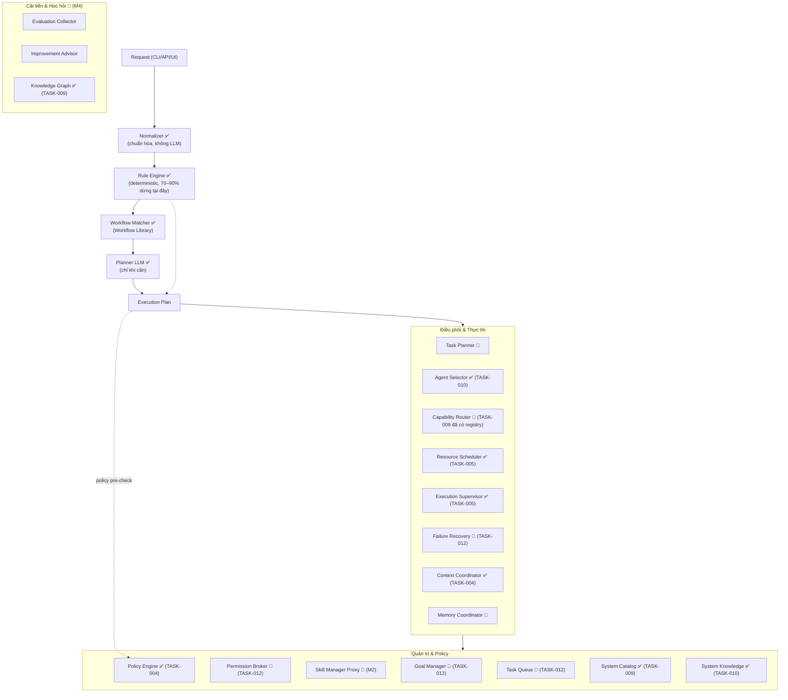

# AIOS — Kiến trúc hệ thống

> Tài liệu tham chiếu: kiến trúc 7 tầng + Orchestrator + tiến độ triển khai theo trạng thái hiện tại.
> Nguồn gốc: `docs/PLAN.md` (master plan v6) + `aios/progress/PROGRESS.md` (trạng thái build thực tế).
> Cập nhật lần cuối: 2026-08-13.

## 1. Kiến trúc tổng thể 7 tầng — theo trạng thái build

## 2. Bên trong Orchestrator — module theo trạng thái

## 3. Luồng xử lý một request

```mermaid
flowchart LR
    U["👤 User:<br/>CLI / API / Dashboard / SDK"] --> UI["UI Layer"]
    UI --> N["Normalizer<br/>(chuẩn hóa tham số, alias — không LLM)"]
    N --> R["Rule Engine<br/>(deterministic)"]
    R -->|"70–90% yêu cầu dừng tại đây"| W["Workflow Matcher"]
    W -->|"có workflow phù hợp"| P["Planner (LLM)<br/>chỉ khi thật cần"]
    P --> E["Execution Plan"]
    W -.->|"không tìm thấy"| P
    R -.->|"intent rõ ràng<br/>chat/coding/doctor/skill..."| E

    E --> POL["Policy Engine<br/>pre-check: allow / deny / ask?"]
    POL -->|allow| S["Execution Supervisor"]
    POL -->|ask| HU["⚠️ Human Approval"]
    HU --> S
    S --> A["Agent Selector → Worker Plane"]
    A --> CAP["Capability Router"]
    CAP --> T["Tools:<br/>Python · Docker · REST · MCP · Shell · Git"]
    T --> INF["Infra:<br/>Model · Memory · KB · Sandbox · FS"]
    INF --> RES["Kết quả"]
    RES --> EV["Evaluation<br/>(score → memory)"]
    EV --> U
```

Thứ tự ưu tiên xử lý: **1. Rule Engine (deterministic, 0 token) → 2. Workflow Library (tái sử dụng) → 3. Planner LLM (chỉ khi cần) → 4. Human Approval** (nếu policy yêu cầu).

## 4. Tiến độ milestone

```mermaid
graph LR
    subgraph M0["M0 — Foundation ✅"]
        A1["4 VS Code agents + progress system + review briefs"]
    end

    subgraph M1["M1 — Core Runtime ✅"]
        B1["TASK-002..009 (9 tasks)<br/>kernel 9 services · models · memory ·<br/>workflow · capability · catalog · KG"]
        B2["TASK-011 Remediation 9 findings ✅<br/>428 tests · coverage 95.76%"]
    end

    subgraph M2["M2 — Developer Edition 🚧 in-progress"]
        C1["TASK-010 Decision Pipeline ✅<br/>402 tests · 10/10 AC"]
        C2["TASK-012 Goal Manager + Task Queue +<br/>Permission Broker + Failure Recovery 🚧<br/>đang test"]
        C3["P4: tools/skills/sandbox 🔲"]
    end

    subgraph M3["M3 — Desktop Edition 🔲"]
        D1["Dashboard + VS Code Extension"]
    end

    subgraph M4["M4 — Platform Edition 🔲"]
        E1["Observability + upgrade pipeline"]
    end

    M0 --> M1 --> M2 --> M3 --> M4
```

## 5. Bảng tổng hợp trạng thái

| Hạng mục | Trạng thái | Chi tiết |
|---|---|---|
| M0 — Foundation | ✅ done | 4 agents, progress system, review quy trình |
| M1 — Core Runtime | ✅ done | 9/9 tasks + remediation, **428 tests, 95.76%** |
| M2 — Orchestrator | 🚧 in-progress | TASK-010 done (402 tests); TASK-012 đang implement/test |
| M3 — Desktop Edition | 🔲 todo | Dashboard + VS Code extension |
| M4 — Platform Edition | 🔲 todo | Observability + upgrade pipeline |
| Deliverable M1 | ✅ | `aiagent run workflow.yaml --simulate` |

### Chi tiết tasks M1 (đã hoàn thành)

| Task | Nội dung | Tests | Coverage |
|------|----------|-------|----------|
| TASK-002 | Scaffold monorepo + aios_core (config/logging/metadata/healthcheck) | 32 | 96.14% |
| TASK-003 | Kernel Foundations (semver, contracts, DI, event bus, execution plan) | 107 | 94.82% |
| TASK-004 | Kernel Services I (context, event+audit, artifact, permission, policy) | 162 | 94.77% |
| TASK-005 | Kernel Services II (scheduler, state, resource, execution) + RuntimeKernel | 207 | 95.32% |
| TASK-006 | Model Contract + providers (Mock/OpenAI/Ollama) + Registry | 233 | 94.73% |
| TASK-007 | Memory 4 loại + Knowledge pipeline | 270 | 94.90% |
| TASK-008 | Workflow Definition + Compilers + Library + CLI simulate | 300 | 94.92% |
| TASK-009 | Capability + Prompt Registry + Catalog + Knowledge Graph | 346 | 95.30% |
| TASK-011 | Remediation 9 P3 findings (M1 v2 review) | 428 | 95.76% |

## 6. Nguyên tắc xuyên suốt

- **Source of Truth = Repo**: `docs/PLAN.md` + `aios/progress/` là nguồn chính, không phải bộ nhớ phiên.
- **Control Plane vs Worker Plane**: Orchestrator là agent **duy nhất** chạm vào Runtime/Registry; Worker agents chỉ làm nghiệp vụ, truy cập hệ thống **bắt buộc qua Capability + Runtime** (enforced bởi Permission + Policy Service).
- **Offline-first**: 70–90% yêu cầu dừng ở Rule Engine + Workflow Matcher — nhanh, rẻ, test được.
- **Deterministic trước, LLM sau**: LLM là phương án cuối, không phải mặc định.
- **Contract-First**: 7 contract version hóa (major/minor compatibility), metadata chuẩn cho mọi component.
