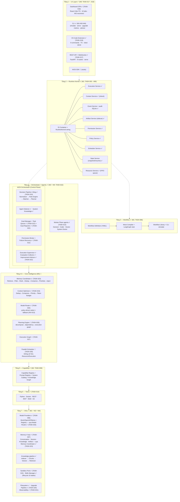
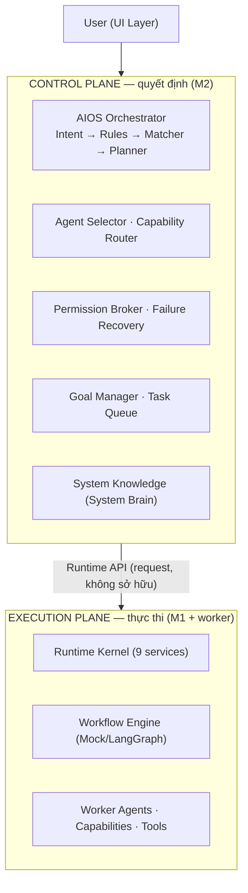
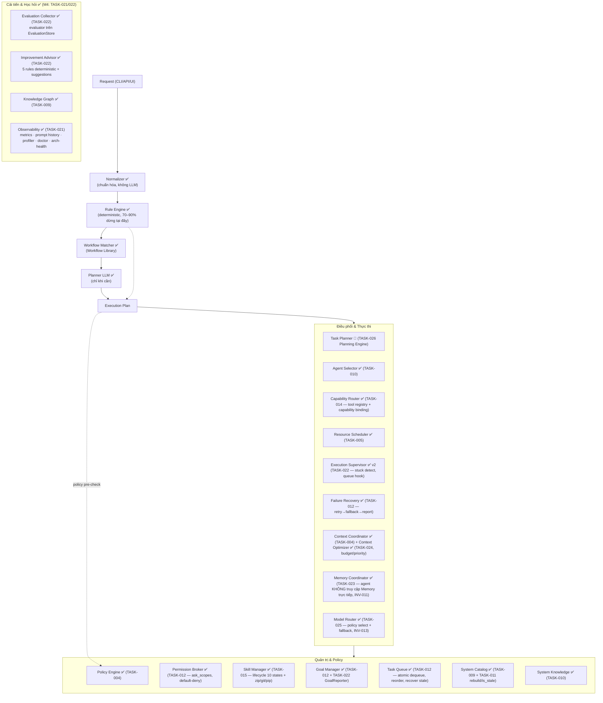
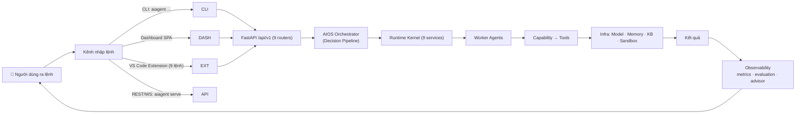
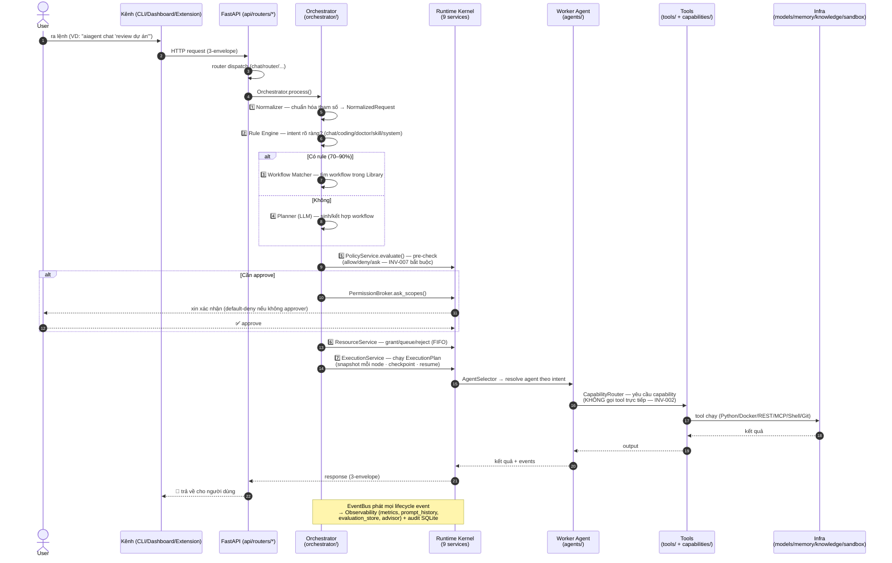

# AIOS — Kiến trúc hệ thống

> Tài liệu tham chiếu: kiến trúc 7 tầng + Orchestrator + tiến độ triển khai theo trạng thái hiện tại.
> Nguồn gốc: `docs/PLAN.md` (master plan v6) + `aios/progress/PROGRESS.md` (trạng thái build thực tế).
> Cập nhật lần cuối: 2026-08-15.

## 1. Kiến trúc tổng thể 7 tầng — theo trạng thái build



> **Dependency một chiều (INV-004, #4)**: Agent → Capability → Tool → Infrastructure.
> Runtime/Capability KHÔNG phụ thuộc ngược Infra. Enforcement: `tests/test_architecture.py` (AST).

### 1.1 Control Plane vs Execution Plane (#1, #11)



**Nguyên tắc**: Orchestrator KHÔNG sở hữu/trộn trách nhiệm Runtime Service — nó *request* Runtime thực hiện qua Runtime API (INV-005). Phân biệt Execution Plane (thực thi) với Control Plane (quyết định) — không phải tầng vật lý mới.

## 2. Bên trong Orchestrator — module theo trạng thái



## 3. Luồng xử lý một request

```mermaid
flowchart LR
    U["👤 User:<br/>CLI / API / Dashboard / SDK"] --> UI["UI Layer"]
    UI --> N["Normalizer<br/>(chuẩn hóa tham số, alias — không LLM)"]
    N --> R["Rule Engine<br/>(deterministic)"]
    R -->|"70–90% yêu cầu dừng tại đây"| W["Workflow Matcher"]
    W -->|"có workflow phù hợp"| P["Planner (LLM)<br/>chỉ khi thật cần"]
    P --> E["Execution Plan"]
    W -.->|"không tìm thấy"| P
    R -.->|"intent rõ ràng<br/>chat/coding/doctor/skill..."| E

    E --> POL["Policy Engine<br/>pre-check: allow / deny / ask?"]
    POL -->|allow| S["Execution Supervisor"]
    POL -->|ask| HU["⚠️ Human Approval"]
    HU --> S
    S --> A["Agent Selector → Worker Plane"]
    A --> CAP["Capability Router"]
    CAP --> T["Tools:<br/>Python · Docker · REST · MCP · Shell · Git"]
    T --> INF["Infra:<br/>Model · Memory · KB · Sandbox · FS"]
    INF --> RES["Kết quả / Artifact"]
    RES --> U["👤 User"]

    %% Evaluation = post-execution observer (#5) — KHÔNG nằm trong execution chain
    RES -.->|event| EV["Evaluation (post-execution observer)<br/>score → memory"]
    EV -.->|learn| KB2["Knowledge"]
```



Thứ tự ưu tiên xử lý: **1. Rule Engine (deterministic, 0 token) → 2. Workflow Library (tái sử dụng) → 3. Planner LLM (chỉ khi cần) → 4. Human Approval** (nếu policy yêu cầu).

### 3.1 Knowledge: Base vs Graph (#6)

```
Knowledge
├── Knowledge Base        ← pipeline M1: Documents → Chunks → Embeddings → Retriever
└── Knowledge Graph       ← M1: Entities · Relations · Index (metadata liên kết)
```

**System Knowledge (#9 — System Brain)**: Orchestrator hỏi qua `Registries → Catalog → Knowledge Graph → System Knowledge → Orchestrator` — KHÔNG đọc trực tiếp từng registry (tránh God Object).

### 3.2 Context vs Memory (#7)

- **Context** = thông tin ĐANG được dùng trong execution (Execution/Agent/Workflow/User/System/SHARED — ContextService M1, có inherit).
- **Memory** = thông tin ĐƯỢC LƯU để dùng lại sau execution (Conversation · Session · Knowledge · Artifact).
- Luồng: `Memory → Memory Coordinator (🔲) → Context → Execution` — Agent KHÔNG tự lấy Memory trực tiếp.

### 3.3 Scheduler / Resource / Execution — 3 vai (#8)

| Vai | Câu hỏi | Service |
|-----|---------|---------|
| Scheduler | WHEN chạy? (cron/one-shot) | SchedulerService ✅ |
| Resource Manager | CÓ THỂ chạy không? (grant/queue/reject) | ResourceService ✅ (FIFO + acquire_slot_wait) |
| Execution Service | CHẠY như thế nào? (plan → nodes → snapshot) | ExecutionService ✅ |

### 3.4 Hành trình một lệnh — theo code thật (M0–M4 đã build)

Khi người dùng ra lệnh, toàn bộ hành trình diễn ra qua các module đã có code thật:



Sequence chi tiết — từng bước có module thật:



| # | Bước | Module thật (đã build) | Trạng thái |
|---|------|------------------------|------------|
| 1 | **Normalizer** | `orchestrator/normalizer.py` — chuẩn hóa, không LLM | ✅ TASK-010 |
| 2 | **Rule Engine** | `orchestrator/rule_engine.py` — deterministic, 70–90% dừng tại đây, 0 token | ✅ TASK-010 |
| 3 | **Workflow Matcher** | `orchestrator/workflow_matcher.py` + Workflow Library (TASK-008) | ✅ TASK-010 |
| 4 | **Planner LLM** | `orchestrator/planner.py` — chỉ khi cần, đếm `llm_calls` | ✅ TASK-010 |
| 5 | **Policy pre-check** | `PolicyService` + `ask_scopes` (Permission Broker) — **bất khả bypass** (INV-007, AST-enforced) | ✅ TASK-004/012 |
| 6 | **Resource** | `ResourceService` — Grant/Queue/Reject + `acquire_slot_wait` | ✅ TASK-005/011 |
| 7 | **Execution** | `ExecutionService` — ExecutionPlan → nodes → snapshot/resume, emit `TOOL_STARTED/FINISHED`, `SNAPSHOT_SAVED`, `WORKFLOW_FAILED/CANCELLED` | ✅ TASK-005/021 |
| 8 | **Agent Selector** | `agents/registry.py` — resolve intent → General/Coder/Doctor/System Doctor (Worker Plane) | ✅ TASK-010/013 |
| 9 | **Capability Router** | `tools/registry.py` + `capabilities/` — agent không chạm tool trực tiếp | ✅ TASK-014 |
| 10 | **Tools** | 6 loại: Python (ast.parse, no-exec), Docker mock, REST validate, MCP, Shell (no-exec), Git mock | ✅ TASK-014 |
| 11 | **Infra** | Models (Mock/OpenAI/Ollama) · Memory 4 loại · KB · Sandbox Pool · Skills | ✅ TASK-006/007/015 |
| 12 | **Observability** | `metrics.py` (workflow/tool duration, failures) · `evaluation_store` · `profiler` · `arch_health` · `advisor` (5 rules đề xuất cải tiến) | ✅ TASK-021/022 |

**Ví dụ cụ thể — CLI:**

```
aiagent chat "viết test cho module config"
```

1. **CLI** gọi API `POST /api/v1/chat` (hoặc xử lý trực tiếp)
2. **Orchestrator**: Normalizer → intent = `coding` → Rule Engine khớp → Coder agent
3. **Policy**: kiểm tra quyền truy cập filesystem/shell → allow (hoặc ask)
4. **Resource**: đủ slot → Grant
5. **ExecutionService**: chạy plan; Coder agent qua **Capability Router** → tool `Python`/`Git`
6. Mỗi node: **snapshot** (State Service) + **event** (Event Bus → audit SQLite + metrics)
7. Kết quả trả về UI; **EvaluationCollector** ghi score; **ImprovementAdvisor** phân tích để đề xuất cải tiến lần sau

> **⚠️ Lưu ý thực tế:** Tools hiện ở mức **stub an toàn** (Python `ast.parse` không exec, Shell no-exec, Docker/Git mock) — đúng thiết kế v1: ưu tiên kiến trúc + test; phần thực thi thật sẽ đến khi policy/sandbox chín muồi.

## 4. Tiến độ milestone

```mermaid
graph LR
    subgraph M0["M0 — Foundation ✅"]
        A1["4 VS Code agents + progress system + review briefs"]
    end

    subgraph M1["M1 — Core Runtime ✅"]
        B1["TASK-002..009 (9 tasks)<br/>kernel 9 services · models · memory ·<br/>workflow · capability · catalog · KG"]
        B2["TASK-011 Remediation 9 findings ✅<br/>428 tests · coverage 95.76%"]
    end

    subgraph M2["M2 — Developer Edition ✅ done"]
        C1["TASK-010 Decision Pipeline ✅<br/>402 tests · 10/10 AC"]
        C2["TASK-012 Goal Manager + Task Queue +<br/>Permission Broker + Failure Recovery ✅<br/>490 tests · 95.96% · 12/12 AC"]
        C3["TASK-016 Architecture Invariants ✅<br/>INV-001..010 + AST tests"]
        C4["TASK-013 Assistants ✅ · TASK-014 Tools ✅ · TASK-015 Skills+Sandbox ✅"]
    end

    subgraph M3["M3 — Desktop Edition ✅ done"]
        D1["TASK-017 REST + WS API ✅<br/>TASK-018 Dashboard SPA ✅<br/>TASK-019 VS Code Extension ✅<br/>689 pytest + 19 vitest"]
    end

    subgraph M4["M4 — Platform Edition ✅ done"]
        E1["TASK-020 Upgrade Pipeline ✅"]
        E2["TASK-021 Observability ✅"]
        E3["TASK-022 Orchestrator v2 ✅<br/>809 tests · 94.92%"]
    end

    subgraph M5["M5 — Core Intelligence 🚧 in-progress"]
        F1["TASK-023 Memory Coordinator ✅<br/>855 pass · 95.16% · 10/10 AC"]
        F2["TASK-024 Context Optimizer ✅<br/>896 pass · 95.21% · 11/11 AC"]
        F3["TASK-025 Model Router ✅<br/>949 pass · 95.13% · 11/11 AC"]
        F4["TASK-026 Planning Engine 🔲<br/>TASK-027 Execution Graph 🔲<br/>TASK-028 Parallel Scheduler 🔲"]
    end

    M0 --> M1 --> M2 --> M3 --> M4 --> M5
```



## 5. Bảng tổng hợp trạng thái

| Hạng mục | Trạng thái | Chi tiết |
|---|---|---|
| M0 — Foundation | ✅ done | 4 agents, progress system, review quy trình |
| M1 — Core Runtime | ✅ done | 9/9 tasks + remediation, **428 tests, 95.76%** |
| M2 — Orchestrator | ✅ done | TASK-010 ✅ (402); TASK-012 ✅ (490 tests, 95.96%, 12/12 AC); TASK-016 ✅ (INV + AST tests); TASK-013 ✅ Assistants; TASK-014 ✅ Tools; TASK-015 ✅ Skills+Sandbox · **669 tests, 95.51%** |
| M3 — Desktop Edition | ✅ done | TASK-017 REST+WS API · TASK-018 Dashboard SPA · TASK-019 VS Code Extension — **689 pytest + 19 vitest** |
| M4 — Platform Edition | ✅ done | TASK-020 Upgrade · TASK-021 Observability · TASK-022 Orchestrator v2 — **809 tests, 94.92%** |
| M5 — Core Intelligence | 🚧 in-progress | TASK-023 Memory Coordinator ✅ · TASK-024 Context Optimizer ✅ · TASK-025 Model Router ✅ (949 tests) · TASK-026/027/028 🔲 (Planning/Graph/Scheduler) |
| M6+ — Enterprise/Evolution | 🔲 todo | M6–M10 theo `docs/PLAN.md` (tương lai — không làm v1) |
| Deliverable M1 | ✅ | `aiagent run workflow.yaml --simulate` |
| Deliverable M3/M4 | ✅ | `aiagent serve` + Dashboard + Extension + `aiagent arch-health` |

### Chi tiết tasks M1 (đã hoàn thành) + M2 (đến hiện tại)

| Task | Nội dung | Tests | Coverage |
|------|----------|-------|----------|
| TASK-002 | Scaffold monorepo + aios_core (config/logging/metadata/healthcheck) | 32 | 96.14% |
| TASK-003 | Kernel Foundations (semver, contracts, DI, event bus, execution plan) | 107 | 94.82% |
| TASK-004 | Kernel Services I (context, event+audit, artifact, permission, policy) | 162 | 94.77% |
| TASK-005 | Kernel Services II (scheduler, state, resource, execution) + RuntimeKernel | 207 | 95.32% |
| TASK-006 | Model Contract + providers (Mock/OpenAI/Ollama) + Registry | 233 | 94.73% |
| TASK-007 | Memory 4 loại + Knowledge pipeline | 270 | 94.90% |
| TASK-008 | Workflow Definition + Compilers + Library + CLI simulate | 300 | 94.92% |
| TASK-009 | Capability + Prompt Registry + Catalog + Knowledge Graph | 346 | 95.30% |
| TASK-011 | Remediation 9 P3 findings (M1 v2 review) | 428 | 95.76% |
| TASK-010 | M2-P3a Decision Pipeline (orchestrator v1) | 402 | — |
| TASK-012 | M2-P3b Goal Manager + Task Queue + Permission Broker + Failure Recovery | **490** | **95.96%** |
| TASK-013 | M2-P3c Assistants (Worker Plane — INV-001/002) | 549 | 96.03% |
| TASK-014 | M2-P4 Tools 6 loại + Tool Registry + capability binding | 622 | 96.15% |
| TASK-015 | M2-P4 Skills lifecycle 10 states + Sandbox Pool | 669 | 95.51% |
| TASK-016 | M2 Architecture Hardening: INV-001..010 + AST tests + reference | 669 + ~12 | 95.51%+ |
| TASK-017 | M3-P5 FastAPI REST + WebSocket (9 routers, serve) | 689 | 95.10% |
| TASK-018 | M3-P5 Dashboard SPA (React+Vite+TS, 10 tabs, WS) | 12 vitest + build | — |
| TASK-019 | M3-P6 VS Code Extension (9 commands, TS) | 19 vitest + tsc | — |
| TASK-020 | M4-P7 Upgrade Pipeline (resolve/backup/migrate/pipeline, `aiagent upgrade`) | 730 | 95.00% |
| TASK-021 | M4-P8 Observability (metrics/prompt_history/profiler/doctor/arch_health/evaluation + API) | 779 | 95.11% |
| TASK-022 | M4-P8 Orchestrator v2 (advisor/supervisor/collector/goal_reporter + API v2) | **809** | **94.92%** |
| TASK-023 | M5-P9a Memory Coordinator (Retrieve→Filter→Rank→Dedup→Compress→Prioritize→Inject, INV-011) | 855 | 95.16% |
| TASK-024 | M5-P9b Context Optimizer (Dedup→Compress→Priority→Token Budget, INV-012) | 896 | 95.21% |
| TASK-025 | M5-P9c Model Router (Selector/Policy/Cost/Availability/Fallback/Health, INV-013) | **949** | **95.13%** |
| TASK-026 | M5-P9d Planning Engine (Goal→Decompose→Dependency→Capability→Execution Graph, INV-014) | 🔲 | — |
| TASK-027 | M5-P9e Execution Graph (Node/Edge/Dependency/Join/Failure, INV-015) | 🔲 | — |
| TASK-028 | M5-P9f Parallel Scheduler (Graph→Resource→Execution, không sở hữu, INV-016) | 🔲 | — |

## 6. Nguyên tắc xuyên suốt

- **Source of Truth = Repo**: `docs/PLAN.md` + `aios/progress/` là nguồn chính, không phải bộ nhớ phiên.
- **Control Plane vs Worker Plane**: Orchestrator là agent **duy nhất** chạm vào Runtime/Registry; Worker agents chỉ làm nghiệp vụ, truy cập hệ thống **bắt buộc qua Capability + Runtime** (enforced bởi Permission + Policy Service).
- **Offline-first**: 70–90% yêu cầu dừng ở Rule Engine + Workflow Matcher — nhanh, rẻ, test được.
- **Deterministic trước, LLM sau**: LLM là phương án cuối, không phải mặc định.
- **Contract-First**: 7 contract version hóa (major/minor compatibility), metadata chuẩn cho mọi component.

## 7. Architecture Invariants (bất biến kiến trúc)

> Mọi PR/task vi phạm các invariant sau → **FAIL architecture review**. Enforcement tự động: `backend/tests/test_architecture.py` (AST import-graph scan — chạy trong pytest bình thường). Quyết định: `docs/adr/0004-architecture-invariants.md`.

| ID | Tên | Nội dung | Enforce |
|----|-----|----------|---------|
| INV-001 | Runtime Isolation | Worker Agent không truy cập trực tiếp Runtime Service | test (khi có `agents/`) |
| INV-002 | Capability Isolation | Agent không gọi Tool trực tiếp — chỉ qua Capability | test tiền đề (khi có `agents/`+`tools/`) |
| INV-003 | Workflow Independence | Workflow Definition không phụ thuộc engine (LangGraph) | test ✅ |
| INV-004 | Tool Independence | Capability không phụ thuộc implementation Tool cụ thể | test ✅ (premise) |
| INV-005 | Control Plane Isolation | Orchestrator điều phối, không chứa business implementation | test ✅ (rule A + B allow-list) |
| INV-006 | Contract First | Cross-layer giao tiếp qua Contract | manual review + purity check `contracts/` |
| INV-007 | Policy First | Execution phải qua policy pre-check trước side effect | test ✅ (hard — call-site `_policy.evaluate`) |
| INV-008 | Artifact First | Output giữa boundary tham chiếu Artifact | future (M4) |
| INV-009 | Event Driven | Lifecycle quan trọng phát Event | test một phần ⚠️ (4/8 business; 4 future) |
| INV-010 | Deterministic First | Rule/Registry/Workflow ưu tiên trước LLM | test ✅ |
| INV-011 | Memory Isolation | Agent KHÔNG truy cập Memory trực tiếp — qua Memory Coordinator | test ✅ (TASK-023) |
| INV-012 | Context Budget | Context có token budget + priority (P0–P6), compression 3 cấp | test ✅ (TASK-024) |
| INV-013 | Model Routing | Model chọn theo policy + fallback, availability flag tĩnh | test ✅ (TASK-025, 3 arch tests) |
| INV-014 | Planning Separation | Planner tạo task graph, tách khỏi execution | test 🔲 (TASK-026) |
| INV-015 | Graph Dependency | Execution Graph hỗ trợ dependency + parallel + join/failure policy | test 🔲 (TASK-027) |
| INV-016 | Scheduler Non-Ownership | Scheduler KHÔNG sở hữu Resource/Execution | test 🔲 (TASK-028) |

**4 invariant chốt (ADR-0004):**
1. **Orchestrator không phải God Object** — điều phối qua Runtime API, không sở hữu service (INV-005).
2. **Agent không được chạm Tool** — mọi truy cập qua Capability (INV-002).
3. **Workflow không biết Engine** — definition thuần declarative (INV-003).
4. **Execution không được bypass Policy** — policy pre-check trước side effect (INV-007).

**Ghi chú gap hiện tại**: `sandbox_required` từ policy chưa được enforce trong ExecutionService v1 (chỉ `logger.warning` — xem ADR-0004); INV-009 chưa phủ context/state/resource/scheduler; INV-001/002 có hiệu lực khi TASK-013 (agents) + TASK-014 (tools) ra đời; INV-014..016 sẽ enforced cùng TASK-026..028 (Phase 3 M5).

## 8. Architecture Health ✅ (hiện thực hóa M4 — TASK-021)

`observability/arch_health.py` — `ArchitectureHealth.scan(package_dir)` kiểm tra 3 nhóm: **layer** (dependency 1 chiều), **contract** (purity `contracts/`), **policy** (INV-007 call-site). Expose qua API `/api/v1/observability/arch-health` + CLI `aiagent arch-health`. Ngoài ra còn đo: contract violations, layer violations, dependency violations, capability bypass, permission bypass, orphan components, broken registrations, circular dependencies, deprecated contracts (định hướng System Doctor + System Evolution Engine). Chi tiết: `docs/PLAN.md`.
