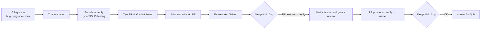

# Quy trình Issue → Branch → PR → Merge thủ công → verify → master

> **BẮT BUỘC** cho mọi thay đổi trong repo AIOS (ghi nhận: ADR-0005 + ADR-0006, AGENTS.md §4.2).
> "main" trong yêu cầu = nhánh `master` của repo này (giữ nguyên `master`, không đổi tên).

## Sơ đồ tổng thể



## Chuẩn bị (một lần)

- Cài GitHub CLI và xác thực (kể cả cho `git push` qua HTTPS):
  ```powershell
  winget install GitHub.cli          # hoặc scoop install gh
  gh auth login                      # xác thực GitHub
  gh auth setup-git                  # cấu hình credential helper cho git
  ```

## Giai đoạn 1 — Đăng yêu cầu lên GitHub Issue

Mọi yêu cầu mới (bug / nâng cấp / ý tưởng thay đổi hệ thống) **phải qua issue** — template có sẵn:

| Loại | Template | Label gợi ý |
|------|----------|-------------|
| Bug | `Bug Report` | `bug` |
| Nâng cấp / tính năng | `Feature / Upgrade Request` | `enhancement`, `upgrade` |
| Ý tưởng / thay đổi hệ thống | `Idea / System Change Proposal` | `idea` |

```powershell
# Ví dụ tạo issue bằng gh CLI
gh issue create --title "[bug]: Dashboard không hiển thị Execution Timeline" --body-file body.md --label bug
```

- Issue được GitHub đánh số tự động → gọi là `ISSUE-N` (vd issue #42).
- Blank issue bị tắt (`config.yml`) — bắt buộc dùng template.

## Giai đoạn 2 — Nhận issue → tạo nhánh

1. **Phân loại** (AIOS Orchestrator): task > ~30 phút / chạm nhiều file → mở `TASK-xxx` qua hard gate (ghi link issue vào spec.md); fix nhỏ (1 dòng, typo) → bypass hợp lệ (ghi LOG.md `[bypass]` + ghi chú issue nếu có).
2. **Xin xác nhận người dùng TRƯỚC khi tạo nhánh** — trình bày tên nhánh đề xuất, lý do, issue tham chiếu; đợi người dùng đồng ý mới thực hiện.
3. **Refresh `verify` TRƯỚC khi tạo nhánh** (tránh drift):
   ```powershell
   git fetch origin
   git checkout verify
   git pull origin verify
   ```
4. **Tạo nhánh TỪ `verify`** (KHÔNG từ `master`):
   ```powershell
   git checkout -b <type>/ISSUE-<N>-<slug> origin/verify
   ```

### Quy ước tên nhánh

| Loại issue | Prefix | Ví dụ |
|------------|--------|-------|
| Bug | `fix/` | `fix/ISSUE-42-login-timeout` |
| Nâng cấp / tính năng | `feature/` | `feature/ISSUE-43-dashboard-tab` |
| Ý tưởng (triển khai) | `feature/` | `feature/ISSUE-44-health-monitor` |
| Ý tưởng (chỉ tài liệu/đề xuất) | `docs/` | `docs/ISSUE-45-issue-workflow` |
| Tài liệu / quy trình | `docs/` | `docs/ISSUE-45-issue-workflow` |
| Refactor / test / operation | `refactor/` `test/` `operation/` | `refactor/ISSUE-46-kernel-di` |
| Fix nhỏ KHÔNG có issue | `fix/bypass-<slug>` (khẩn cấp: `hotfix/bypass-<slug>`) | `fix/bypass-login-typo` |

- `<slug>` = 2–5 từ viết thường, nối bằng `-`.
- ⚠️ **Danh sách prefix nằm ở 2 nơi**: tài liệu này + regex trong `.github/workflows/pr-validation.yml`. Thêm prefix mới phải cập nhật ĐỒNG BỘ cả 2 nơi (ADR-0006).

## Giai đoạn 3 — Tạo PR rồi mới sửa (PR-driven)

Sau commit đầu tiên có ý nghĩa → **tạo PR ngay** (đánh **draft** nếu chưa xong), mọi commit tiếp theo đẩy lên chính nhánh đó:

```powershell
# Commit đầu tiên
git add .
git commit -m "docs: add issue-pr workflow (ISSUE-45)"
git push -u origin docs/ISSUE-45-issue-pr-workflow

# Tạo PR draft ngay (base = verify, KHÔNG phải master)
gh pr create --draft --base verify --head docs/ISSUE-45-issue-pr-workflow `
  --title "docs/ISSUE-45: quy trình issue → PR → verify → master" `
  --body-file pr-body.md

# Sửa tiếp → push lên CÙNG nhánh → PR tự cập nhật (không tạo PR mới)
git add . ; git commit -m "..." ; git push
# Khi xong → đánh dấu sẵn sàng review
gh pr ready
```

**Quy ước PR** (bị `.github/workflows/pr-validation.yml` kiểm tra tự động):

| Trường | Quy tắc | Ví dụ |
|--------|---------|-------|
| Title (có issue) | `<type>/ISSUE-<N>: <mô tả>` | `fix/ISSUE-42: sửa timeout đăng nhập` |
| Title (bypass) | `<type>/bypass-<slug>: <mô tả>` | `fix/bypass-login-typo: sửa typo` |
| Title (promotion) | `release: verify → master (YYYY-MM-DD)` | `release: verify → master (2026-08-16)` |
| Body | Link issue `Fixes #N` / `Refs #N`; hoặc dòng `[bypass]` + lý do | `Fixes #42` |

- **KHÔNG dùng `Closes #N`** cho PR feature → verify: GitHub tự đóng issue ngay khi merge vào `verify` (trước khi promotion lên master). Đóng issue thủ công SAU khi promotion.
- Body-check chỉ xác nhận "có link issue" — không xác minh đó đúng là issue (giới hạn đã biết, dùng `Fixes/Refs` để chính xác hơn).
- Title promotion phải copy đúng ký tự `→` (U+2192) — gõ `->` sẽ fail regex.
- ⚠️ **PR đầu tiên của chính workflow này KHÔNG chạy action** (workflow chưa tồn tại trên default branch). Sau khi workflow vào `verify`/`master`, mọi PR sau đều được kiểm tra.

## Giai đoạn 4 — Duyệt & merge thủ công

1. **Review**: người dùng review trên GitHub (hoặc agent trình bày tóm tắt để người dùng quyết định).
2. **Reject (Request changes)**: sửa tiếp trên CÙNG nhánh → push → re-request review. **KHÔNG tạo PR mới**.
3. **Conflict khi merge feature → verify**: resolve trên nhánh feature trước:
   ```powershell
   git fetch origin
   git rebase origin/verify        # hoặc: git merge origin/verify
   # resolve conflict nếu có
   git push --force-with-lease
   ```
4. **Merge thủ công** — chỉ người dùng bấm nút **Merge** trên GitHub. **KHÔNG có bot tự merge/auto-approve.**
   - PR nhánh chức năng → **merge vào `verify`** (KHÔNG merge thẳng master).
   - Merge local bằng `git` CHỈ hợp lệ cho feature → verify (trường hợp không dùng GitHub). `master` KHÔNG BAO GIỜ cập nhật bằng lệnh git local — chỉ qua merge button của PR promotion.
5. Sau merge: trên `verify` chạy đủ **test + hard gate + review** (đối chiếu AGENTS.md §2) trước khi promotion.

## Giai đoạn 5 — Xác nhận nguồn verify → master (qua PR promotion)

Sau khi verify PASS → code về `master` **chỉ qua một PR promotion riêng** (PR-based source confirmation):

```powershell
# Agent chuẩn bị nội dung + lệnh; người dùng bấm create & merge (quyết định cuối thuộc người dùng)
gh pr create --base master --head verify `
  --title "release: verify → master (2026-08-16)" `
  --body-file promotion-body.md
```

Body promotion **bắt buộc**:
- Mục `Issues included: #42, #45, ...` (traceability)
- Danh sách commit/thay đổi đã verify
- Kết quả test/hard gate (bằng chứng từ `aios/progress/`)

Người dùng review diff + bằng chứng → **merge thủ công** → `master` cập nhật.

> Lưu ý: promotion là **all-or-nothing** — gộp MỌI thay đổi đã vào verify. Vì vậy: promote thường xuyên, nhỏ, nhanh; title có ngày để tránh trùng.

## Dọn dẹp sau merge

```powershell
# Xóa nhánh chức năng đã gộp (cả remote lẫn local)
git push origin --delete <branch>
git branch -d <branch>
```

## Vi phạm quy trình

| Vi phạm | Hậu quả |
|---------|---------|
| Commit / merge thẳng `master` | Sai quy trình (ADR-0005/0006) — phải sửa lại |
| Tạo nhánh từ `master` | Sai quy trình — tạo lại từ `verify` |
| PR feature nhắm base = `master` | Action `pr-validation` **fail** (bước 3) |
| Title PR không đúng quy ước | Action **fail** (bước 5/6/7) |
| Body thiếu link issue (có ISSUE-N) | Action **fail** (bước 5) |

> Check fail chỉ hiển thị ✗ trên PR; merge chỉ **thực sự bị chặn** khi bật **required status checks** trong GitHub branch protection:
> Settings → Branches → Branch protection rules → chọn `verify` (và `master`) → "Require status checks to pass before merging" → chọn `Validate PR title, body and base branch`.
> Khuyến nghị bật — đây là bước người dùng tự làm trên GitHub settings.

## Tham chiếu

- `docs/adr/0005-branching-model.md` — branching model gốc (verify là trạm kiểm tra)
- `docs/adr/0006-issue-pr-workflow.md` — ADR quy trình này (extends 0005)
- `AGENTS.md` §4.2 — quy tắc bắt buộc cho mọi agent
- `.github/pull_request_template.md` — template PR
- `.github/ISSUE_TEMPLATE/` — 3 template issue
- `.github/workflows/pr-validation.yml` — action kiểm tra tự động
